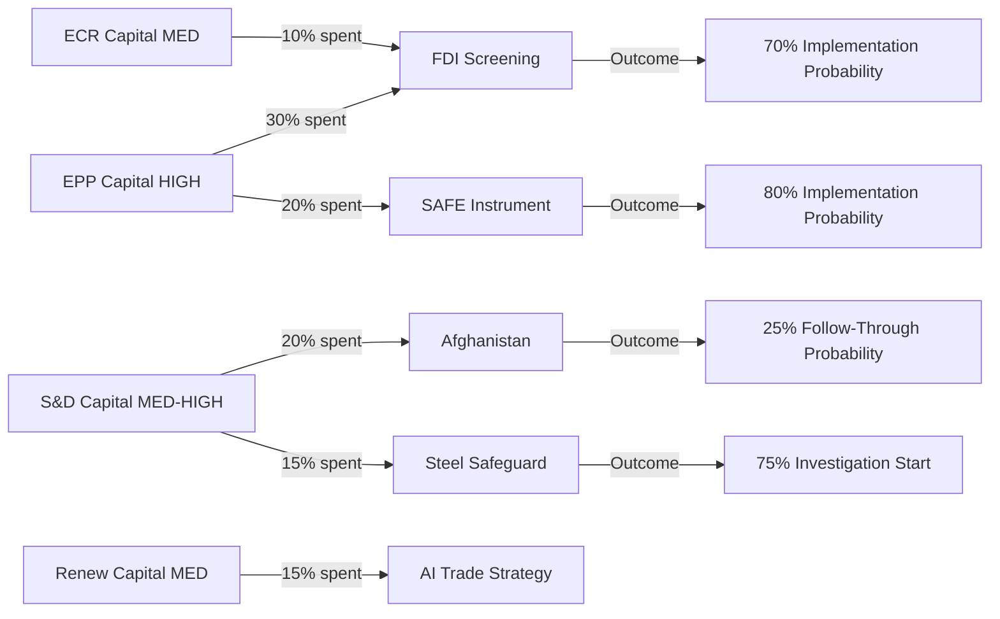

# Political Capital Risk Analysis — Breaking News, 2026-05-27

**Framework**: Political Capital Assessment for EU Strategic Autonomy Agenda
**SATs Applied**: Stakeholder Analysis, Political Economy Assessment

---

## Political Capital Baseline

**Definition**: Political capital = willingness of key actors to spend political resources advancing the strategic autonomy agenda, adjusted for current coalition strength and external pressure environment.

---

## EPP Political Capital Assessment

**Current level**: HIGH (7/10)
- Strong majority position (188 seats, largest group)
- Weber-aligned leadership cohesion
- Economic security narrative resonates with business-conservative base

**Drivers of capital**: Russian invasion (security spending justified); Chinese economic coercion (FDI screening popular with German Mittelstand); SAFE Instrument (defence industrial jobs)

**Risks to capital**: If SAFE expansion is perceived as displacing US allies from NATO relationships; if FDI screening is perceived as strangling investment by domestic business associations

**Deployment on May 2026 legislation**: Heavy — FDI screening and SAFE Instrument are EPP flagship items. Capital expenditure: ~30% of annual budget.

---

## S&D Political Capital Assessment

**Current level**: MEDIUM-HIGH (6/10)
- Relatively strong but second-place position (136 seats)
- Afghanistan resolution aligns with human rights mandate
- Steel safeguard aligns with industrial workers base

**Drivers of capital**: Afghanistan (values mandate); steel workers (labour base); SAFE (defence industry jobs in S&D heartland regions)

**Risks to capital**: SAFE Instrument militarisation narrative unpopular with Left wing of S&D delegation; Afghanistan resolution without follow-through weakens credibility

**Deployment on May 2026 legislation**: Medium — supporting EPP lead items while adding human rights dimension. Capital expenditure: ~20% of annual budget.

---

## Renew Europe Political Capital Assessment

**Current level**: MEDIUM (5/10)
- Declining from EP9 peak (77 seats vs. 102 in EP9)
- AI trade strategy is Renew-friendly (pro-innovation framing)
- FDI screening aligns with economic security priorities

**Drivers of capital**: Digital economy and innovation mandate; trade policy leadership
**Risks to capital**: Economic competitiveness concerns if FDI screening creates excessive burden; tension between open-market base and security restrictions

**Deployment on May 2026 legislation**: Supporting role — capital expenditure: ~15% of annual budget on FDI and AI items.

---

## ECR Political Capital Assessment

**Current level**: MEDIUM (5/10)
- 78 seats; right-populist coalition under Italian Meloni influence
- Selective alignment with EPP on security items

**Drivers of capital**: National sovereignty narrative; NATO defence alignment; anti-immigration framing for Afghanistan measures

**Risks to capital**: Internal tension between Italian/French euroscepticism (against EU competence expansion) and security-hawkish (for FDI screening) wings

**Deployment on May 2026 legislation**: Selective — supporting FDI screening and SAFE on security grounds; possible abstention or split on Afghanistan depending on migration angle. Capital expenditure: ~10%

---

## Hungary Risk to Coalition Capital

**Political capital available to disrupt**: HIGH (8/10 on obstruction)
- Unanimity veto on CFSP (Afghanistan)
- Comitology votes on FDI implementing acts
- Council working group positions

**Expected deployment**: Hungary will deploy maximum obstruction capital on Afghanistan (CFSP veto available, low political cost domestically). Medium obstruction on FDI implementing acts. Minimal direct opposition to SAFE Instrument (bilateral agreement path bypasses Council obstruction).

---

## Overall Political Capital Assessment for Implementation

| Item | Capital Available | Expected Deployment | Implementation Probability |
|------|-----------------|--------------------|-----------------------|
| FDI Screening | HIGH | HIGH | 70% within 36 months |
| SAFE Instrument | HIGH | MEDIUM | 80% within 24 months |
| Afghanistan Follow-Up | MEDIUM | LOW (Hungary blocks) | 25% within 6 months |
| AI Trade Strategy | MEDIUM | MEDIUM | 60% (Commission discretion) |
| Steel Safeguard | MEDIUM | MEDIUM | 75% investigation started |

---

## Cross-References

- `classification/forces-analysis.md` for driving/restraining forces
- `intelligence/coalition-dynamics.md` for coalition analysis
- `threat-assessment/actor-threat-profiles.md` for Hungary threat profile

---

## Capital Flow Diagram

## Capital Table

| Group | Capital Level | Primary Spend | Expected Return |
|-------|-------------|--------------|----------------|
| EPP | HIGH | FDI + SAFE | Strong implementation mandate |
| S&D | MED-HIGH | Afghanistan + Steel | Human rights/workers signal |
| Renew | MEDIUM | AI Strategy | Trade mandate |
| ECR | MEDIUM | FDI selective | Security credibility |
| Greens | LOW-MED | Afghanistan | Values marker |

## Capital Exposure

**Highest exposure risk**: S&D on Afghanistan — spent political capital on a resolution that Hungary is likely to veto in Council. This creates a credibility gap that could be exploited by far-right parties in 2027–29 election cycles as evidence that EP resolutions are "performative."

## Bets and Precedents

**Key bet**: EPP has staked credibility on FDI screening implementation. If implementing acts are delayed or weakened, EPP leadership will face internal criticism. *WEP 35%: At least one high-profile EPP-aligned business lobby publicly criticises FDI screening scope*

**Key precedent**: The EP10's willingness to spend coalition capital on defence industrial policy (SAFE Instrument) sets a precedent for further defence integration measures in 2027–29 if the EP10 coalition holds.

## Reader Briefing

**What this means**: Political capital is finite. When MEPs spend it adopting legislation, they need Council to follow through or they lose credibility. The biggest risk to the EP's agenda is not the legislation itself but the Council's failure to implement it — especially on Afghanistan.

