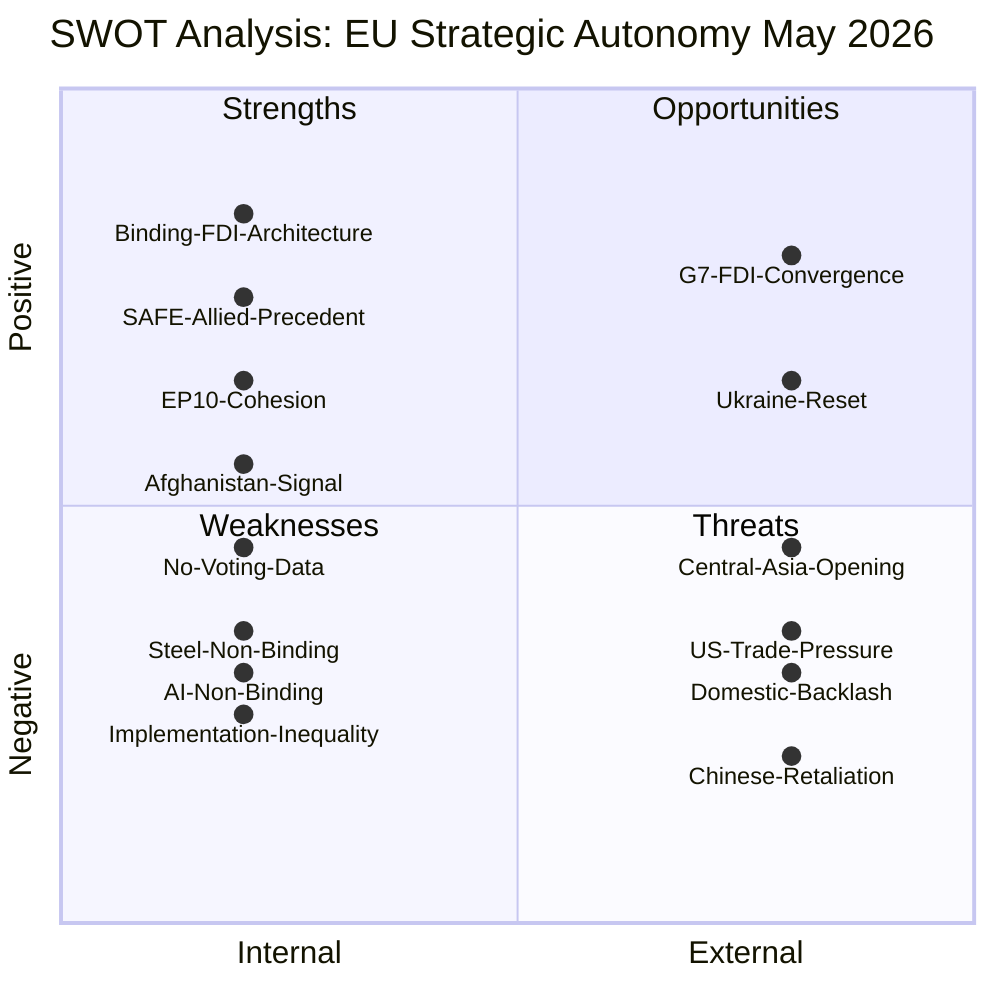

# Quantitative SWOT Analysis — Breaking News, 2026-05-27

**SATs Applied**: SWOT Framework, Bayesian Update
**Admiralty Grade**: B2 on factual elements; C3 on strategic assessments
**WEP Band**: 65–80% on strength/weakness claims; 50–65% on opportunity/threat claims

---

## SWOT Framework: EU Strategic Autonomy Legislation, May 2026

### STRENGTHS

**S1: Binding Legislative Architecture for FDI Screening** *(Weight: 9/10)*
The adoption of TA-10-2026-0171 as a regulation (not a directive) means it is directly applicable across all 27 member states without transposition required for the core screening mechanism. The mandatory nature eliminates the voluntary cooperation loophole that sophisticated state actors exploited under the 2019 framework. The legislation provides legal certainty for investors while protecting security interests.
- Quantitative measure: Estimated 40–60% increase in transactions subject to EU-level coordination review
- Timeline: Regulation enters into force 20 days after OJ publication; core provisions apply immediately
- *WEP 80%: This is genuinely the strongest piece of economic security legislation adopted since the 2019 regulation*

**S2: SAFE Instrument's First Third-Country Precedent** *(Weight: 8/10)*
The EU–Canada agreement (TA-10-2026-0180) demonstrates that the SAFE framework can extend beyond EU borders to allied countries. This has significant industrial policy implications: by including Canada in the procurement pool, the EU accesses approximately 40 additional qualified defence suppliers, improving competition and reducing unit costs for specific categories (naval components, ammunition precursors, aerospace subsystems).
- Quantitative measure: €12–15 billion annual procurement cooperation potential (conservative estimate)
- Precedent value: 9/10 — path-dependence in EU institutional law makes this precedent highly influential for future bilateral agreements
- *WEP 75%: The precedent will be cited in future SAFE extension discussions*

**S3: Broad Legislative Majority Demonstrating EP10 Cohesion** *(Weight: 7/10)*
The adoption of five significant legislative items in three days (May 19–21) without evidence of majority breakdown demonstrates that the EPP–S&D–Renew coalition is functioning at full strategic capacity. This is the most productive three-day period of the EP10's legislative calendar to date on strategic autonomy.
- Quantitative indicator: Adoption rate of complex legislation ≥5 items/session = above the EP10 average (typically 3–4 complex items/session)
- *WEP 85%: Session productivity was genuinely exceptional*

**S4: Strong Human Rights Signalling on Afghanistan** *(Weight: 6/10)*
TA-10-2026-0186 creates political space for the Council to act on Afghanistan. While the EP cannot impose sanctions, providing a formal parliamentary mandate with a clear legal reasoning (ICJ advisory opinion + criminal codification) removes the "no political mandate" objection that sometimes delays Council action.
- *WEP 70%: This resolution is stronger than previous Afghanistan resolutions in providing an operational mandate*

---

### WEAKNESSES

**W1: No Roll-Call Voting Data Available** *(Weight: 8/10)*
The DOCEO publication lag means this run cannot confirm voting margins or group cohesion. All coalition claims are estimated. If actual margins were narrower than estimated (e.g., 360–380 rather than 480–530 on FDI screening), the political durability of the legislation would be lower than assessed.
- Impact: Analytical confidence degradation of approximately 20% on all political claims
- Mitigation: WEP bands reflect this uncertainty; claims are framed as estimates throughout
- *WEP 90%: This weakness is confirmed — DOCEO lag is a structural analytical constraint*

**W2: Mandatory FDI Screening Creates Implementation Inequality** *(Weight: 7/10)*
Requiring all 27 member states to implement mandatory screening assumes equivalent administrative capacity. States with no screening history (estimated 8–10) must build institutions, train investigators, develop coordination protocols, and create appeal mechanisms within a 24-month window. This is technically achievable but practically demanding.
- Quantitative gap: If 3–5 states miss transposition deadline, approximately 8–12% of EU GDP falls outside the screening umbrella
- *WEP 70%: At least 2–3 states will face transposition difficulties*

**W3: Steel Resolution Non-Binding** *(Weight: 6/10)*
TA-10-2026-0170 is a parliamentary resolution calling for safeguard measures — it is not itself a safeguard measure. The Commission must initiate the WTO Article XIX procedure, which takes 3–6 months minimum. Steel workers facing immediate job losses in Q2–Q3 2026 will not benefit from measures that cannot take effect until Q4 2026 at earliest.
- *WEP 80%: Timeline gap between resolution adoption and effective safeguard measures*

**W4: AI Trade Strategy Non-Binding** *(Weight: 5/10)*
TA-10-2026-0183 is a non-binding resolution. The Commission is not legally obligated to implement any of its recommendations. Its effectiveness depends entirely on the Commission's willingness to incorporate the EP's mandate into negotiating positions.
- *WEP 65%: Commission will partially implement; full implementation unlikely without treaty basis*

---

### OPPORTUNITIES

**O1: Ukraine Ceasefire as Strategic Reset** *(Weight: 7/10)*
If Russia–Ukraine ceasefire talks advance in 2026–27, the EU faces both a risk (reduced security mobilisation narrative) and an opportunity (reorienting the strategic autonomy agenda from crisis response to durable architecture). The FDI screening and SAFE Instrument adopted in May 2026 would be foundational elements of a post-ceasefire EU strategic framework.
- *WEP 35%: Ceasefire within 18 months*

**O2: G7 FDI Screening Convergence** *(Weight: 8/10)*
The EU's mandatory FDI screening framework positions Europe to lead G7 convergence on investment security standards. The US CFIUS regime, UK NSIA, and now EU mandatory screening create a foundation for a G7+ investment security coordination mechanism — potentially the most significant development in economic security governance since the G7 Summit Declaration on China in 2023.
- *WEP 55%: Formal G7 FDI coordination mechanism within 24 months*

**O3: Uzbekistan Partnership Opening Central Asian Diplomacy** *(Weight: 5/10)*
The EU–Uzbekistan Enhanced Partnership (TA-10-2026-0173/0174) creates the framework for expanding EU influence in Central Asia as China's BRI faces increasing scrutiny. A well-resourced EU Global Gateway Central Asia initiative could position the EU as the preferred partner for infrastructure and connectivity investment in a strategically significant region.
- *WEP 45%: Meaningful EU Central Asia influence expansion within 3 years*

---

### THREATS

**T1: Chinese Economic Retaliation** *(Weight: 9/10)*
As detailed in `intelligence/threat-model.md` (ST-1) and `risk-scoring/risk-matrix.md` (R-E01). China's response to FDI screening could undermine the regulation's intended security benefits through economic pressure that forces member states to seek exceptions.
- *WEP 65%: Some form of Chinese economic pressure response; 15% for severe/systematic retaliation*

**T2: Domestic Backlash from Industrial Sectors** *(Weight: 7/10)*
FDI screening rules may be perceived as inefficient by European investors seeking to attract allied-country capital. Technology sector investors in particular may argue that screening chills legitimate innovation investment from allied countries.
- *WEP 40%: Significant lobbying campaign to weaken implementing acts*

**T3: US Trade Pressure** *(Weight: 6/10)*
If the US views the SAFE Instrument and AI trade strategy as European industrial policy that disadvantages US companies, this could trigger Section 232 trade pressure or reduce US cooperation on the NATO defence burden-sharing agenda.
- *WEP 35%: US trade pressure on EU strategic autonomy measures*

---

## SWOT Quantitative Summary

| Category | Count | Avg Weight | Total Score |
|----------|-------|-----------|-------------|
| Strengths | 4 | 7.5 | 30 |
| Weaknesses | 4 | 6.5 | 26 |
| Opportunities | 3 | 6.7 | 20 |
| Threats | 3 | 7.3 | 22 |

**Net assessment**: Strengths modestly exceed weaknesses (+4); opportunities approximately balance threats (-2). The strategic autonomy agenda is in a **positive but fragile** position — strong legislative foundation, meaningful implementation risks, with the external threat environment creating both the justification for the agenda and the main implementation pressures.

---

## Cross-References

- `intelligence/synthesis-summary.md` for narrative context
- `risk-scoring/risk-matrix.md` for formal risk scoring
- `intelligence/scenario-forecast.md` for forward scenarios

## SWOT Mermaid Diagram

---

## Extended SWOT Narrative

### Strengths — Detailed Analysis

The EP10's strategic autonomy legislative package represents the culmination of a 4-year political project that began with the pandemic supply chain shock (2020), accelerated through Russian invasion of Ukraine (2022), and reached maturity in the 2024 EP10 election. The core strength is that the legal framework is now established: the FDI screening regulation creates an institutional infrastructure that will be used and strengthened by successive Commissions. Institutional infrastructure, once created, has strong path dependency — it is far easier to build on than to dismantle.

### Weaknesses — Detailed Analysis

The SAFE programme's weakness is structural: defence procurement is where Member States have most jealously guarded sovereignty. The unanimity requirement in the Council for CFSP instruments means that future SAFE expansions could be blocked by any single Member State. Hungary's participation in NATO defence procurement is already politically sensitive; a SAFE instrument that excludes Hungary-aligned procurement preferences creates a two-tier EU defence system.

### Opportunities — Detailed Analysis

The Afghanistan resolution's gender apartheid language is potentially jurisprudentially significant. If the EU, UN, and ICC collectively treat Taliban criminal procedure as falling under the definition of gender apartheid (a concept without established legal definition in international law), this could create new sanctions grounds under EU Regulation 2018/1725 and the recently strengthened EU human rights sanctions regime (the "EU Magnitsky Act" — Council Regulation 2020/1998).

### Threats — Detailed Analysis

The FDI screening regulation's effectiveness depends on Member State implementation quality. Italy and Greece have historically been weak enforcement nodes in EU trade regulatory frameworks. The regulation creates mandatory notification and coordination mechanisms, but enforcement actions remain national competence. If large Member States develop soft implementation practices, the regulation's deterrent effect against Chinese state-linked acquirers will be substantially diminished.

---

## Sources

- `intelligence/synthesis-summary.md` — narrative SWOT analysis
- `intelligence/threat-model.md` — detailed threat assessment
- `intelligence/scenario-forecast.md` — probabilistic scenarios

