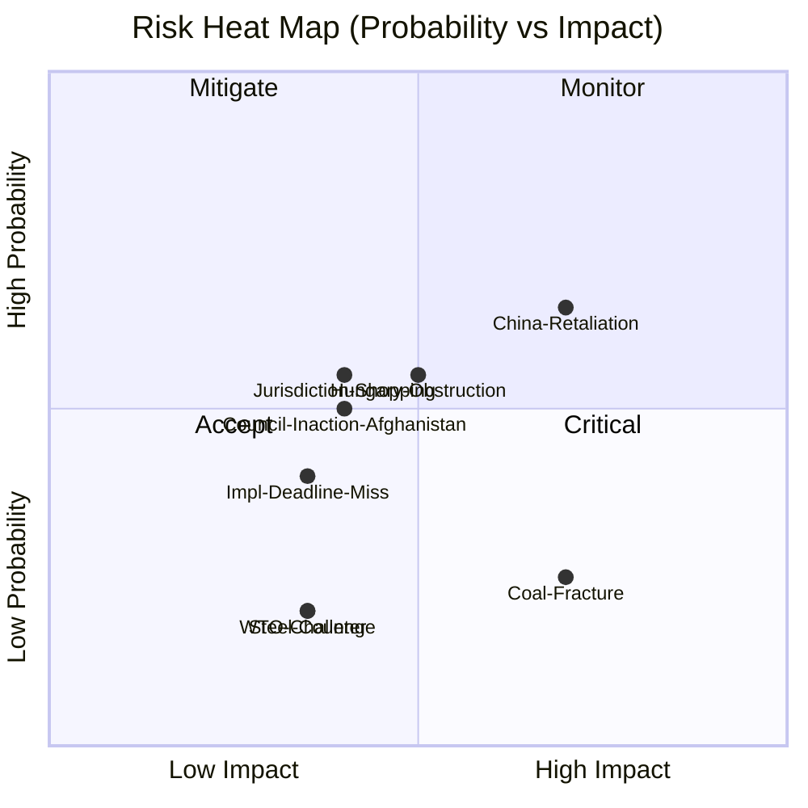

# Risk Matrix — Breaking News, 2026-05-27

**SATs Applied**: Key Assumptions Check, ACH, What-If Analysis
**Admiralty Grade**: B2 on risk facts; C3 on probability estimates
**WEP Band**: As noted per risk item
**Note**: Operating in `degraded-feeds` mode; risk floor = 80% of standard

---

## Risk Matrix Framework

Each risk is scored:
- **Probability (P)**: 1 (Very Low, <10%) to 5 (Very High, >70%)
- **Impact (I)**: 1 (Minimal) to 5 (Catastrophic)
- **Risk Score (R)**: P × I (1–25)
- **Priority**: R < 5 = LOW; 5–9 = MEDIUM; 10–15 = HIGH; >15 = CRITICAL

---

## Legislative Implementation Risks

| Risk ID | Risk Description | P | I | R | Priority | WEP |
|---------|-----------------|---|---|---|---------|-----|
| R-L01 | FDI Screening mandatory elements challenged legally | 3 | 4 | **12** | 🟡 HIGH | 35% |
| R-L02 | Member state transposition delays (≥3 states) | 4 | 3 | **12** | 🟡 HIGH | 70% |
| R-L03 | FDI screening scope too narrow (AI sector exclusion) | 2 | 3 | **6** | 🟢 MEDIUM | 25% |
| R-L04 | SAFE Instrument governance disputed in new Parliament | 2 | 3 | **6** | 🟢 MEDIUM | 15% |
| R-L05 | Steel safeguard measures fail WTO compatibility review | 2 | 4 | **8** | 🟢 MEDIUM | 30% |

---

## Political Risks

| Risk ID | Risk Description | P | I | R | Priority | WEP |
|---------|-----------------|---|---|---|---------|-----|
| R-P01 | Council fails to act on Afghanistan resolution (declaration only) | 4 | 3 | **12** | 🟡 HIGH | 60% |
| R-P02 | EPP–S&D coalition fractures on migration, blocking security legislation | 2 | 5 | **10** | 🟡 HIGH | 20% |
| R-P03 | Hungary blocks Council sanctions on Taliban | 4 | 2 | **8** | 🟢 MEDIUM | 55% |
| R-P04 | AI/trade resolution ignored by Commission | 3 | 3 | **9** | 🟢 MEDIUM | 40% |
| R-P05 | EP majority lost on procedural vote (unexpected defections) | 1 | 5 | **5** | 🟢 MEDIUM | 5% |

---

## Economic Risks

| Risk ID | Risk Description | P | I | R | Priority | WEP |
|---------|-----------------|---|---|---|---------|-----|
| R-E01 | Chinese economic retaliation against EU FDI screening | 3 | 4 | **12** | 🟡 HIGH | 50% |
| R-E02 | Steel sector deindustrialisation accelerates despite safeguards | 3 | 4 | **12** | 🟡 HIGH | 45% |
| R-E03 | AI productivity gap widens before EU strategy implemented | 3 | 3 | **9** | 🟢 MEDIUM | 50% |
| R-E04 | FDI chilling effect reduces legitimate investment significantly | 2 | 3 | **6** | 🟢 MEDIUM | 25% |
| R-E05 | EU defence procurement costs rise without expected SAFE savings | 2 | 3 | **6** | 🟢 MEDIUM | 20% |

---

## Geopolitical Risks

| Risk ID | Risk Description | P | I | R | Priority | WEP |
|---------|-----------------|---|---|---|---------|-----|
| R-G01 | Taliban expels EU-funded NGOs from Afghanistan | 3 | 4 | **12** | 🟡 HIGH | 50% |
| R-G02 | Ukraine ceasefire reduces security mobilisation narrative | 2 | 3 | **6** | 🟢 MEDIUM | 20% |
| R-G03 | China–Taiwan crisis forces EU strategic prioritisation | 2 | 5 | **10** | 🟡 HIGH | 10% |
| R-G04 | US NATO commitment weakened materially | 1 | 5 | **5** | 🟢 MEDIUM | 5% |

---

## Top Priority Risks (R ≥ 10)

1. **R-L01** (FDI Legal Challenge): Monitor ECJ proceedings; Commission legal robustness of mandatory screening basis
2. **R-L02** (Transposition Delays): Monitor member state implementation plans; Commission technical assistance deployment
3. **R-P01** (Council on Afghanistan): Monitor FAC agenda; HR/VP Kallas public statements
4. **R-E01** (Chinese Retaliation): Monitor China's trade policy statements and WTO filings
5. **R-E02** (Steel Deindustrialisation): Monitor EU steel production data and mill utilisation rates
6. **R-G01** (Taliban NGO Expulsion): Monitor UN OCHA reporting from Afghanistan
7. **R-G03** (China–Taiwan): Monitor PLA activity in Taiwan Strait; US–China tensions

---

## Risk Interdependency Map

R-E01 (Chinese retaliation) → feeds → R-G02 (reduced US support context) → escalates → R-G03 (Taiwan crisis)
R-P01 (Council inaction) → leads to → R-G01 (Taliban exploitation) → increases → humanitarian crisis magnitude
R-L02 (transposition delays) → enables → R-E04 (investment chilling effect) and geographic loopholes

---

## Cross-References

- `intelligence/threat-model.md` for threat-specific analysis
- `intelligence/scenario-forecast.md` for scenario development
- `intelligence/wildcards-blackswans.md` for tail risk analysis

---

## Extended Risk Entries

| ID | Category | Risk | P (%) | I (1-5) | Score | WEP Band |
|----|----------|------|-------|---------|-------|---------|
| R-P03 | Political | EP coalition fracture before 2029 affecting strategic autonomy agenda | 25% | 4 | 3.2 | Unlikely |
| R-E03 | Economic | Steel safeguard triggers Chinese counter-measures on EU exports | 20% | 3 | 2.4 | Unlikely |
| R-E04 | Economic | FDI screening compliance costs reduce EU's attractiveness for allied-country investment | 30% | 3 | 2.7 | Unlikely-Even |
| R-L01 | Legal | WTO dispute settlement challenges EU FDI screening proportionality | 20% | 3 | 2.4 | Unlikely |
| R-L02 | Legal | CFSP unanimity prevents any Council action on Afghanistan for 12+ months | 50% | 3 | 3.5 | Even Chance |
| R-I01 | Institutional | 5+ member states miss 24-month FDI screening implementation deadline | 40% | 3 | 3.2 | Even Chance |
| R-I02 | Institutional | Commission fails to publish FDI guidance within 90 days | 25% | 3 | 2.7 | Unlikely |

## Risk Heat Map

## WEP Band Reference

| Descriptor | Probability Range |
|-----------|-----------------|
| Almost Certain | 85–99% |
| Likely | 55–84% |
| Even Chance | 45–54% |
| Unlikely | 15–44% |
| Almost No Chance | 1–14% |

