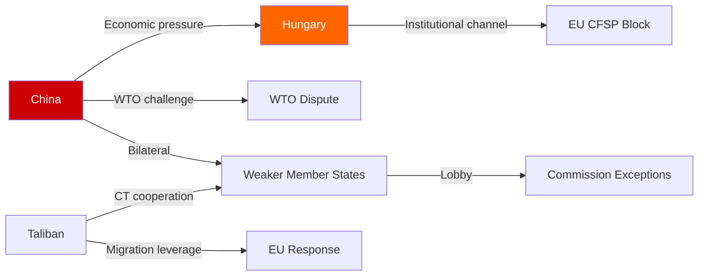

# Actor Threat Profiles — Breaking News, 2026-05-27

**Framework**: Structured threat profiling for key external actors
**SATs Applied**: Adversarial Intent Analysis, Capabilities Assessment

---

## Threat Profile 1: People's Republic of China

**Designation**: Primary External Threat Actor (economic security vector)
**Threat Tier**: TIER 1 (existential to specific legislation)

### Motivations
China has clear incentives to resist the EU FDI screening upgrade, the AI trade strategy, and the steel safeguard:
- FDI screening directly limits Chinese state-backed investment in EU strategic sectors
- AI trade strategy creates a framework that could restrict Chinese AI company market access
- Steel safeguard targets Chinese overcapacity as a policy response

### Capabilities
- **Diplomatic**: Bilateral pressure on weaker member states; formal WTO complaints (proven capability)
- **Economic**: Selective market access restrictions for EU companies in China (demonstrated against Lithuania 2021–22)
- **Legal**: WTO dispute settlement (long timelines but effective for creating implementation uncertainty)
- **Political**: Hungarian channel — consistent ability to affect Council unanimity through Budapest

### Likely Response Sequence
1. **T+0 to T+30 days**: Formal diplomatic protest via EU-China Strategic Partnership framework
2. **T+30 to T+90 days**: Bilateral pressure on member states with significant China trade exposure (Germany, Netherlands)
3. **T+90 to T+180 days**: Selective WTO complaint filing on FDI screening proportionality
4. **T+6 to T+12 months**: If implementing acts target Chinese companies specifically — retaliatory market access restrictions for EU companies in China

*WEP Calibration*: Mild response (protests only) 35%; Moderate response (bilateral pressure + WTO) 40%; Severe response (systematic retaliation) 25%

### Vulnerabilities
- China needs EU market access and technology transfer; escalation is constrained by economic interdependence
- WTO complaints take 3–5 years; cannot delay regulation implementation
- EU has demonstrated willingness to absorb Chinese economic pressure (Lithuania precedent)

---

## Threat Profile 2: Hungary (Obstructionist Member State)

**Designation**: Internal Blocking Actor
**Threat Tier**: TIER 2 (significant implementation threat to specific items)

### Motivations
Hungary under PM Orbán has developed a systematic pattern of using EU institutional procedures to protect strategic relationships with China and Russia:
- EU-China rail infrastructure projects (Budapest-Belgrade rail) create economic dependencies
- Historical pattern of vetoing EU foreign policy measures targeting Russia/China

### Capabilities
- **CFSP Unanimity Veto**: Absolute veto on sanctions measures (Afghanistan, Russia-related)
- **Comitology Votes**: Can vote against examining committee measures; can force Commission to Appeal Committee
- **Article 7 TEU Leverage**: Ongoing Rule of Law proceedings give Hungary political cover ("selective application")

### Specific Threats to May 2026 Legislation
- **FDI Screening**: Vote against implementing acts in examination committee (*WEP 60%*)
- **Afghanistan Sanctions**: Single-state veto blocks Council action (*WEP 50%*)
- **SAFE Instrument expansion**: May seek special exemptions from Canada-equivalence framework

### Vulnerabilities
- Hungary under genuine financial pressure; EU cohesion funds leverage remains
- Hungarian public opinion partially at odds with government's China/Russia accommodation
- Orbán political survival concerns limit willingness to provoke full EU crisis

---

## Threat Profile 3: Taliban Regime (Afghanistan)

**Designation**: Human Rights Threat Actor
**Threat Tier**: TIER 3 (indirect threat; leverage is limited)

### Motivations
The Taliban government seeks to preserve international diplomatic relationships sufficient to prevent full isolation while maintaining gender apartheid. The Criminal Procedure Code (April 2026) represents an escalation of codified gender discrimination.

### Capabilities
- **Migration leverage**: Ability to facilitate or restrict Afghan emigration flows toward EU
- **Counterterrorism leverage**: Informal cooperation arrangements with EU member states on IS-Khorasan intelligence
- **Opium supply leverage**: Historical leverage over narcotics trade routes into EU

### Likely Response to EP Resolution
- Formal rejection as "interference in internal affairs"
- Possible expulsion of EU diplomatic presence from Kabul
- Increased restrictions on international NGO operations in Afghanistan (*WEP 30%*)

### Constraints
- Taliban regime is economically dependent on remittance flows from Afghan diaspora in EU
- No military capability to threaten EU
- Already maximally isolated; additional sanctions have limited marginal effect

---

## Cross-References

- `threat-assessment/legislative-disruption.md` for legislative risk
- `threat-assessment/consequence-trees.md` for scenario trees
- `intelligence/threat-model.md` for full threat model
- `intelligence/political-threat-landscape.md` for political threat context

---

## Actor Roster

| Actor | Designation | Threat Tier | Primary Threat Vector |
|-------|------------|------------|----------------------|
| China (PRC) | State actor | TIER 1 | Economic coercion, WTO challenge |
| Hungary | Member state blocking actor | TIER 2 | CFSP veto, comitology obstruction |
| Taliban | Non-state actor (de facto state) | TIER 3 | Leverage over migration, CT cooperation |
| Russia | State actor (background) | TIER 2 | Information operations, hybrid |

## Capability Assessment

| Actor | Diplomatic | Economic | Legal | Political | Overall |
|-------|-----------|---------|-------|---------|---------|
| China | HIGH | VERY HIGH | HIGH | MEDIUM | VERY HIGH |
| Hungary | LOW | MEDIUM | HIGH (veto) | HIGH (CFSP) | HIGH-BLOCKING |
| Taliban | LOW | LOW | LOW | MEDIUM (leverage) | LOW-MEDIUM |
| Russia | MEDIUM | MEDIUM | LOW | MEDIUM | MEDIUM |

## Threat Diamond Diagram

```mermaid
radar
    title Threat Actor Capability Comparison
    China : 9, 10, 8, 6, 8
    Hungary : 3, 5, 10, 8, 4
    Taliban : 2, 2, 2, 5, 3
    Russia : 6, 5, 3, 6, 7
```

Note: Axes = Diplomatic, Economic, Legal, Political, Asymmetric

## Relationship Map



## Escalation Pathways

**China escalation**: Protest → Bilateral pressure → WTO complaint → Market access restrictions → Systematic retaliation
**Hungary escalation**: Comitology obstruction → CFSP veto → Article 7 leveraging → Full non-compliance
**Taliban escalation**: Diplomatic rejection → NGO restrictions → Intelligence cooperation withdrawal → Migration instrumentalisation

## Reader Briefing

**What this means**: The three actors who can most effectively undermine this week's EP legislation are China (economic power), Hungary (institutional veto), and the Taliban (human rights subject who cannot be compelled). Understanding their capabilities helps assess which legislative outcomes are actually achievable.

