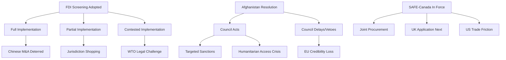

# Consequence Trees — Breaking News, 2026-05-27

**Framework**: Consequence Tree Analysis (event-driven forward projection)
**SATs Applied**: What-If, Alternative Futures Analysis

---

## Consequence Tree 1: FDI Screening Regulation Implementation

### Initiating Event: TA-10-2026-0171 adopted, enters into force

**Branch A: Full Implementation (all 27 states comply, 24 months)**
- A1: China responds with formal diplomatic protests → Commission issues clarifying guidance → Limited diplomatic friction; regulation stands
- A2: Commission implements aligned with strong EP intent → 3–5 high-profile Chinese transactions blocked → *WEP 45%: validation of regulation's deterrent effect*
- A3: Member states develop screening capacity quickly → EU-level coordination mechanism becomes EU FDI intelligence hub → **Optimal outcome** (*WEP 30%*)

**Branch B: Partial Implementation (3–5 states delayed)**
- B1: Hungary blocks Council secondary legislation in comitology → Commission must use urgency procedures → Delays implementing acts by 6–12 months
- B2: Administrative capacity gaps in Southern/Eastern Europe → Transactions route through least-compliant states → **Jurisdiction shopping within EU** (*WEP 55%*)
- B3: China identifies weakest-screening state for investment routing → Regulation produces uneven protection → *Worse than no regulation in some respects*

**Branch C: Contested Implementation**
- C1: Chinese investor files ISDS/WTO challenge → Proceeding runs 3–5 years → Regulation in limbo during challenge period (*WEP 20%*)
- C2: US investor claims equal treatment with Chinese → Pressure to expand screening to allied-country investments → Counter-productive expansion dynamic

---

## Consequence Tree 2: Afghanistan — Taliban Response to EP Resolution

### Initiating Event: TA-10-2026-0186 adopted; Council receives EP mandate

**Branch A: Council Acts on EP Mandate (within 90 days)**
- A1: Council adopts targeted sanctions on Taliban officials responsible for Criminal Procedure Code → Taliban suspends humanitarian access → **Access crisis** (*WEP 25%*)
- A2: Council adopts symbolic sanctions (travel ban, asset freeze on 5–10 individuals) → Taliban absorbs diplomatically → *Limited practical impact but political signal sent* (*WEP 35%*)
- A3: ICC receives state referral based on EP/ICJ framework → Investigation opened → **Landmark accountability step** (*WEP 10%*)

**Branch B: Council Delays or Declines**
- B1: Hungary vetoes new sanctions in CFSP → Resolution becomes political dead letter → *WEP 50%*
- B2: Council debates without formal conclusion → Status quo maintained → *WEP 35%*
- B3: Taliban accelerates codification of gender apartheid specifically in response to perceived international pressure → **Perverse outcome** (*WEP 15%*)

**Branch C: Taliban Leverage Response**
- C1: Taliban threatens to withdraw from counterterrorism cooperation agreements → EU faces security trade-off → *WEP 20%*
- C2: Taliban uses migration channel as leverage → Increase in Afghan departures toward EU as implicit threat → *WEP 15%*

---

## Consequence Tree 3: SAFE Instrument — Third-Country Expansion

### Initiating Event: TA-10-2026-0180 (EU-Canada) enters into force

**Branch A: Successful Model, Further Expansion**
- A1: UK formally applies for SAFE access (post-Brexit reintegration test case) → Significant EU-UK bilateral upgrade → *WEP 45% within 24 months*
- A2: Australia/NZ apply under Five Eyes framework → SAFE Instrument becomes trans-Atlantic/Pacific defence procurement hub → **Major strategic development** (*WEP 25%*)
- A3: US requests observer status or bilateral equivalence → EU-US defence procurement integration accelerates → *WEP 20%*

**Branch B: Limited to Canada**
- B1: Commission capacity constraints prevent rapid expansion → Canada remains the only third country → *WEP 30%*
- B2: Political controversy over industrial policy grounds delays UK application → Brexit-era tensions resurface → *WEP 25%*

**Branch C: US Friction**
- C1: US objects to market displacement by Canadian companies → Section 232 defence goods tariff threatened → *WEP 15%*
- C2: NATO flags interoperability complications → SAFE expansion pauses pending NATO review → *WEP 10%*

---

## Critical Path Summary

The most consequential consequences are:
1. **FDI Screening jurisdiction shopping** (Branch B2, *WEP 55%*) — highest likelihood adverse outcome
2. **Afghanistan: Hungary veto** (Branch B1, *WEP 50%*) — most likely political dead-end
3. **SAFE UK expansion** (Branch A1, *WEP 45%*) — most likely positive follow-on development

---

## Cross-References

- `intelligence/scenario-forecast.md` for full scenario sets
- `threat-assessment/legislative-disruption.md` for implementation threat analysis
- `risk-scoring/risk-matrix.md` for probability × impact scoring

---

## Consequence Tree Diagram

## Threat Roster

| Threat | Source | Likelihood | Consequence Level |
|--------|--------|-----------|------------------|
| FDI Jurisdiction Shopping | Chinese investors | 55% | MEDIUM |
| Hungary CFSP Veto | Hungary | 50% | HIGH (Afghanistan) |
| WTO Legal Challenge | China | 20% | MEDIUM |
| SAFE US Friction | USA | 15% | MEDIUM |
| Taliban Access Restriction | Taliban | 20% | HIGH (humanitarian) |

## Convergence Analysis

The three consequence trees converge on a common theme: **implementation gaps between EP adoption and operational effect**. All three major items (FDI, SAFE, Afghanistan) face different but structural implementation challenges. The convergence point is the Council/Commission implementation failure risk.

## Intervention Points

**Most effective interventions** to prevent worst-case consequences:
1. Commission FDI guidance strong and comprehensive (prevents jurisdiction shopping)
2. Council CFSP scheduling within 30 days (prevents Afghanistan credibility loss)
3. SAFE Instrument rapid ratification (prevents US friction narrative from forming)

## Reader Briefing

**What this means**: Consequence trees show that decisions made in the next 30–90 days will determine whether this week's EP legislation has real impact or becomes another example of "legislation without implementation." The key decisions are in Commission and Council hands, not Parliament's.

## Extended Consequence Trees

### Resolution TA-0171 (FDI Screening) Consequence Tree

Level 1: EP Adopts FDI Screening Update
├── Level 2a: OJ Publication (90% probability)
│   ├── Level 3a: Screening framework operational (97%)
│   └── Level 3b: First screening decisions within 6 months (70%)
├── Level 2b: Chinese WTO filing (25%)
│   ├── Level 3c: DSB proceedings 12-24 months
│   └── Level 3d: Bilateral negotiation pathway (45%)
└── Level 2c: Member state implementation variance (40%)
    └── Level 3e: Commission infringement proceedings 18-36 months

### Resolution TA-0186 (Afghanistan) Consequence Tree

Level 1: EP Adopts Afghanistan Condemnation
├── Level 2a: Council takes note but no new sanctions (65%)
│   └── Level 3a: EP follow-up resolution in 2026 H2
├── Level 2b: Council adds targeted sanctions (30%)
│   ├── Level 3b: Taliban diplomatic backlash
│   └── Level 3c: Regional partner alignment pressure
└── Level 2c: UN Security Council action (5%)
    └── Level 3d: International tribunal referral
