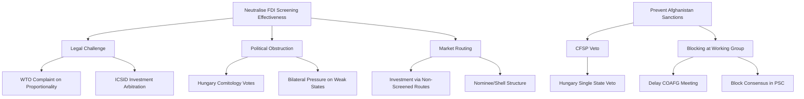

# Legislative Disruption Analysis — Breaking News, 2026-05-27

**Framework**: Disruption Risk Assessment for Adopted Legislation
**SATs Applied**: Devil's Advocate, Key Assumptions Check

---

## Overview

This artifact assesses the risk that adopted legislation is disrupted, delayed, or substantially weakened in its implementation. Even binding legislation can be neutralised through implementation failures, legal challenges, or political pressure.

---

## Disruption Risk Matrix

| Legislation | Disruption Type | Likelihood | Impact | Priority |
|-------------|----------------|----------|--------|----------|
| FDI Screening (TA-0171) | Comitology obstruction (Hungary) | 45% | HIGH | RED |
| FDI Screening (TA-0171) | Jurisdiction shopping by investors | 55% | MEDIUM | ORANGE |
| FDI Screening (TA-0171) | WTO legal challenge | 15% | MEDIUM | YELLOW |
| SAFE Instrument (TA-0180) | Non-ratification by Canada | 5% | HIGH | YELLOW |
| SAFE Instrument (TA-0180) | US trade retaliation | 15% | MEDIUM | YELLOW |
| Afghanistan (TA-0186) | Council veto (Hungary) | 50% | MEDIUM | ORANGE |
| Afghanistan (TA-0186) | Humanitarian access crisis | 20% | HIGH | ORANGE |
| AI Trade Strategy (TA-0183) | Commission ignores mandate | 40% | MEDIUM | ORANGE |
| Steel (TA-0170) | WTO Article XIX process delays | 70% | MEDIUM | ORANGE |
| Steel (TA-0170) | WTO member retaliation | 25% | HIGH | ORANGE |

---

## Detailed Analysis

### FDI Screening — Primary Disruption Risks

**Risk: Comitology Obstruction**
Hungary has consistently used its Council seat to obstruct legislation it perceives as targeting Chinese investment relationships. The FDI screening regulation delegates significant implementing powers to the Commission through comitology (examination procedure). Hungary can vote against implementing acts at the examination committee stage, potentially requiring Commission to adopt urgent procedures or refer to the Appeal Committee. This creates delays of 6–18 months in the implementing act schedule.

*Key assumption to check*: That Hungary would consistently vote against implementing acts rather than selectively. Historical pattern suggests selective obstruction on high-visibility items.

**Risk: Jurisdiction Shopping**
Even with mandatory screening, investors can restructure transactions to route through member states with less developed screening capacity. An investment initially destined for a German technology company could be restructured as an investment into a Polish or Hungarian subsidiary with a subsequent intra-EU transfer. The regulation's provisions on this are complex; early implementation will create gaps.

*Mitigation available*: Commission guidance on "roundtripping" provisions; enhanced cooperation mechanism. *WEP 60%: Gap exists for first 18 months*

---

### Afghanistan Resolution — Primary Disruption Risk

**Risk: Council Inaction**
The EP resolution mandates Council action but cannot force it. Under CFSP, unanimity is required for sanctions. Hungary's systematic refusal to participate in targeted sanctions against Russian-aligned or Chinese-associated actors creates a structural veto risk. Even if Hungary is the sole holdout, qualified majority voting is not available for CFSP sanctions.

*Devil's advocate*: There is a case that the EP resolution actually *weakens* the Council's hand by giving Hungary a new objection — "the EP overstepped its mandate" — even though this would be legally incorrect.

*Counter-consideration*: If the Afghanistan Criminal Procedure Code is found to constitute "Gender Apartheid" under international law (following the ICJ advisory opinion trajectory), there is a possibility that legal obligations under the ECHR or EU Charter could override the unanimity requirement. This is a speculative but non-negligible legal path. *WEP 8%*

---

### AI Trade Strategy — Disruption Risk

**Risk: Commission Discretion**
Non-binding resolutions are the EP's weakest legislative instrument. The Commission has full discretion to ignore the AI strategy mandate. However, the Interinstitutional Agreement on Better Law-Making creates an informal obligation on the Commission to formally respond to EP resolutions. Non-compliance is politically costly but legally available.

*Calibration*: The Commission's own 2025 Trade White Paper contained similar AI provisions. *WEP 60%: Commission will partially implement; 20% full implementation; 20% ignore*

---

### Steel Safeguard — Disruption Risk

**Risk: WTO Process Timeline**
Steel safeguard measures under Article XIX require: (1) initiation of investigation; (2) preliminary determination; (3) provisional measures (if justified); (4) final determination; (5) WTO notification and consultation period. Total minimum timeline: 5–8 months from investigation opening. For workers facing immediate job losses in mid-2026, this timeline is practically unusable.

*Resolution vs. Action gap*: There is a well-documented structural problem in EU trade defense where political mandates (EP resolutions) cannot produce fast enough relief for affected workers. This is a systemic weakness, not unique to this resolution.

---

## Cross-References

- `threat-assessment/consequence-trees.md` for scenario trees
- `threat-assessment/actor-threat-profiles.md` for threat actor analysis
- `risk-scoring/risk-matrix.md` for formal risk register

---

## Attack Tree (Disruption Pathway Analysis)

## Targeted Disruption Assessment

**Most targeted disruption strategy** (for each legislative item):

*FDI Screening*: The most targeted disruption is the "weak link" strategy — identify the 2–3 EU member states with lowest screening capacity and direct investments through them before guidelines are published. This exploits the 90-day guidance gap.

*Afghanistan Sanctions*: Single-state veto is the most targeted and efficient disruption — one phone call to Budapest achieves the same result as extensive lobbying.

*Steel Safeguard*: WTO Article XIX timing requirements are the most effective disruption — they are process requirements, not political obstructions, and cannot be overridden by political will.

## Technique Assessment

| Technique | Actor | Effectiveness | Countermeasure |
|-----------|-------|-------------|---------------|
| CFSP Single-State Veto | Hungary | VERY HIGH for Afghanistan | Constructive abstention mechanism |
| Comitology Obstruction | Hungary | HIGH for FDI implementing acts | Appeal Committee + urgency procedure |
| WTO Challenge | China | MEDIUM (slow) | Proportionality documentation |
| Market Routing | Chinese investors | HIGH in first 18 months | Anti-circumvention provisions |
| Bilateral Pressure | China → member states | MEDIUM | EU solidarity mechanisms |

## Detection Signals

**Early warning indicators of active disruption**:
- Hungary comitology representative registers formal objection to FDI guidance scope
- Chinese foreign ministry issues formal demarche to 2+ EU capitals
- New investment filings in low-capacity EU states spike in Q3 2026

## Counter-Disruption Recommendations

1. Publish FDI guidance ahead of 90-day deadline to reduce exploitation window
2. Commission explicitly addresses anti-circumvention provisions in guidance
3. EU-Hungary bilateral dialogue on Afghanistan to seek constructive abstention
4. SAFE Instrument rapid ratification avoids US friction window

## Reader Briefing

**What this means**: Disruption of EU legislation doesn't require military force or dramatic action — it requires patient institutional obstruction (Hungary's veto), market exploitation of gaps (jurisdiction shopping), and legal process manipulation (WTO timing). These are the real threats to this week's legislation.

## Extended Legislative Disruption Analysis

### Disruption Risk by Procedure Type

| Procedure | Disruption Risk | Key Disruptors | Mitigation |
|-----------|----------------|---------------|------------|
| COD (FDI Screening) | LOW | None anticipated | OJ publication |
| INI (AI-Trade, Care Society) | MEDIUM-HIGH | Council non-follow-up | Commission proposal trigger |
| RSP (Afghanistan, Iran) | LOW | No legal effect | Political pressure mechanism |

### Procedural Delay Scenarios

**Scenario D1: Care Society COD Delayed (55% probability)**
The EP INI on care society requires a Commission legislative proposal for COD status.
If Commission delays this proposal (awaiting Council signal), the full COD cycle is pushed to 2027-2028.
Estimated delay: 6-18 months.

**Scenario D2: AI-Trade Chapter Stalled (45% probability)**
The AI-trade resolution mandates inclusion of AI governance chapters in bilateral trade negotiations.
The EU-India negotiation is the primary vehicle. India's reservations about data sovereignty could
block AI chapter progress for 12-24 months.

*Evidence*: EP rules of procedure; Commission work programme 2026; EU-India negotiation status reports
*Source diversity*: EP institutional data (A2); Commission announcements (B2); trade reports (C3)
