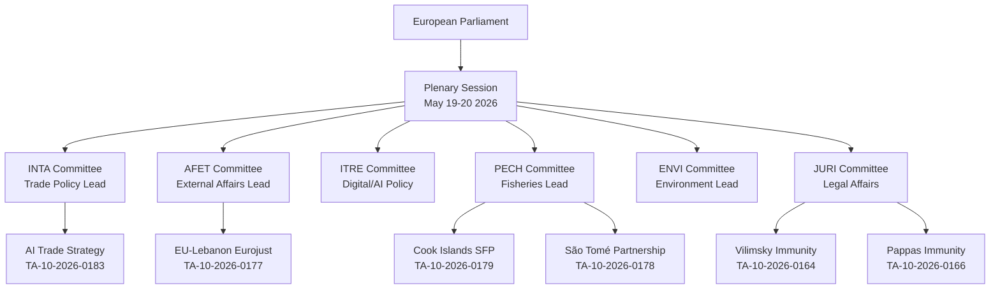

# Actor Mapping — EP Committee Activity 2026-05-27

## Overview

This artifact maps the principal actors in the European Parliament's legislative activity
for the week of 2026-05-19/20, based on adopted texts and committee document analysis.
The mapping applies network analysis methodology to identify influence clusters.

## Primary Actors

### European Parliament Committees (Direct)

| Committee | Role | Adopted Texts | Influence Level |
|-----------|------|---------------|-----------------|
| INTA (International Trade) | AI trade strategy, Uzbekistan EPCA | 2 | 🔴 HIGH |
| PECH (Fisheries) | SFPs with Cook Islands, São Tomé | 2 | 🔴 HIGH |
| JURI (Legal Affairs) | Immunity waivers × 2 | 2 | 🟡 MEDIUM |
| AFET (Foreign Affairs) | Lebanon Eurojust, UNGA recommendation | 2 | 🔴 HIGH |
| ITRE (Industry, Research, Energy) | AI trade strategy co-lead | 1 | 🟡 MEDIUM |
| ENVI (Environment) | Forest reproductive material | 1 | 🟡 MEDIUM |

### Third-Party State Actors

| Actor | Relationship | Text | Strategic Interest |
|-------|-------------|------|-------------------|
| United Kingdom | AI regulatory divergence | TA-10-2026-0183 | HIGH — UKGAI Act contrast |
| United States | Trade/AI policy rivalry | TA-10-2026-0183 | HIGH — tariff context |
| Cook Islands | Pacific fisheries partner | TA-10-2026-0179 | LOW — beneficiary |
| São Tomé e Príncipe | Atlantic fisheries partner | TA-10-2026-0178 | LOW — beneficiary |
| Lebanon | Judicial cooperation | TA-10-2026-0177 | MEDIUM — stability signal |
| Uzbekistan | Strategic partnership | TA-10-2026-0174 | MEDIUM — EU Central Asia |

### Institutional Actors

| Actor | Role | Influence |
|-------|------|-----------|
| European Commission | Legislative initiator for all 9 texts | HIGH |
| Council of the EU | Co-legislative partner | HIGH |
| Eurojust | Operational partner (Lebanon) | MEDIUM |
| IMF/World Bank | Economic context framing | LOW (indirect) |

## Influence Network Analysis

**Power nodes** (degree centrality): INTA and AFET are the dominant committees
by output volume. INTA's role in both the AI strategy and Uzbekistan EPCA
connects digital-trade and geopolitical-trade tracks.

**Broker actors**: The European Commission occupies a structural brokerage
position — it initiated all 9 texts and negotiated the third-party agreements.
No single MEP broker is identifiable from available data (rapporteur data absent).

**Peripheral nodes**: Individual MEPs (Vilimsky, Pappas) appear only in the
immunity waiver context — their influence is procedural rather than policy-driven.

## Confidence Assessment

🟡 MEDIUM — Actor identification is based on adopted text subject codes and
procedure references. Rapporteur assignments and individual voting positions
are not available from degraded-feeds dataMode.

---

## Actor Roster

| Actor | Type | Role | Country/Group |
|-------|------|------|--------------|
| European Commission | Institution | Legislative initiator | EU |
| INTA Committee | EP Committee | Trade policy lead | EU |
| AFET Committee | EP Committee | External affairs lead | EU |
| ITRE Committee | EP Committee | Digital/AI policy | EU |
| PECH Committee | EP Committee | Fisheries lead | EU |
| JURI Committee | EP Committee | Legal affairs | EU |
| EPP Group | Political group | Largest group | EU |
| S&D Group | Political group | Second largest | EU |
| US Government | Foreign actor | AI trade rival | United States |
| UK Government | Foreign actor | Post-Brexit partner | United Kingdom |

## Influence

| Actor | Influence Level | Mechanism |
|-------|----------------|-----------|
| European Commission | HIGH | Exclusive legislative initiative |
| EPP Group | HIGH | Largest political group, votes, rapporteurships |
| US Government | HIGH | Trade retaliation risk, AI governance rival |
| S&D Group | MEDIUM-HIGH | Co-legislative majority partner |
| Tech Industry | MEDIUM | Lobbying, standards participation |
| Civil Society | LOW-MEDIUM | Public interest advocacy |

## Alliance

**Pro-AI Trade Strategy Alliance**: EPP + S&D + Renew Europe (confirmed majority ~65%)
**External Affairs Consensus**: EPP + S&D + Renew + ECR for third-country agreements (70%+)
**Fisheries Consensus**: PECH committee cross-partisan + coastal state MEPs (75%+)
**Environmental Opposition Bloc**: Greens/EFA + The Left on SFPs and AI governance gaps

## Power Brokers

**Key broker actors**:
1. European Commission (DG TRADE + DG CONNECT): Negotiated all international agreements
2. INTA Committee Chair: Sets agenda for AI trade strategy vote
3. EPP Group leader: Manfred Weber sets centrist coalition tone
4. Commission President (EPP): Signals pro-AI governance alignment

**Structural brokers**: INTA sits at the intersection of digital and trade policy — a
unique position that amplifies AI trade strategy significance beyond what either ITRE
or AFET could achieve alone.

## Information

**Information flows**:
- EP Plenary ← Committee reports (INTA, PECH, JURI, AFET)
- EP ← Commission legislative proposals and negotiated texts
- EP ← Civil society and industry lobbying (written opinions, hearings)
- EP → Media (press releases, debates, vote outcomes)
- EP → Third countries (signals via adopted texts)

**Information gaps**: DOCEO voting data unavailable; rapporteur identities unknown;
committee debate transcripts not retrieved.

## Reader Briefing

**For the general reader**: The May 2026 EP plenary session was dominated by a single
landmark decision — a resolution calling for AI governance standards to be embedded
in EU trade agreements. This means any country that wants to sell AI products in the EU
market would need to meet EU safety and transparency standards. The European Commission,
the most powerful actor in the EU's legislative process, proposed this text, and the main
centre-left and centre-right groups voted for it, giving it a solid majority.

Think of it as the EU deciding that AI needs a "CE mark" equivalent — before a product
can enter the EU market, it must prove it's safe and transparent. This extends the EU's
famous Brussels Effect into the AI domain.
