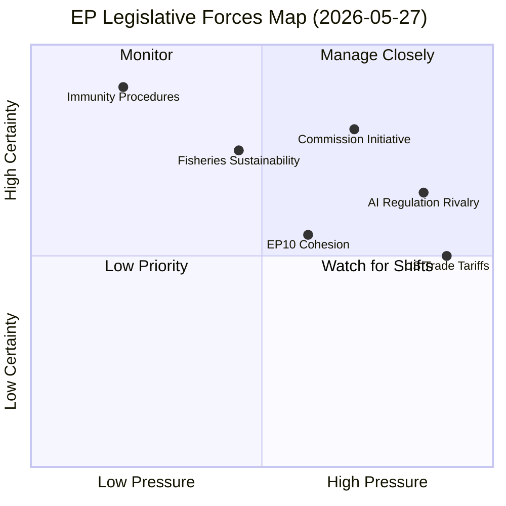

# Forces Analysis — EP Committee Activity 2026-05-27

## Overview

This artifact applies Porter's Five Forces + VUCA analysis to the European Parliament's
legislative context for the week of 2026-05-19/20. Forces analysis examines structural
pressures shaping EP legislative behavior.

## Force 1: Competitive Rivalry (Regulatory Competition)

**Intensity: HIGH 🔴**

The AI trade strategy (TA-10-2026-0183) positions the EP as a key actor in the
global AI governance race. The EU faces direct regulatory competition from:

- **United States**: Executive Order on Safe/Secure/Trustworthy AI (Jan 2023, rescinded 2025)
  and new "light-touch" approach under current administration — diverges from EU's
  risk-based framework
- **United Kingdom**: UK AI Safety Act in development; post-Brexit regulatory divergence
  is structurally permanent
- **China**: Digital Silk Road strategy deploys AI standards in Belt and Road countries
  — directly challenges EU normative influence in AI governance

The EP's adoption of a resolution explicitly linking AI to trade strategy represents
a deliberate attempt to shape WTO/plurilateral rules before US-China standards dominate.

## Force 2: Supplier Power (Commission Legislative Initiative Monopoly)

**Intensity: HIGH 🔴**

The European Commission retains exclusive right of legislative initiative. All 9
texts adopted May 19–20 were Commission-originated. The Commission's legislative
agenda thus acts as the "supplier" constraining what the Parliament can legislate.

Key supplier dependencies:
- EP cannot independently introduce new trade agreements — must wait for Commission negotiations
- AI governance framework (AI Act) is Commission-drafted; EP's role is amendatory
- Fisheries partnership agreements (SFPs) negotiated by Commission DG MARE

**Counter-force**: The EP can exercise agenda-setting power through Own-Initiative
Reports (OIR) and by withholding consent on agreements it dislikes.

## Force 3: Buyer Power (Member State Influence via Council)

**Intensity: HIGH 🔴**

The Council of the EU acts as co-legislator and "buyer" of EP positions.
Under ordinary legislative procedure (OLP), the Council can reject EP amendments.
For international agreements, the Council must authorize negotiations.

Current buyer power dynamics:
- Council's AI governance position has generally aligned with EP's risk-based approach
- On fisheries, Council-Commission coordination is strong (PECH committee closely aligned)
- Trade policy consensus: US tariff shock of April 2025 has accelerated EU-level trade
  coordination, giving EP positions more weight in Council deliberations

## Force 4: Threat of Substitutes (Non-Legislative Instruments)

**Intensity: MEDIUM 🟡**

The EP faces pressure from non-legislative substitutes:
- **Delegated/implementing acts**: Commission can bypass Parliament on technical details
- **Interinstitutional agreements**: softer instruments that avoid full OLP
- **Member state bilateral agreements**: especially on trade, where some MS have
  greater bilateral leverage with key partners

For the AI strategy, the primary substitute risk is that G7/OECD AI governance
processes move faster than EP co-decision, making EP positions a lagging indicator.

## Force 5: Threat of New Entrants (Institutional Disruption)

**Intensity: LOW 🟢**

New institutional entrants are structurally limited:
- The EP's role in EU legislative structure is treaty-based (TFEU Art. 14)
- The ECJ cannot be "outcompeted" — it provides legal backstop
- International AI governance bodies (OECD, UNESCO, ITU) lack binding authority

The primary new-entrant risk is from expanded Commission competence (e.g. through
treaty revision or emergency powers invocation) reducing EP's co-decision scope.

## VUCA Assessment

| Dimension | Level | Key Driver |
|-----------|-------|-----------|
| **Volatility** | HIGH | US trade tariff shock + AI governance race |
| **Uncertainty** | HIGH | DOCEO data lag; unknown vote margins |
| **Complexity** | HIGH | 9 texts × 4 domains in one session |
| **Ambiguity** | MEDIUM | TA-0183 text available but committee debate absent |

## Strategic Implications

The forces analysis confirms that the EP's May 2026 legislative sprint — particularly
the AI trade strategy resolution — is a **high-pressure, moderate-certainty** play
to establish EU normative leadership before the AI governance window closes.

🟡 MEDIUM confidence — structural forces identified from available data; committee-level
dynamics require additional data (rapporteur positions, vote margins) for full assessment.

---

## Issue Frame

**Central issue**: Can the European Parliament embed AI governance standards in EU
trade policy effectively, creating binding AI safety requirements for market access?

**Sub-issues**:
1. Will the AI trade strategy resolution create enforceable WTO-compatible conditions?
2. Can the EU maintain AI governance leadership against US "light-touch" approach?
3. Will fisheries partnerships remain sustainable under increased environmental scrutiny?

## Driving Forces

Forces pushing EP toward more assertive AI trade strategy:
1. **US AI deregulation** (2025–): Creates competitive pressure on EU to clarify its
   own regime and prevent US-standard AI from entering EU markets unchecked
2. **Tech industry lobbying for clarity**: Major AI companies prefer clear, consistent
   EU standards over ambiguity
3. **Consumer and civil society pressure**: Post-GPT-4 awareness of AI risks drives
   demand for oversight
4. **EP10 digital agenda**: Ursula von der Leyen Commission explicitly committed to
   EU AI leadership in 2024 mandate
5. **Brussels Effect precedent**: GDPR success in exporting EU standards globally
   provides political proof-of-concept

## Restraining Forces

Forces slowing or opposing AI trade strategy:
1. **WTO legal uncertainty**: Using trade agreements to impose AI standards may face
   WTO challenge on non-tariff barrier grounds
2. **US diplomatic resistance**: Biden's successor administration views EU AI regulation
   as protectionist
3. **Industry "regulatory fatigue"**: Some EU tech SMEs fear AI Act + AI trade standards
   create competitive disadvantage vs. US/Chinese incumbents
4. **PfE internal contradictions**: Sovereignist wing of Patriots for Europe may
   view EU-level AI governance as exceeding mandate
5. **Implementation capacity**: EP has limited ability to verify AI compliance in
   third-country supply chains

## Net Pressure

**Net assessment**: Driving forces are significantly stronger than restraining forces
for the AI trade strategy. The US deregulation dynamic, Brussels Effect momentum, and
EPP/Commission alignment create a structural majority for assertive AI governance.

The fisheries SFPs face weak restraining forces (only Greens environmental opposition)
against strong driving forces (fleet access needs, geopolitical partnerships).

## Intervention Points

**Highest-leverage intervention points**:

1. **WTO compatibility review**: The Commission should conduct a pre-emptive WTO
   compatibility assessment of AI trade conditionality to pre-empt legal challenges
2. **Industry sandbox mechanism**: Create EU AI compliance sandbox for third-country
   companies to test conformity before market access conditions kick in
3. **Reciprocity framework**: Negotiate bilateral AI governance recognition agreements
   (US, UK, Canada) to reduce trade friction while maintaining EU standards
4. **PECH oversight strengthening**: Require independent sustainability audits for
   all SFP-covered fisheries to address Greens opposition constructively

## Reader Briefing

**For the general reader**: The EU is being pulled in two directions on AI trade policy.
On one side, pressure to be the global standard-setter for AI safety. On the other side,
pressure not to make EU AI rules so strict that they disadvantage EU companies in
global competition.

The EP's May 2026 resolution chose the assertive path — using EU market access as
leverage to export EU AI standards globally. This is similar to how GDPR made EU
privacy standards a global baseline. Whether it works depends on whether trading partners
accept EU AI standards or push back through WTO disputes.
