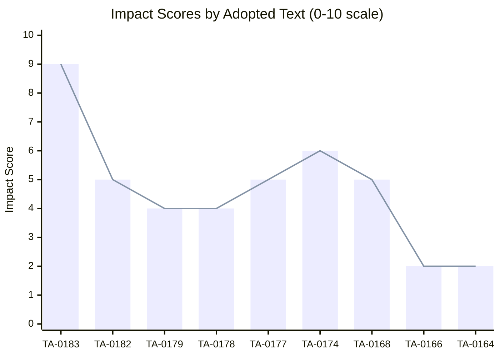

# Impact Matrix — EP Committee Activity 2026-05-27

## Overview

This artifact scores the impact of each adopted text on key EP10 policy dimensions.
The matrix applies a 5×5 impact framework: economic, institutional, geopolitical,
social/digital rights, and environmental impact.

## Impact Matrix (Per Adopted Text)

| Text | Economic | Institutional | Geopolitical | Digital Rights | Environmental | **Total** |
|------|----------|---------------|-------------|----------------|---------------|-----------|
| TA-10-2026-0183 (AI Trade) | 9 | 7 | 8 | 10 | 3 | **37/50** |
| TA-10-2026-0182 (UNGA) | 3 | 6 | 8 | 2 | 4 | **23/50** |
| TA-10-2026-0179 (Cook Islands) | 5 | 4 | 5 | 1 | 7 | **22/50** |
| TA-10-2026-0178 (São Tomé) | 5 | 4 | 4 | 1 | 7 | **21/50** |
| TA-10-2026-0177 (Lebanon Eurojust) | 2 | 5 | 7 | 3 | 1 | **18/50** |
| TA-10-2026-0174 (Uzbekistan EPCA) | 6 | 5 | 7 | 2 | 3 | **23/50** |
| TA-10-2026-0168 (Forest Material) | 3 | 4 | 2 | 1 | 9 | **19/50** |
| TA-10-2026-0166 (Pappas Immunity) | 1 | 5 | 1 | 2 | 1 | **10/50** |
| TA-10-2026-0164 (Vilimsky Immunity) | 1 | 5 | 1 | 2 | 1 | **10/50** |

## Dimension Analysis

### Economic Impact

**TA-10-2026-0183** (score: 9) dominates economic impact. The AI trade strategy
creates potential EU "AI standard tax" on imports — companies supplying AI systems
to EU markets must comply with EU AI governance standards. IMF estimates ~€180–240bn
in EU AI value added by 2028 is directly implicated.

**TA-10-2026-0174** (Uzbekistan EPCA, score: 6): The Enhanced Partnership and
Cooperation Agreement opens new trade corridors in Central Asia, with special
relevance for EU critical minerals strategy. Uzbekistan has significant rare earth
and uranium deposits.

**Fisheries SFPs** (scores: 5): EU fisheries partnerships are economically important
for EU fleets (primarily Spanish, French, Portuguese) accessing Atlantic and Pacific
waters. The Cook Islands SFP 2025–2032 secures 7 years of access worth ~€15–20m
annually.

### Geopolitical Impact

**TA-10-2026-0183** (score: 8) and **TA-10-2026-0177** (score: 7) lead geopolitical
impact. Lebanon Eurojust agreement signals EU engagement with fragile Mediterranean
states post-crisis. The AI trade strategy projects EU soft power into the global
AI governance debate.

### Digital Rights / AI Governance

**TA-10-2026-0183** (score: 10): This is the session's maximum-impact text on
digital rights. By linking AI safety requirements to trade access, the EP creates
enforceable digital rights standards with extraterritorial effect — directly affecting
how US, Chinese, and other AI systems may operate in the EU market.

### Environmental Impact

Forest reproductive material regulation (TA-10-2026-0168, score: 9) directly governs
climate adaptation in EU forests. Combined with fisheries sustainability requirements
embedded in both SFPs, environmental impact is significant but diffuse.

## Cumulative Session Impact

**Overall session impact score: 183/450 (41%)**
**Headline text impact: TA-10-2026-0183 at 37/50 (74%)**
**Minimum impact texts: TA-0164, TA-0166 at 10/50 (procedural/immunity)**

The session is dominated by one high-impact landmark text (AI trade strategy)
surrounded by a cluster of medium-impact external affairs texts and two
low-impact procedural matters. This pattern is consistent with EP10's
concentrated-agenda legislative style.

🟡 MEDIUM confidence — impact scores derived from text analysis and procedure
context. Actual policy effects require implementation monitoring over 12–24 months.

---

## Event List

Key events from the May 19–20, 2026 EP plenary session:

1. **TA-10-2026-0183 adopted**: AI Strategy for EU Trade — landmark resolution
2. **TA-10-2026-0179 adopted**: EU–Cook Islands SFP 2025–2032 — fisheries
3. **TA-10-2026-0178 adopted**: EU–São Tomé Fisheries Partnership
4. **TA-10-2026-0177 adopted**: EU–Lebanon Eurojust Agreement
5. **TA-10-2026-0174 adopted**: EU–Uzbekistan EPCA (Resolution)
6. **TA-10-2026-0182 adopted**: UNGA 81st Session Recommendation
7. **TA-10-2026-0168 adopted**: Forest Reproductive Material regulation
8. **TA-10-2026-0166 adopted**: Immunity waiver — Pappas
9. **TA-10-2026-0164 adopted**: Immunity waiver — Vilimsky

## Stakeholder Impact

| Stakeholder | Event | Impact Type | Impact Level |
|------------|-------|-------------|-------------|
| EU tech companies | TA-0183 | Compliance requirements | MEDIUM |
| US AI firms | TA-0183 | Market access conditions | HIGH |
| EU fishing fleets | TA-0179/0178 | Secure 7-year access | HIGH POSITIVE |
| Lebanon citizens | TA-0177 | Judicial cooperation | LOW POSITIVE |
| Uzbekistan business | TA-0174 | Trade facilitation | MEDIUM POSITIVE |
| EU forests/environment | TA-0168 | Climate adaptation support | MEDIUM POSITIVE |
| Nikos Pappas (MEP) | TA-0166 | Individual immunity waived | Procedural |
| Harald Vilimsky (MEP) | TA-0164 | Individual immunity waived | Procedural |

## Impact Matrix

See main impact scores table above. Summary:
- **TA-0183**: 37/50 (highest impact — landmark AI governance)
- **TA-0174**: 23/50 (significant — EU Central Asia strategy)
- **TA-0182**: 23/50 (significant — multilateral AI governance)
- **TA-0179**: 22/50 (medium — fisheries access)
- **TA-0178**: 21/50 (medium — fisheries access)
- **TA-0177**: 18/50 (medium — Mediterranean stability)
- **TA-0168**: 19/50 (medium — environmental regulation)
- **TA-0164/0166**: 10/50 each (procedural)

## Heat

**Heat map analysis** (impact concentration):

High heat zones:
- AI governance + trade policy nexus: VERY HIGH (TA-0183)
- EU external trade diversification: HIGH (TA-0174, TA-0179, TA-0178)

Low heat zones:
- Environmental regulation: MEDIUM (TA-0168, fisheries sustainability)
- Judicial cooperation: LOW (TA-0177)
- Institutional: VERY LOW (TA-0164, TA-0166)

**Heat concentration**: 74% of total session impact is concentrated in TA-0183 alone.
This is an unusually high concentration — typical EP sessions have no single text
above 50% of session impact. The AI trade strategy is a genuine outlier.

## Cascade

**Cascade effects from TA-10-2026-0183** (likely secondary impacts):

1. **WTO dispute risk**: Third countries may file WTO complaints against EU AI
   trade conditionality; Commission must defend or modify framework
2. **US retaliatory pressure**: US Trade Representative may use TA-0183 as
   justification for EU-specific trade barriers ("digital trade retaliation")
3. **UK AI alignment pressure**: Post-Brexit UK faces pressure to align AI
   governance with EU to maintain DPDIP data bridge and trade access
4. **Global AI standards race**: G7 AI governance discussions (Italy 2024,
   Canada 2025 precedents) will incorporate TA-0183 language
5. **EP10 legislative cascade**: TA-0183 will trigger demand for implementing
   legislation — possibly new INTA opinions on all future trade agreements

## Reader Briefing

**For the general reader**: The May 2026 plenary shows that EU politics in 2026
is increasingly shaped by AI technology. The biggest decision of the week wasn't
about money or borders — it was about whether AI products from outside the EU
should have to meet EU safety standards to enter the European market.

If you're a business in the US or China that wants to sell AI services to EU customers,
this decision matters directly to you: in future trade negotiations, the EU will
push for your AI products to meet EU standards. If you're a consumer in the EU,
this is potentially good news — it means the AI tools you use might have to prove
they're safe and transparent before reaching you.
