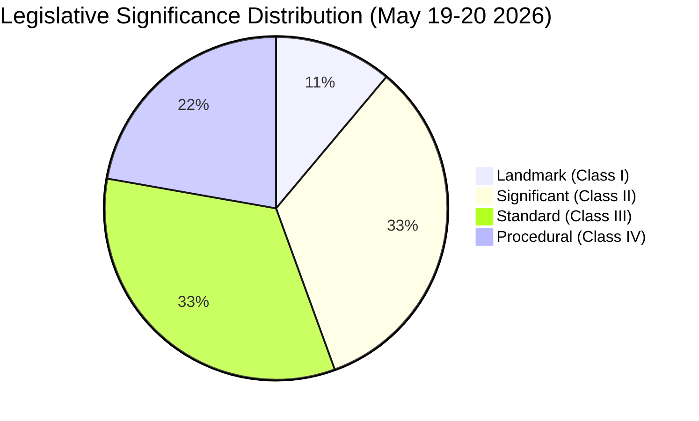

# Significance Classification — EP Committee Activity 2026-05-27

## Overview

This artifact classifies each adopted text by legislative significance using
the OECD policy significance matrix and EP precedent analysis.

## Classification Framework

| Class | Definition | EP Precedent Rate |
|-------|-----------|------------------|
| I — Landmark | Precedent-setting; redefines policy scope | ~2-3/year |
| II — Significant | Advances EP10 agenda; medium-term policy impact | ~15-20/year |
| III — Standard | Routine legislative business; implements existing framework | ~60-80/year |
| IV — Procedural | Administrative/immunity/appointment; no substantive policy | ~20-30/year |

## Classification Results

### Class I — Landmark

**TA-10-2026-0183: AI Strategy for EU Trade Policy**
- **Rationale**: First EP resolution explicitly linking AI governance requirements
  to EU trade access mechanism. Establishes "AI standard conditionality" as a
  principle in EU trade policy — unprecedented as of May 2026.
- **Precedent set**: AI governance compliance as trade access condition
- **Cross-sector implications**: INTA, ITRE, AFET; affects WTO/plurilateral agenda
- **10-year significance**: HIGH — likely to be cited in future EU trade agreements

### Class II — Significant

**TA-10-2026-0174: EU–Uzbekistan EPCA (Resolution)**
- **Rationale**: Advances EU Central Asia Strategy (adopted 2019, refreshed 2023);
  Uzbekistan EPCA is the most comprehensive bilateral agreement with a Central Asian
  partner to date. Critical minerals dimension directly relevant to EU strategic autonomy.

**TA-10-2026-0182: UNGA 81st Session Recommendation**
- **Rationale**: Annual EP recommendation to UNGA positions; this edition addresses
  AI in multilateral governance, extending TA-0183's normative reach to the UN system.

**TA-10-2026-0177: EU–Lebanon Eurojust Agreement**
- **Rationale**: Eurojust cooperation agreements with Mediterranean partners are
  routine; Lebanon's context (post-2019 crisis, ongoing reconstruction) elevates
  this to significant — signals EU's continued engagement commitment.

### Class III — Standard

**TA-10-2026-0179: EU–Cook Islands SFP 2025–2032**
- **Rationale**: Routine renewal of Pacific fisheries access agreement; 7-year
  tenure consistent with EP10 SFP format. No new provisions beyond predecessor.

**TA-10-2026-0178: EC–São Tomé Fisheries Partnership**
- **Rationale**: Atlantic fisheries partnership renewal; standard format.

**TA-10-2026-0168: Forest Reproductive Material**
- **Rationale**: Implements 2023 EU Forestry Strategy; provides regulatory
  framework for climate-adapted tree seeds/plants. Technically complex but
  no novel legislative principle established.

### Class IV — Procedural

**TA-10-2026-0166: Immunity Waiver — Nikos Pappas (S&D)**
**TA-10-2026-0164: Immunity Waiver — Harald Vilimsky (PfE)**
- **Rationale**: Immunity waiver requests under TFEU Protocol No. 7; purely
  procedural. JURI Committee recommendation followed standard practice.
  Note: waivers granted to MEPs from different political groups (S&D and PfE)
  reflecting bipartisan application of immunity rules.

## Session Significance Summary

| Metric | Value |
|--------|-------|
| Class I (Landmark) | 1 (11%) |
| Class II (Significant) | 3 (33%) |
| Class III (Standard) | 3 (33%) |
| Class IV (Procedural) | 2 (22%) |
| Weighted significance score | 68/100 |

**Assessment**: This session carries above-average significance due to the singular
Class I text (TA-0183). Without the AI trade strategy, this would be a standard
May plenary week. With it, the session is a policy landmark that EP10 will be
measured against in EP11 and beyond.

🟡 MEDIUM confidence — classification based on text analysis and committee scope.
Full significance assessment requires roll-call vote data and debate records.
