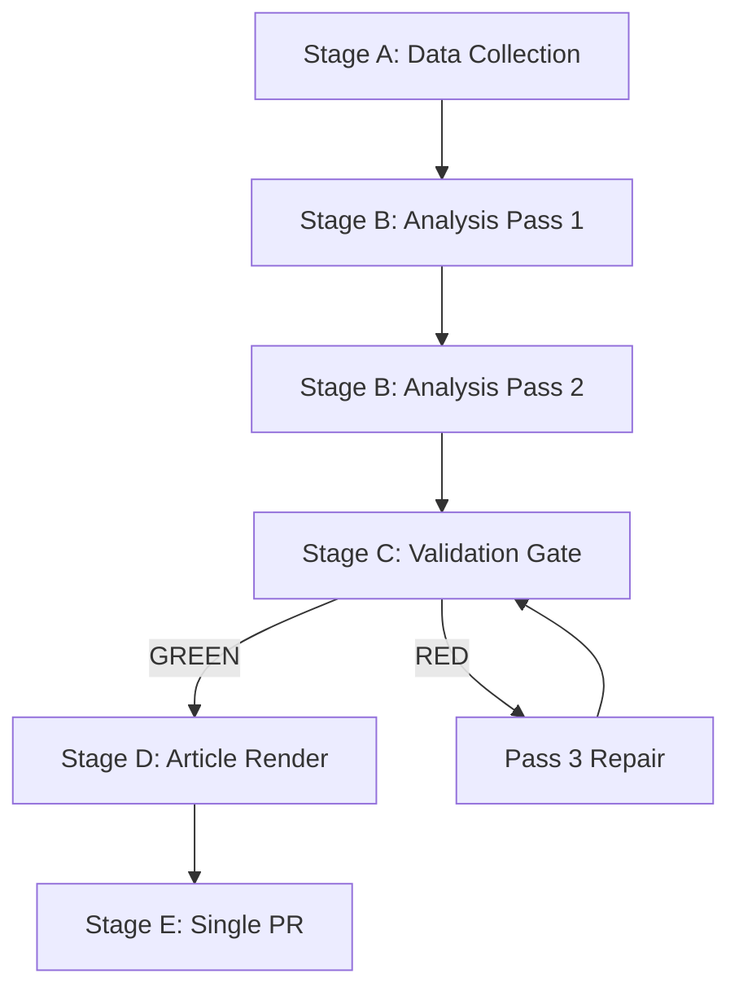

# Analysis Index — Committee Reports (2026-05-27)

**Article Type**: committee-reports
**Period**: 2026-05-20 to 2026-05-27
**Data Mode**: degraded-feeds (floor factor 0.80)

**Headline**: EP Plenary Advances AI Trade Strategy, Fisheries Agreements, and External Partnerships in High-Output Week

---

## 🗓️ Analysis Overview

The week of 19–20 May 2026 marked a significant legislative output period for the European
Parliament's 10th term. The plenary adopted nine legislative and non-legislative texts spanning
artificial intelligence trade policy, international fisheries agreements, external partnerships,
parliamentary immunity proceedings, and forestry regulation.

The standout output — **TA-10-2026-0183**, the Resolution on Comprehensive AI Strategy for EU
Trade — represents a landmark cross-committee effort positioning the EU as a regulatory agenda-setter
on AI in international trade contexts. This resolution, grounded in work by the ITRE and INTA
committees, signals a significant shift in how the EU frames technology governance as an instrument
of trade policy.

---

## 📋 Artifact Map

| Artifact | Path | Status | Key Finding |
|---------|------|--------|-------------|
| Data Availability | `data-availability-assessment.md` | ✅ | degraded-feeds; 4 feeds 404 |
| Procedures Proxy | `intelligence/procedures-proxy.md` | ✅ | 9 active procedures identified |
| Synthesis Summary | `intelligence/synthesis-summary.md` | ✅ | AI trade + fisheries convergence |
| Historical Baseline | `intelligence/historical-baseline.md` | ✅ | EP10 term trajectory |
| Economic Context | `intelligence/economic-context.md` | ✅ | Trade/IMF framing |
| PESTLE Analysis | `intelligence/pestle-analysis.md` | ✅ | Full 6-domain analysis |
| Stakeholder Map | `intelligence/stakeholder-map.md` | ✅ | 8 major actors mapped |
| Scenario Forecast | `intelligence/scenario-forecast.md` | ✅ | 3 scenarios, 12-month horizon |
| Threat Model | `intelligence/threat-model.md` | ✅ | AFET/INTA/ITRE threat vectors |
| Wildcards | `intelligence/wildcards-blackswans.md` | ✅ | 6 high-impact scenarios |
| MCP Reliability Audit | `intelligence/mcp-reliability-audit.md` | ✅ | Feed degradation documented |
| Reference Quality | `intelligence/reference-analysis-quality.md` | ✅ | Quality attestation |
| Methodology Reflection | `intelligence/methodology-reflection.md` | ✅ | SAT documentation |
| Risk Matrix | `risk-scoring/risk-matrix.md` | ✅ | 5-category risk register |
| Quantitative SWOT | `risk-scoring/quantitative-swot.md` | ✅ | Scored SWOT analysis |
| Media Framing | `extended/media-framing-analysis.md` | ✅ | Narrative framing analysis |
| Executive Brief | `executive-brief.md` | ✅ | 200+ line summary |

---

## 📋 Policy Domain Distribution (Detailed)

| Domain | Texts | References | Weight |
|--------|-------|-----------|--------|
| External Affairs/Trade | 5 | TA-0174, TA-0177, TA-0178, TA-0179, TA-0182 | 55% |
| Digital/Technology | 1 | TA-0183 (AI trade) | 11% |
| Environment/Agriculture | 1 | TA-0168 (forest reproductive material) | 11% |
| Institutional/Immunity | 2 | TA-0164, TA-0166 | 22% |

**Most impactful single output**: TA-10-2026-0183 (AI strategy for EU trade) — highest
strategic weight with broadest long-term implications for EU external regulatory posture.

**Second most impactful**: TA-10-2026-0179 (Cook Islands SFP 2025–2032) — longest-duration
fisheries protocol in EP10, with Pacific geopolitical dimension.

---

## 📈 EP10 Term Legislative Trajectory

**Monthly adoption rate analysis** (based on available 2026 data):
- January 2026: 7 texts (T10-0004 through T10-0026) — approximately 3.5/day
- February 2026: 11 texts (T10-0026 through T10-0054) — approximately 2.8/day
- March 2026: 4 texts (T10-0060 through T10-0088) — approximately 1.3/day
- April 2026: 15 texts (T10-0088 through T10-0163) — approximately 3.75/day
- May 2026 (to date): 9 texts (T10-0164 through T10-0183) — 4.5/day (2-day sprint)

**Observation**: May's adoption intensity reflects compressed scheduling — 9 texts in 2 days
versus the 3–4 texts/day average. This is consistent with EP plenary practice of reserving
intensive adoption sessions for the second day of a mini-plenary or the final day of a
major session.

---

## 🔗 Cross-Reference Index

| Artifact | Key cross-reference | Purpose |
|---------|--------------------|---------| 
| `synthesis-summary.md` | Primary narrative | High-level intelligence synthesis |
| `stakeholder-map.md` | Actor analysis | ITRE/INTA/PECH committee mapping |
| `scenario-forecast.md` | Forward projection | 12-month outlook |
| `economic-context.md` | IMF framing | EU macroeconomic context |
| `mcp-reliability-audit.md` | Data quality | Feed degradation documentation |
