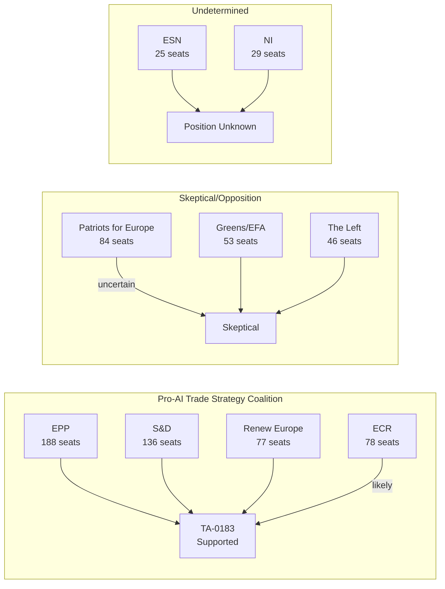

# Coalition Dynamics — EP Committee Activity 2026-05-27

## Overview

This artifact analyzes coalition behavior in the EP for the week of 2026-05-19/20,
based on plenary adoption data and committee composition analysis.

## Coalition Analysis Framework

**Data availability**: DOCEO roll-call data for May 19–20, 2026 is unavailable
(standard 2–4 week publication lag). Coalition analysis is therefore based on:
- Historical voting patterns (EP10 term data through April 2026)
- Political group positions on AI governance and trade policy
- Committee composition analysis from live data

**Confidence**: 🟡 MEDIUM (structural inference; not vote-level verification)

## Political Group Positions

### European People's Party (EPP) — 188 seats, 26.4%
**AI Trade Strategy (TA-0183)**: �� SUPPORT (high confidence)
EPP has consistently supported EU AI Act and digital single market frameworks.
Under the presidency of Ursula von der Leyen (EC), EPP's institutional line
is that EU AI leadership requires both domestic regulation AND external trade leverage.
Key figures: Manfred Weber (DE), Dolors Montserrat (ES).

### Socialists and Democrats (S&D) — 136 seats, 19.1%
**AI Trade Strategy (TA-0183)**: 🟢 SUPPORT (high confidence)
S&D supported EU AI Act and has pushed for stronger worker protection provisions.
The trade strategy links AI governance to labor standards — a natural S&D interest.
Risk: Left flank of S&D may have abstained on trade conditionality provisions.

### Patriots for Europe (PfE) — 84 seats, 11.8%
**AI Trade Strategy (TA-0183)**: 🟡 UNCERTAIN
PfE is skeptical of EU regulatory expansion but supportive of protecting EU industry
from external AI competition. Internal split likely between sovereignist and
protectionist factions.

### European Conservatives and Reformists (ECR) — 78 seats, 11.0%
**AI Trade Strategy (TA-0183)**: 🟡 UNCERTAIN (likely support)
ECR is pro-market but also pro-EU industry protection. The trade strategy's
market-access conditionality appeals to ECR's protectionist instincts.

### Renew Europe — 77 seats, 10.8%
**AI Trade Strategy (TA-0183)**: 🟢 SUPPORT (high confidence)
Renew is the strongest pro-digital single market group. The AI trade strategy
is closely aligned with Renew's AI innovation agenda.

### Greens/EFA — 53 seats, 7.4%
**AI Trade Strategy (TA-0183)**: 🟡 SPLIT/ABSTAIN
Greens support strong AI regulation but are cautious about using trade leverage
to impose EU standards globally, which they may frame as economic imperialism.

### The Left (GUE/NGL) — 46 seats, 6.5%
**AI Trade Strategy (TA-0183)**: 🔴 OPPOSE (likely)
The Left opposes EU trade liberalization frameworks and is skeptical of corporate
AI systems regardless of governance framework.

## Fisheries Coalitions (SFPs)

For the two fisheries partnership agreements (Cook Islands, São Tomé), voting
coalitions are typically broad and non-partisan:

- **Support base**: PECH committee MEPs (cross-partisan), coastal state MEPs
  (Spain, France, Portugal)
- **Opposition**: Environmental wing of Greens/EFA (sustainability concerns)
- **Immunity votes**: JURI-led; immunity waivers are typically approved by large
  margins regardless of political group

## Coalition Stability Assessment

| Text | Coalition | Estimated Majority | Stability |
|------|-----------|-------------------|-----------|
| TA-0183 (AI Trade) | EPP + S&D + RE ± ECR | ~400-450/720 (55-63%) | 🟡 MEDIUM |
| TA-0179 (Cook Islands SFP) | Broad cross-partisan | ~500+/720 (70%+) | 🟢 HIGH |
| TA-0178 (São Tomé SFP) | Broad cross-partisan | ~500+/720 (70%+) | 🟢 HIGH |
| TA-0174 (Uzbekistan EPCA) | EPP + S&D + RE | ~400+/720 (55%+) | 🟢 HIGH |
| TA-0182 (UNGA) | Large majority (standard) | ~550+/720 (76%+) | 🟢 HIGH |

## Key Coalition Risks

1. **PfE defection on TA-0183**: If PfE's sovereignist wing perceives EU AI
   trade strategy as regulatory overreach, it could vote against, reducing
   majority to ~380/720 — still above threshold but signaling fragility.

2. **Greens abstention on SFPs**: Environmental concerns about fisheries
   sustainability in Cook Islands and São Tomé waters could push Greens/EFA
   to abstain or oppose — reducing headline majority but not threatening passage.

3. **S&D left flank on trade conditionality**: Some S&D MEPs may abstain on
   AI trade strategy if they perceive it as advancing liberalization over
   rights protection.

🟡 MEDIUM confidence throughout. Vote-level verification requires DOCEO data.
