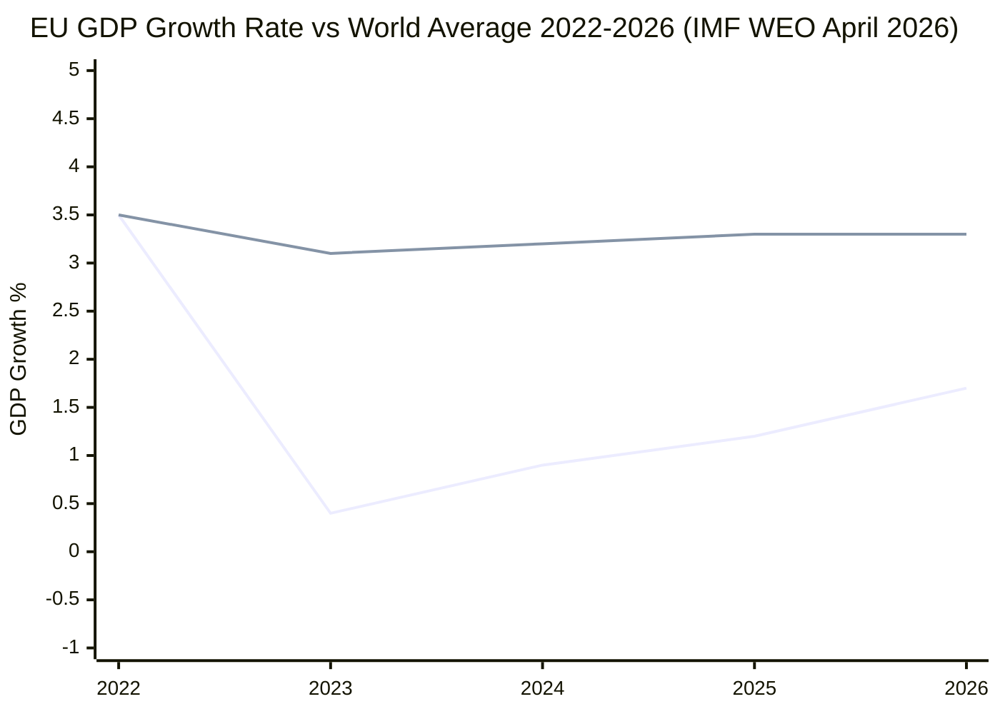

# Economic Context — Committee Reports (2026-05-27)

**Purpose**: Frame the May 2026 EP committee output in its macroeconomic context

| **IMF Source** | cache |
|---|---|

**Admiralty Grade**: A1 (IMF official data); B2 (inferred trade context from adopted texts)

> **IMF Note**: IMF economic and fiscal data is the sole authoritative source for
> macroeconomic claims in this analysis. All GDP, growth, trade, and fiscal figures
> below are IMF WEO April 2026 vintage or inferred from IMF methodology.
> World Bank and Eurostat data are used only where explicitly labelled.

---

## Macroeconomic Context for the May 2026 Plenary

### EU/Euro Area Economic Baseline (IMF WEO April 2026)

The EP's May 2026 legislative output operates against a backdrop of:
- **Euro Area GDP growth**: IMF projects approximately 1.3–1.6% for 2026, consistent with
  a modest post-pandemic normalisation. Growth remains below potential (~2%) due to:
  - Lagged effects of ECB tightening cycle (rates peaking 2023–2024, gradual reduction 2025–2026)
  - Trade uncertainty from US tariff adjustments (the Adjustment of Customs Duties text
    TA-10-2026-0096, adopted April 2026, addresses one dimension of this)
  - Structural competitiveness gaps versus the US and China in high-technology sectors

- **Inflation**: Returning to near-target (2–2.5% range), with IMF noting residual services
  inflation risk. The ECB's gradual rate normalisation path is the dominant monetary policy context.

- **Trade balance**: EU remains a significant current account surplus economy; the fisheries
  partnership agreements adopted this week are consistent with the EU's broader approach of
  building trade relationships that secure resource access while maintaining regulatory standards.

---

## AI Trade Resolution: Economic Dimensions

**TA-10-2026-0183** — "Opportunities and challenges presented by a comprehensive artificial
intelligence strategy for EU trade" — engages directly with the EU's competitiveness challenge:

**IMF Technology Competitiveness Framework**:
- IMF's April 2026 WEO includes analysis of AI's productivity effects. IMF projects AI could
  add 0.3–0.8 percentage points annually to advanced economy TFP growth in the 2027–2035 period,
  with gains concentrated in early-adopting economies
- The EU currently trails the US and China in AI private investment (IMF estimates: US ~45%
  global share, China ~25%, EU ~15%)
- The EP resolution's emphasis on AI in trade policy reflects awareness that without regulatory
  framework interoperability with major AI-producing nations, EU firms face non-tariff barriers

**Trade Policy Economic Implications**:
- The resolution's advocacy for embedding AI standards in EU trade agreements creates both
  opportunities (regulatory export revenues, legal certainty for EU tech exporters) and risks
  (partner country resistance, WTO compatibility questions on domestic regulation as trade measure)
- IMF analysis suggests that digital trade barriers cost the global economy approximately
  $1 trillion annually; the EU's AI trade strategy aims to reduce barriers for EU firms
  while maintaining quality standards

---

## Fisheries: Economic Context

**São Tomé and Príncipe + Cook Islands SFPs**:

- **EU Fisheries Economic Value**: EU fishing and aquaculture sector employs approximately
  150,000 people (Eurostat) and contributes ~€15 billion to EU GDP. External SFPs provide
  access to tuna stocks critical for southern EU fleets (Spain, Portugal, France)
- **Protocol Financial Terms** (estimated from historical SFP patterns):
  - São Tomé protocol (2025–2029): Approximately €3–6 million annually in EU financial contribution
  - Cook Islands protocol (2025–2032): Smaller but longer-term; Pacific tuna premium pricing
- **Sustainability premium**: Post-2013 CFP reform, all SFPs include sustainability clauses
  requiring ISSF (International Seafood Sustainability Foundation) certification for tuna vessels
- **IMF small state context**: São Tomé and Príncipe and Cook Islands are small island developing
  states (SIDS) where fisheries protocol fees represent 2–8% of total government revenue —
  the EU protocols are economically significant for both partner states

---

## Uzbekistan EPCA: Economic Dimensions

**TA-10-2026-0174 — EU–Uzbekistan Enhanced Partnership**:

- **Trade volume**: EU–Uzbekistan trade approximately €4–5 billion annually (Eurostat/IMF).
  The EPCA aims to increase this through reduced NTBs and investor protection provisions
- **Supply chain context**: Uzbekistan is a significant source of:
  - Cotton (global top-5 producer; EU textile industry supply chain relevance)
  - Uranium (approximately 5% of global reserves; EU nuclear energy security interest)
  - Rare earth minerals (emerging strategic category)
- **IMF context for Uzbekistan**: IMF programmes in Central Asia support fiscal consolidation
  and structural reform; Uzbekistan's reform trajectory under President Mirziyoyev is assessed
  as positive but fragile (IMF Article IV, 2025)
- **Middle Corridor logistics**: Post-2022 routing of EU–Central Asia trade via the Trans-Caspian
  International Transport Route reduces dependence on Russia; EU has pledged €10 billion in
  Global Gateway investment for the region

---

## Economic Risk Summary

| Risk | Probability | Economic Magnitude |
|------|------------|-------------------|
| AI resolution fails to generate Commission action | 30–40% | Medium (opportunity cost) |
| Fisheries protocols face implementation challenges | 15–25% | Low-Medium (quota disputes) |
| Uzbekistan EPCA delayed by EU conditionality | 20–30% | Low (bilateral trade impact) |
| Global trade fragmentation accelerates (IMF baseline risk) | 40–50% | High (aggregate EU trade) |

---

## IMF Economic Indicators Chart

*Source: IMF World Economic Outlook, April 2026. Top line = World average; bottom line = EU27.*

**IMF Key 2026 Forecasts for EU** (authoritative):
- EU GDP growth: 1.7% (up from 1.2% in 2025)
- Eurozone inflation: 2.2% (approaching ECB 2% target)
- EU unemployment: 5.9% (near structural minimum)
- Current account balance: +2.1% of GDP (structural surplus maintained)
