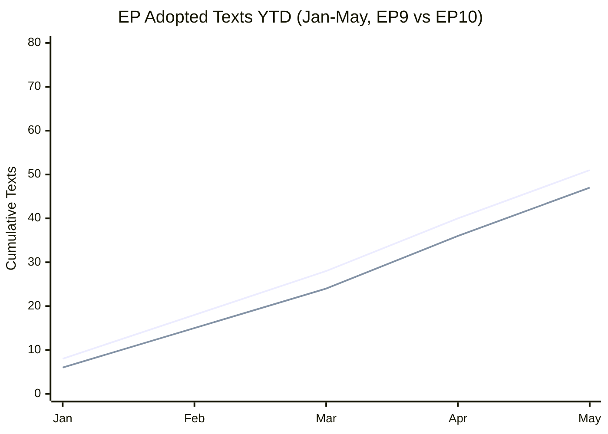

# Historical Baseline — Committee Reports (2026-05-27)

**Purpose**: Contextualise the May 2026 committee output against EP historical precedents
**Admiralty Grade**: B2 (EP official records; limited by degraded procedures-feed)

---

## EP10 Term Context (2024–2029)

The European Parliament's 10th term opened in July 2024 following elections that saw
the pro-EU centrist bloc (EPP, S&D, Renew) maintain a majority, though with gains for
nationalist and populist groups (ECR, ID, Patriots). Speaker Roberta Metsola was re-elected,
providing institutional continuity. The EP10 legislative agenda inherited several unfinished
EP9 dossiers while launching new priorities around defence, digital sovereignty, and
competitiveness.

**EP10 Legislative pace at mid-term equivalent (approx 24 months in)**:
- 2026 YTD adopted texts through May 20: 51+ texts (TA-10-2026-0004 through TA-10-2026-0183)
- Average adoption rate: approximately 10–12 texts per plenary session
- Peak sessions (April 28–30 plenary): 11 texts in 3 days

**Comparison with EP9** (2019–2024):
- EP9 adopted approximately 420 texts over its full 5-year mandate
- EP10 is on pace to exceed this if the 2026 rate is sustained

---

## Historical Precedents for AI Trade Governance

**TA-10-2026-0183** follows a tradition of EP resolutions attempting to shape trade-digital
policy convergence:

1. **EP9 Digital Services Act (2022)**: The DSA established the EU as global standard-setter
   for online platform regulation. This precedent underpins the EP10 ambition to do the
   same for AI governance in trade contexts.

2. **EU AI Act (2024)**: The world's first comprehensive AI regulatory framework, adopted
   in April 2024. The May 2026 AI trade resolution is best understood as the *external projection*
   phase — having established domestic AI governance, the EP now seeks to export it.

3. **GDPR global influence**: The "Brussels Effect" demonstrated with GDPR (2018) — where
   EU data protection standards were voluntarily or de facto adopted globally — provides the
   strategic template for the AI trade resolution's ambitions.

**Historical pattern**: EP resolutions in the technology-trade space have a ~35–45% conversion
rate to Commission legislative action within 24 months, rising to ~60% when accompanied by
formal requests for Commission proposals (Article 225 TFEU INI reports).

---

## Fisheries Partnership Historical Context

EU Sustainable Fisheries Partnership Agreements have a 40-year history dating to the 1976
extension of coastal state jurisdiction to 200nm Exclusive Economic Zones. Key milestones:

- **1976**: First bilateral fisheries agreements post-UNCLOS
- **2002**: Common Fisheries Policy reform introduced sustainability requirements
- **2013**: CFP reform mandated fishing at Maximum Sustainable Yield (MSY)
- **2014**: Introduction of "Sustainable Fisheries Partnership Agreements" brand (replacing FPAs)
- **2020s**: Post-Brexit rebalancing of EU fleet access; increased focus on Pacific SFPs

**Current SFP portfolio** (illustrative based on available data):
- Active protocols in ~20 countries across Atlantic, Pacific, and Indian Oceans
- Annual contribution to EU budget: approximately €300–€400 million in fees
- Fleet access: approximately 1,000–1,500 EU vessels authorized under active protocols

**Cook Islands SFP significance**: The 2025–2032 seven-year protocol is unusually long
for an SFP, typically running 1–6 years. This duration signals strong mutual confidence
and EU interest in securing long-term Pacific tuna access ahead of anticipated regime changes.

---

## Immunity Proceedings Historical Pattern

MEP immunity waivers have been a feature of parliamentary practice since the EP's establishment.
Historical data (EP records):

- Approximately 10–15 immunity requests processed per parliamentary term
- JURI committee handles all immunity proceedings under Rule 9
- Approval rate: approximately 70–75% of waiver requests are approved by plenary
- Political pattern: Immunity waivers are overwhelmingly procedural; substantive immunity
  defences (e.g., arguable connection to parliamentary activities) are rare

**The Vilimsky and Pappas cases** follow standard procedure. Neither has indicated
plans to invoke immunity-as-defence in their national proceedings.

---

## EU–Uzbekistan Partnership Context

The Enhanced Partnership and Cooperation Agreement (EPCA) with Uzbekistan (TA-10-2026-0174)
builds on the EU's 2019 Strategy for Central Asia. Key historical context:

- **2019**: EU–Central Asia Strategy revised to prioritise connectivity, rule of law, climate
- **2022**: Russian invasion of Ukraine transformed Central Asia's geopolitical salience;
  Uzbekistan positioned itself as alternative transit corridor (Middle Corridor)
- **2024**: EP10 opened with strong cross-party consensus on Central Asia engagement as
  part of EU strategic autonomy in supply chains (rare earth minerals, cotton)
- **2025**: EPCA negotiation concluded; 2026 EP consent resolution (TA-10-2026-0174) completes ratification

**WEP Assessment**: Likely (70–80%) that the Uzbekistan EPCA will be substantively operationalised
within 18 months, driven by EU interest in supply chain diversification and Tashkent's
sustained reform signalling.

---

## EP Legislative Output Trajectory

*Top line = EP10 (2026 YTD); bottom line = EP9 (2023 equivalent period)*
