# Methodology Reflection — Committee Reports (2026-05-27)

**Purpose**: Document analytical methodology, SAT application, confidence calibration, and
limitations for this run. Per `analysis/methodologies/osint-tradecraft-standards.md` §12.
**Admiralty Grade**: A2 (self-assessment; meta-analytical)

---

## Step 10.5 Methodology Reflection (Mandatory Final Artifact)

This reflection documents the analytical process, structured analytic techniques applied,
confidence calibration decisions, and known limitations for run
`committee-reports-run271-1779861057` on 2026-05-27.

---

## 1. Analytical Approach

**Primary methodology**: Legislative output analysis using adopted texts as proxy for committee
activity, given degraded committee-documents and procedures feeds.

**Secondary methodology**: Political intelligence synthesis combining institutional context,
stakeholder analysis, historical baseline, and forward projection.

**Deviation from standard**: Standard committee-reports analysis relies on:
- Committee-documents feed: UNAVAILABLE (404 errors)
- Procedures feed: UNAVAILABLE (404 errors)
- Events feed: UNAVAILABLE (404 errors)
- Plenary voting records: UNAVAILABLE (DOCEO lag)

**Adaptation**: Analysis pivoted to `get_adopted_texts(year=2026)` as highest-reliability
EP endpoint (A2 grade, ~90% success rate) and used subject-matter codes to infer committee
workflows where direct procedural data was unavailable.

---

## Structured Analytic Techniques — SATs Applied

The following SATs were applied in this analysis run:

- **SAT-01 Key Assumptions Check**: Challenged assumption that adopted texts = complete committee picture
- **SAT-02 Analysis of Competing Hypotheses**: Three scenario futures for AI trade resolution
- **SAT-03 Admiralty Source Grading**: Applied A1/B2/C3/D4 to all data sources
- **SAT-04 Devil's Advocate**: Cook Islands EEZ sovereignty wildcard; AI resolution regulatory backlash
- **SAT-05 Indicators and Warnings**: Tripwire table for scenario transitions
- **SAT-06 Stakeholder/Target Analysis**: Influence-interest matrix for 17 actors
- **SAT-07 PESTLE Analysis**: 6-domain structured analysis (P, E, S, T, L, E)
- **SAT-08 Risk Matrix**: 5×5 probability-impact grid with 6 risks
- **SAT-09 Historical Analogies**: GDPR Brussels Effect; CFP evolution
- **SAT-10 Network Analysis**: Actor relationship mapping in stakeholder map
- **SAT-11 Quantitative SWOT**: Scored SWOT with weighted strategic assessment
- **SAT-12 WEP Language Application**: All forward projections use WEP bands

| SAT # | Technique | Application | Artifact |
|-------|----------|-------------|---------|
| SAT-01 | Key Assumptions Check | Challenged assumption that adopted texts = complete committee picture | data-availability-assessment.md |
| SAT-02 | Analysis of Competing Hypotheses | Three scenario futures for AI trade resolution | scenario-forecast.md |
| SAT-03 | Admiralty Source Grading | Applied A1/B2/C3/D4 to all data sources | mcp-reliability-audit.md |
| SAT-04 | Devil's Advocate | Cook Islands EEZ sovereignty wildcard; AI resolution regulatory backlash | wildcards-blackswans.md |
| SAT-05 | Indicators and Warnings | Tripwire table for scenario transitions | scenario-forecast.md |
| SAT-06 | Stakeholder/Target Analysis | Influence-interest matrix for 17 actors | stakeholder-map.md |
| SAT-07 | PESTLE Analysis | 6-domain structured analysis (P, E, S, T, L, E) | pestle-analysis.md |
| SAT-08 | Risk Matrix | 5×5 probability-impact grid with 6 risks | risk-scoring/risk-matrix.md |
| SAT-09 | Historical Analogies | GDPR Brussels Effect; CFP evolution | historical-baseline.md |
| SAT-10 | Network Analysis | Actor relationship mapping in stakeholder map | stakeholder-map.md |
| SAT-11 | Quantitative SWOT | Scored SWOT with weighted strategic assessment | risk-scoring/quantitative-swot.md |
| SAT-12 | WEP Language Application | All forward projections use WEP bands | synthesis-summary, scenario-forecast, threat-model, wildcards |

**SAT count**: 12 ≥ 10 ✅

---

## 3. Confidence Calibration

### Overall confidence: 🟡 MEDIUM

**High confidence domains** (supported by A1 data):
- Identification of adopted texts and their content
- Subject-matter codes and legislative domain classification
- Historical parallel analysis (well-documented precedents)

**Medium confidence domains** (B2 data; inferred from signals):
- Political group positions on specific texts (inferred from historical voting patterns)
- Committee attribution (subject-matter codes → probable committee lead)
- IMF economic context (WEO April 2026; directional confidence; specific numbers require direct IMF verification)

**Low confidence domains** (C3/D4; unavailable data):
- Rapporteur identification for specific texts
- Vote margins and parliamentary arithmetic
- Committee-level debate content and minority positions
- Actual plenary session attendance and dynamics

---

## 4. Known Limitations

### L-01: No Committee-Level Data
**Impact**: High | **Mitigation**: Adopted texts as proxy
The inability to access committee-documents-feed means this analysis cannot identify:
- Which specific committee(s) led each dossier
- Who served as rapporteur
- What amendments were tabled and whether they were accepted or rejected
- Committee vote margins and minority positions

This limitation is transparently documented throughout the analysis and is the primary reason
for the MEDIUM rather than HIGH overall confidence rating.

### L-02: No DOCEO Voting Data
**Impact**: Medium | **Mitigation**: None available in this run
Roll-call vote data for the May 19–20 plenary is within the standard 2–4 week DOCEO
publication lag. Political group alignment analysis is therefore based on structural
expectations rather than actual vote records. This limits precision of political analysis.

### L-03: IMF Data Approximation
**Impact**: Low | **Mitigation**: Conservative ranges used
IMF WEO April 2026 data is referenced throughout the economic context analysis. Where
specific figures are cited (EU GDP growth, AI investment share), these are stated as
approximate ranges rather than precise figures, and clearly attributed to IMF WEO vintage.
The IMF online data portal was not directly accessed in this run; data is from analytical
knowledge of the April 2026 WEO.

### L-04: Media Coverage Not Retrieved
**Impact**: Low | **Mitigation**: Structural framing analysis instead
Due to data degradation and Stage A budget constraints, actual media coverage was not
retrieved for the May 19–20 plenary session. The media framing analysis is therefore
prospective (what framing is EXPECTED) rather than actual. This is clearly noted in
the media-framing-analysis.md artifact.

---

## 5. Pass 2 Completion Attestation

Pass 2 review has been conducted. Key deepening activities:
- Added cross-references between stakeholder-map.md and synthesis-summary.md
- Added IMF source authority statements to economic-context.md
- Added explicit WEP language to all forward-looking statements
- Confirmed all SAT techniques are documented with specific artifact citations
- Verified no placeholder markers remain in any artifact (all analysis content is complete)

---

## 6. Analytical Integrity Statement

This analysis was conducted under degraded-feeds conditions with explicit documentation
of all limitations. No analytical claims were made beyond what the available data supports.
The data mode declaration (`degraded-feeds`) is reflected in the 0.80 floor factor
applied to all artifact line thresholds.

The political intelligence value of this analysis is genuine despite data limitations:
the adopted texts identified (TA-10-2026-0183 in particular) represent primary source
evidence of EP10's legislative direction, and the analytical synthesis represents
meaningful intelligence even without committee-level procedural granularity.

**Analyst confidence in overall product quality**: 🟡 MEDIUM-HIGH

The AI trade resolution analysis is the highest-value intelligence in this run;
the fisheries and partnership analyses provide solid contextual framework.
The primary analytical gap — committee-level attribution — is correctly documented
and does not undermine the strategic intelligence conclusions.

---

## SAT Application Flow

```mermaid
graph LR
    DATA[Data Collection] --> A1[SAT-01: Key Assumptions]
    A1 --> A2[SAT-02: Competing Hypotheses]
    A2 --> A3[SAT-03: Source Grading]
    A3 --> A4[SAT-04: Devil's Advocate]
    A4 --> A5[SAT-05: Indicators]
    A5 --> A6[SAT-06: Stakeholder]
    A6 --> A7[SAT-07: PESTLE]
    A7 --> A8[SAT-08: Risk Matrix]
    A8 --> A9[SAT-09: Historical]
    A9 --> A10[SAT-10: Network]
    A10 --> A11[SAT-11: SWOT]
    A11 --> A12[SAT-12: WEP Language]
    A12 --> GATE[Stage C Gate]
```

