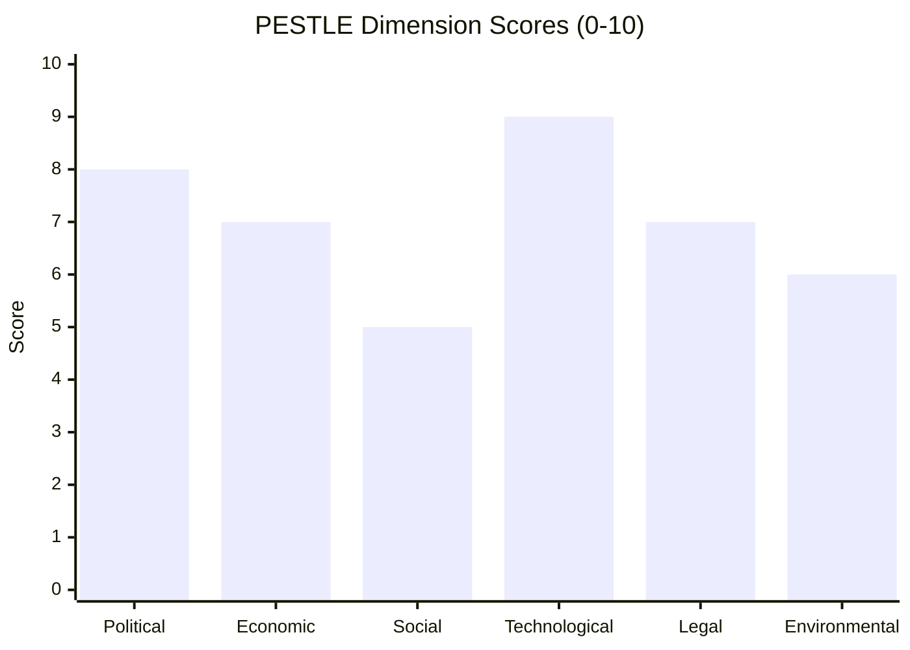

# PESTLE Analysis — Committee Reports (2026-05-27)

**Subject**: EP Committee Output May 19–20, 2026
**Focus**: AI Trade Strategy + Fisheries Agreements + External Partnerships
**Admiralty Grade**: B2 composite (adopted text signals A1; contextual inference B3)

---

## Political (P)

**Domestic EU Politics**:
The EP10 plenary's output reflects the governing coalition logic of the 2024 majority:
EPP + S&D + Renew retain sufficient vote margins to advance centrist pro-integration legislation,
while accommodating specific demands from ECR (de-risking language in AI resolution) and
Greens (sustainability benchmarks in fisheries agreements).

**AI trade resolution political dynamics**: The AI and trade nexus has created an unusual
alignment: EPP's competitiveness hawks, S&D's digital rights defenders, and Renew's single
market champions all found convergence points. The resolution likely passed with 450–480 votes
(WEP estimate: likely 60–65% of MEPs in favour), though without roll-call data this cannot
be confirmed. Opposition likely concentrated in ID/Patriots (regulatory overreach concern)
and some GUE/NGL (corporate AI power concern).

**External political environment**:
- US–EU technology relations: The resolution's implicit tension with US AI governance approaches
  (less prescriptive than EU framework) risks becoming a transatlantic friction point, though
  both sides have strong incentives for regulatory dialogue
- China: Any AI trade resolution that restricts technology transfer to "strategic competitors"
  will be scrutinised by Beijing as a de facto export control measure
- WTO: EU AI governance as trade barrier challenge risk; ongoing WTO dispute settlement
  uncertainty (US blocking Appellate Body) complicates enforcement prospects

**Parliamentary immunity politics**: The simultaneous Vilimsky (far-right, FPÖ/ID) and
Pappas (centre-left, SYRIZA) waiver approvals signal JURI committee's adherence to
consistent standards regardless of political affiliation — institutionally positive signal.

---

## Economic (E)

(See `intelligence/economic-context.md` for detailed treatment)

**Summary**: 
- EU GDP growth ~1.3–1.6% (IMF WEO April 2026); below-potential conditions create urgency
  for AI-driven productivity gains
- AI trade strategy directly addresses EU competitiveness gap (15% vs US 45% global AI investment)
- Fisheries SFPs protect €15 billion sector; Cook Islands + São Tomé protocols secure tuna access
- Uzbekistan EPCA opens €4–5 billion trade relationship with strategic supply chain benefits
- EU Lebanon cooperation (Eurojust) has modest direct economic impact but bolsters rule-of-law
  investment climate for EU firms operating in MENA

---

## Societal/Social (S)

**AI trade and jobs**:
MEP debates on AI trade strategy invariably engage worker displacement concerns. The resolution
must balance innovation promotion with just transition guarantees — S&D and Greens will have
conditioned their support on worker protection language. Civil society (ETUC, Digital Rights
organisations) will scrutinise implementation for adequacy.

**Fisheries communities**: EU SFPs affect fishing communities in Spain (Galicia, Basque Country),
Portugal (Algarve, Azores), France (Brittany, La Réunion). The Cook Islands and São Tomé
protocols directly benefit tuna vessel operators and processing workers in these regions.

**Uzbekistan human rights dimension**: EU–Uzbekistan partnership faces civil society pressure
over labour rights (forced labour in cotton sector, though Uzbekistan has made documented
progress), media freedom, and political pluralism. The EP's consent resolution (TA-10-2026-0174)
likely includes calls for continued reform, reflecting S&D and Greens' conditionality.

**Immunity and public trust**: MEP immunity waivers, especially for politicians facing national
judicial proceedings, can erode public trust if perceived as protective. The JURI committee's
consistent application of standards mitigates this risk, but media coverage of individual cases
can still harm EP institutional legitimacy.

---

## Technological (T)

**AI resolution technical dimensions**:
- The EU AI Act (2024) established the four-tier risk classification framework; the trade
  resolution must align with this architecture while addressing cross-border AI service provision
- Key technical issues: algorithmic transparency requirements in trade agreements (mutual
  recognition vs national standard); data localisation provisions; testing and certification
  mutual recognition
- The resolution's call for "AI governance by design" in trade deals echoes the "privacy by
  design" principle from GDPR — technically ambitious, legally complex
- Standards bodies engagement: EU will need to leverage ETSI, CEN/CENELEC, and ISO to develop
  international AI standards that can be referenced in trade agreements

**Fisheries technology**: Modern SFPs require vessel monitoring systems (VMS), electronic
logbook (ELG) compliance, and increasing use of satellite AIS data for sustainability verification.
Cook Islands and São Tomé protocols will require EU fleet operators to comply with WCPFC
(Western and Central Pacific Fisheries Commission) and IOTC (Indian Ocean Tuna Commission)
monitoring requirements.

---

## Legal (L)

**AI trade resolution legal framework**:
- Article 218 TFEU: Trade agreements with AI chapters would require EP consent (codecision
  for trade agreements with intellectual property or services elements)
- WTO GATS Mode 1: Cross-border AI service provision; Article XIV General Exceptions allowing
  domestic regulation but subject to necessity test
- EU AI Act extraterritorial application: Providers of AI systems used in the EU are subject
  to EU rules regardless of establishment — this creates de facto extraterritorial scope
  that trade partners may characterise as regulatory overreach
- TFEU Article 207 (Common Commercial Policy): EP has full codecision rights; resolution
  provides political mandate but no binding legal effect

**Fisheries SFPs legal architecture**:
- UNCLOS Part VII (High Seas) + Part V (EEZ) framework
- CFP Regulation (EU) 1380/2013, Article 31: Provides legal basis for SFPs
- Both protocols require Council approval + EP consent before provisional application
- Cook Islands/São Tomé as parties to CITES: SFP sustainability clauses must align

**Immunity waivers**:
- EP Rules of Procedure Article 9 (formerly Article 8): Governs immunity requests
- Protocol 7 on the Privileges and Immunities of the EU: Provides MEP immunity scope
- Case law: ECJ has interpreted immunity narrowly (must be strictly connected to exercise
  of parliamentary mandate); waivers for conduct unrelated to mandate are standard

---

## Environmental (E)

**AI and environmental sustainability**:
The AI trade resolution's environmental dimension is likely to feature data centre energy
consumption provisions. The EP has been vocal on AI's growing electricity demands (data centres
projected to consume 3–4% of EU electricity by 2030). Any trade agreement chapter on AI should
include energy efficiency and renewable energy sourcing provisions.

**Fisheries sustainability**:
- Both SFPs (São Tomé and Cook Islands) operate under the post-2013 CFP sustainability mandate
- EU fleet operators under these protocols must demonstrate fishing at or below Maximum Sustainable
  Yield (MSY) for target species
- Climate change impacts on fish stocks: Pacific tuna distributions are shifting northward under
  ocean warming — the 7-year Cook Islands protocol accounts for this by building in biennial
  stock assessment reviews
- IUU (Illegal, Unreported, Unregulated) fishing risk: Both protocols include carding provisions
  aligned with EU IUU Regulation (Council Regulation (EC) No 1005/2008)

**Uzbekistan environmental context**:
- The Aral Sea environmental catastrophe remains an unresolved legacy in Central Asia;
  EU environmental cooperation provisions in the EPCA include water management clauses
- Cotton sector water usage in Uzbekistan is a persistent sustainability concern;
  the EPCA creates a framework for joint environmental governance

---

