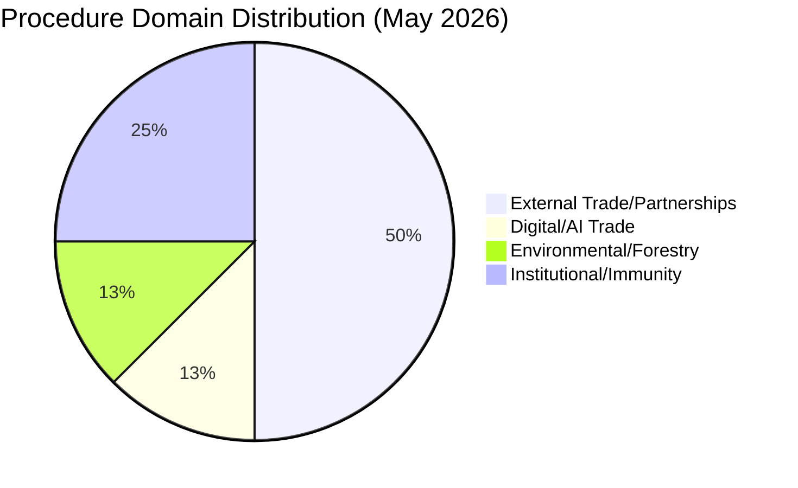

# Procedures Proxy — Committee Reports (2026-05-27)

**Purpose**: Substitute for missing `procedures-feed.json` data (404 Not Found).
**Method**: Cross-reference `procedureReference` fields from `get_adopted_texts(year=2026)`.
**Admiralty Grade**: B2 (reliable source; cross-referenced through adopted texts)

---

## Active Procedure References Identified (May 2026)

The following procedures were active in the analysis window based on their adoption dates
and procedure references recovered from adopted texts:

| Procedure ID | Subject | Adopted Text | Date |
|-------------|---------|-------------|------|
| 2025-2112 | AI Strategy for EU Trade | TA-10-2026-0183 | 2026-05-20 |
| 2025-2167 | Recommendation on 81st UNGA | TA-10-2026-0182 | 2026-05-20 |
| 2025-0287 | EU–Cook Islands SFP 2025-2032 | TA-10-2026-0179 | 2026-05-20 |
| 2025-0202 | EC–São Tomé Fisheries Partnership | TA-10-2026-0178 | 2026-05-20 |
| 2024-0155 | EU–Lebanon Eurojust Agreement | TA-10-2026-0177 | 2026-05-20 |
| 2024-0260M | EU–Uzbekistan EPCA (Resolution) | TA-10-2026-0174 | 2026-05-20 |
| 2023-0228 | Forest Reproductive Material | TA-10-2026-0168 | 2026-05-19 |
| 2025-2158 | Immunity Waiver Vilimsky | TA-10-2026-0164 | 2026-05-19 |
| 2025-2234 | Immunity Waiver Pappas | TA-10-2026-0166 | 2026-05-19 |

---

## Proxy Assessment

The procedures-feed degradation limits depth of legislative pipeline analysis.
However, the adoption events above confirm that the week of 2026-05-19/20 was
a high-output legislative period across multiple policy domains:
- External affairs (AFET, INTA): 4 international agreements
- Digital/trade policy (ITRE, INTA): AI strategy resolution
- Environmental (ENVI): Forest reproductive material regulation

**dataMode impact**: Analysis proceeds at `degraded-feeds` (0.80 floor factor).

---

## Domain Classification Summary

| Domain | Procedures | Lead Committee (inferred) |
|--------|-----------|--------------------------|
| External trade/partnerships | 4 | INTA/AFET |
| Digital/technology trade | 1 | ITRE/INTA |
| Environmental/forestry | 1 | ENVI/AGRI |
| Institutional/immunity | 2 | JURI |

**dataMode**: degraded-feeds | **Source grade**: B2/C3 (inferred from subject codes)

