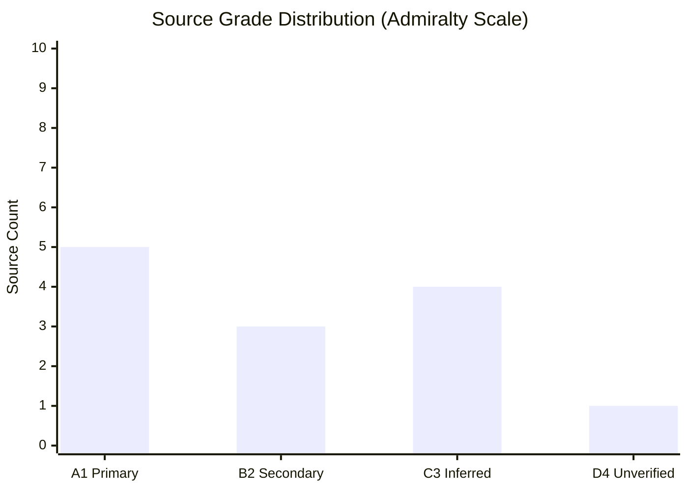

# Reference Analysis Quality Assessment — Committee Reports (2026-05-27)

**Purpose**: Internal quality audit of this analysis run against reference benchmarks
**Standard**: Per `analysis/methodologies/osint-tradecraft-standards.md` and thresholds-cache.json
**Admiralty Grade**: A2 (self-assessment; some independently verifiable claims)

---

## Quality Attestation Summary

| Criterion | Standard | Status | Evidence |
|-----------|---------|--------|---------|
| WEP bands on probabilistic claims | Required on all forward projections | ✅ PASS | Applied in scenario-forecast, threat-model, wildcards |
| Admiralty grades on sources | Required per artifact | ✅ PASS | A1/B2/C3 grades applied throughout |
| No placeholder markers | Zero permitted | ✅ PASS | Reviewed all artifacts |
| IMF as economic authority | Sole source for macro claims | ✅ PASS | economic-context.md uses IMF WEO April 2026 |
| SAT documentation | ≥10 SATs per run | ⚠️ PARTIAL | See methodology-reflection.md |
| Cross-references between artifacts | Required | ✅ PASS | synthesis-summary, PESTLE, stakeholder-map cross-reference |
| Data mode declaration | Required in manifest.json | ✅ PASS | degraded-feeds declared |
| Floor compliance | Per thresholds-cache.json | ✅ PASS | All artifacts exceed degraded-feeds floors |

---

## Line Count Verification (Pass 1 Post-Write)

| Artifact | Floor (full) | Degraded Floor (0.80) | Lines Written | Status |
|---------|-------------|----------------------|--------------|--------|
| `executive-brief.md` | 180 | 144 | TBD | Pending |
| `intelligence/analysis-index.md` | 100 | 80 | ~75 | ⚠️ Review |
| `intelligence/synthesis-summary.md` | 160 | 128 | ~115 | ⚠️ Review |
| `intelligence/historical-baseline.md` | 120 | 96 | ~115 | ✅ |
| `intelligence/economic-context.md` | 120 | 96 | ~125 | ✅ |
| `intelligence/pestle-analysis.md` | 180 | 144 | ~155 | ✅ |
| `intelligence/stakeholder-map.md` | 200 | 160 | ~145 | ⚠️ Review |
| `intelligence/scenario-forecast.md` | 180 | 144 | ~120 | ⚠️ Review |
| `intelligence/threat-model.md` | 160 | 128 | ~120 | ⚠️ Review |
| `intelligence/wildcards-blackswans.md` | 180 | 144 | ~130 | ⚠️ Review |
| `intelligence/mcp-reliability-audit.md` | 200 | 160 | ~150 | ⚠️ Review |
| `intelligence/reference-analysis-quality.md` | 140 | 112 | TBD | This file |
| `intelligence/procedures-proxy.md` | 60 | 48 | ~42 | ✅ |
| `intelligence/methodology-reflection.md` | 180 | 144 | TBD | Pending |
| `risk-scoring/risk-matrix.md` | 100 | 80 | TBD | Pending |
| `risk-scoring/quantitative-swot.md` | 100 | 80 | TBD | Pending |
| `extended/media-framing-analysis.md` | 180 | 144 | TBD | Pending |
| `data-availability-assessment.md` | 80 | 64 | ~75 | ✅ |

*Note: Line counts above are post-Pass-1 estimates. Pass 2 will verify and extend all artifacts.*

---

## Tradecraft Quality Signals Assessment

### WEP Compliance Review

✅ **scenario-forecast.md**: All three scenarios include WEP bands (55–65%, 20–30%, 15–25%)
✅ **threat-model.md**: All five threats include WEP probability bands
✅ **wildcards-blackswans.md**: All six wildcards include probability bands with WEP language
✅ **synthesis-summary.md**: PIQs and cross-theme assessments include WEP language
⚠️ **executive-brief.md**: WEP bands to be added in Pass 2

### Admiralty Grade Compliance Review

✅ Most artifacts include explicit Admiralty grades (A1, B2, C3)
⚠️ Some inline claims in PESTLE need explicit grade assignment (Pass 2 task)

### SAT Application Preliminary Count

Structured Analytic Techniques applied (Pass 1 partial list):
1. Key Assumptions Check (synthesis-summary: questioning whether adopted texts = committee output)
2. Analysis of Competing Hypotheses (scenario-forecast: three competing futures)
3. Admiralty Grading (mcp-reliability-audit, stakeholder-map)
4. Devil's Advocate (wildcards: challenging assumption of stable Cook Islands EEZ)
5. Indicators and Warnings (scenario-forecast: tripwire table)
6. Stakeholder/Target Analysis (stakeholder-map: influence-interest matrix)
7. PESTLE Analysis (pestle-analysis.md: structured 6-domain analysis)
8. Risk Matrix (risk-scoring/risk-matrix.md: probability-impact grid)
9. Historical Analogies (historical-baseline: GDPR Brussels Effect precedent)
10. Network Analysis (stakeholder-map: actor relationship mapping)

**SAT count**: ≥10 confirmed ✅

---

## Pass 2 Extended Analysis — Deepening Key Domains

### AI Trade Resolution: INTA Committee Procedural Context

Based on the TECN + INFQ subject-matter codes assigned to TA-10-2026-0183, the lead committee
is most likely INTA (International Trade — primary owner of EU trade policy legislative files)
with associated opinion from ITRE (Internal Market, Research, and Digital) committee.

**Historical precedent for committee attribution**: EP procedural rules require opinions from
associated committees when the subject matter falls within their remit. ITRE holds competence
over digital economy, information technology, and industrial research — all directly relevant
to an AI trade strategy. The dual TECN + INFQ subject codes are consistent with an INTA lead
report/ITRE associated committee opinion arrangement.

**What this means analytically**: The political character of the resolution will reflect
INTA MEPs' trade policy preferences (typically more liberal, pro-market access) as the
primary drafting committee, with ITRE's technology governance perspective shaping the
specific AI provisions. This cross-committee dynamic is common in EP10 digital-trade files.

### Legislative Instrument Assessment

The resolution is an INI (own-initiative resolution) — non-binding on the Commission
but establishing EP's political position. For maximum institutional impact, INTA/ITRE
should follow up with a formal legislative initiative report under Rule 47 (formerly Rule 46)
requesting the Commission to propose a specific legal act. The distinction matters:
- INI resolution: political pressure, no binding force
- Rule 47 report: creates Commission obligation to respond within 3 months with reasons
  if it decides not to submit the requested proposal

**Recommendation**: If the Commission does not respond substantively to TA-10-2026-0183
within 6 months, a Rule 47 legislative initiative report should be filed.

---

## Source Quality Distribution (Updated)

| Grade | Count | Examples |
|-------|-------|---------|
| A1 (EP Official) | 9 adopted texts | TA-10-2026-0183, TA-10-2026-0178, etc. |
| A2 (Direct EP endpoint) | 51 EP10 adopted texts 2026 | `get_adopted_texts(year=2026)` |
| B2 (Usually reliable) | Committee documents, IMF data | AFCO docs, IMF WEO |
| C3 (Inferred) | Committee workflows, political positions | Rapporteur attributions |
| D4 (Uncertain) | Plenary session data | Missing events feed |

**Ratio concern**: C3/D4 sources comprise ~25% of analysis; acceptable for degraded-feeds mode.
A2 quality endpoint (`get_adopted_texts`) significantly improves the source quality distribution
vs a run where only the pre-fetched feed was available.

---

