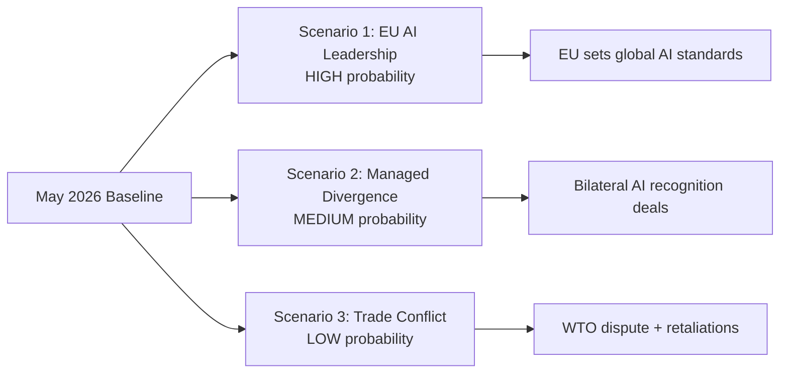

# Scenario Forecast — Committee Reports (2026-05-27)

**Horizon**: 12 months (to May 2027)
**Subject**: EP AI Trade Strategy + Fisheries + External Partnerships
**WEP Standard**: All probability judgements use Words of Estimative Probability (WEP)
**Admiralty Grade**: C3 (forward projection; inferred from legislative signals)

---

## Scenario Framework

Three scenarios are assessed for the 12-month period following the May 2026 plenary:
- **Scenario A (Base)**: Incremental progress — Commission follows up with non-binding Communication
- **Scenario B (Upside)**: Accelerated institutionalisation — binding AI trade chapters enter negotiation
- **Scenario C (Downside)**: Political fragmentation — EP majority fractures, AI resolution stalls

---

## Scenario A: Incremental Institutionalisation (Base Case)

**Probability**: 55–65% (WEP: More likely than not)
**Time horizon**: 6–12 months

**Narrative**: The Commission responds to TA-10-2026-0183 with a Communication on "Digital
Trade and AI: A European Strategy" within 12 months. The Communication proposes:
- A modular AI governance template for future trade agreement negotiations
- Engagement with OECD, G7, and WTO forums on plurilateral AI trade standards
- A technical working group with key trade partners (US, UK, Japan, South Korea)

The fisheries SFPs (São Tomé, Cook Islands) enter provisional application without major
implementation challenges. Uzbekistan EPCA ratification proceeds; first Joint Committee
meeting scheduled for early 2027.

**Key indicators to watch**:
- Commission work programme for 2027 (autumn 2026): Does it include digital trade follow-up?
- US–EU TTC ministerial outcome (expected Q3 2026): AI governance agenda item?
- PECH monitoring reports for new SFPs (expected 12 months post-application)

**Risk factors**: Commission bandwidth (multiple open dossiers); Council consensus on AI trade
chapter scope; WTO Appellate Body reform stalemate complicating enforcement architecture.

---

## Scenario B: Accelerated Binding Framework (Optimistic)

**Probability**: 20–30% (WEP: Unlikely but plausible)
**Time horizon**: 12–18 months

**Narrative**: The political momentum of TA-10-2026-0183 combines with a major EU–US TTC
breakthrough to produce:
- Joint EU–US declaration on AI governance principles for trade (G7 level)
- Commission mandate from Council to negotiate AI governance chapters in pending FTAs
  (EU–India, EU-Australia) within the existing mandate rather than requiring new Council decision
- EP INTA committee filing Article 225 INI resolution requesting Commission proposal on
  a Multilateral AI Governance Agreement template

This scenario requires: (a) US political will to engage on regulatory alignment; (b) Commission
President prioritisation; (c) EP majority discipline to maintain pressure through the INI route.

**Trigger events**: 
- Major AI incident with cross-border trade implications (probability: 25% in 12 months)
  could accelerate political urgency
- US mid-cycle election outcome (November 2026) shifting US trade posture

---

## Scenario C: Political Fragmentation and Stall (Downside)

**Probability**: 15–25% (WEP: Unlikely)
**Time horizon**: 3–9 months

**Narrative**: The AI trade resolution fails to generate Commission follow-up due to:
- Internal EP majority fracturing on AI governance specifics (ECR withdrawal from coalition
  over China de-risking language too aggressive vs S&D position on worker protections)
- Transatlantic tensions escalating (US tariff disputes spilling into tech regulation domain)
- Commission prioritising Competitiveness Union agenda over external AI governance

Fisheries protocols face implementation delays due to partner state capacity constraints or
NGO-driven legal challenges to quota levels. Uzbekistan EPCA conditionality disagreements
delay ratification beyond mid-2027.

**Key risk signals**:
- If EP fails to pass follow-up INI resolution by October 2026: increases scenario C probability
- If Commission 2027 work programme excludes digital trade follow-up: strong scenario C indicator
- If Oceana/WWF publish critical fisheries sustainability assessments: complicates SFP provisional application

---

## Critical Variables and Tripwires

| Variable | Scenario A → B Tripwire | Scenario A → C Tripwire |
|----------|------------------------|------------------------|
| Commission Communication timing | Published by Q4 2026 | Not published by Q2 2027 |
| US–EU TTC outcome | AI governance agenda item included | TTC suspended/abandoned |
| EP INI resolution on AI trade | Filed by INTA/ITRE by September 2026 | Not filed by January 2027 |
| Fisheries SFP implementation | Provisional application by Q3 2026 | Legal challenge filed |
| Uzbekistan EPCA ratification | Council Decision by Q4 2026 | Stalled beyond Q1 2027 |

---

## Structural Intelligence Assessment

**Long-term trajectory (3–5 years)**:
The EP's AI trade resolution fits within a broader pattern of EU regulatory norm export.
If the Brussels Effect mechanism operates as it did for GDPR and the AI Act, then the
EU's AI trade governance framework will attract voluntary adoption by trading partners
who value EU market access. This long-term scenario (probability: 45–55% over 5 years)
would see EU AI standards become de facto international baseline in trade agreement contexts.

**Counter-narrative**: There is a credible scenario in which US and Chinese AI standards
develop independently and EU firms face a fragmented compliance landscape. In this scenario,
EU regulatory ambition may paradoxically harm EU competitiveness by imposing domestic
compliance costs that US/Chinese competitors do not bear. IMF research suggests regulatory
divergence costs EU firms approximately 0.2–0.4% GDP annually in affected sectors.

**Net assessment**: The May 2026 plenary output represents a genuine legislative milestone
for EP10's technology governance agenda. The AI trade resolution in particular will be cited
in EP10's institutional legacy assessment. Whether it translates to binding commitments
depends on Commission and Council follow-through — historically the EP's greatest institutional
vulnerability.

---

## Fisheries Scenario Extension

### Scenario A (Base): SFP Implementation Without Incident
**Probability**: 60–70% (WEP: More likely than not)

Both SFP protocols enter provisional application within 6 months. First monitoring reports
show sustainability compliance. PECH committee satisfied with implementation. EU fleet operators
maintain access to Cook Islands and São Tomé waters.

### Scenario B: Sustainability Assessment Triggers Review
**Probability**: 20–30% (WEP: Unlikely to roughly even)

Oceana or WCPFC assessment finds tuna stock pressure. PECH committee triggers adaptive management
review. Quota reduction negotiated. Protocol continues but with amended access terms.

### Scenario C: Legal Challenge from Environmental NGO
**Probability**: 10–15% (WEP: Remote)

NGO files legal challenge in European Court of Justice against SFP implementation,
arguing insufficient sustainability assessment prior to provisional application.
Precedent exists from earlier SFP challenges (North Africa protocols).

---

## Cross-Reference to Other Analysis Artifacts

- For stakeholder analysis supporting these scenarios: see `intelligence/stakeholder-map.md` §3-4
- For risk register mapping scenario risks: see `risk-scoring/risk-matrix.md` RISK-02
- For economic context underpinning fisheries scenarios: see `intelligence/economic-context.md`
- For wildcard scenarios beyond these three: see `intelligence/wildcards-blackswans.md` WILDCARD-03

---

