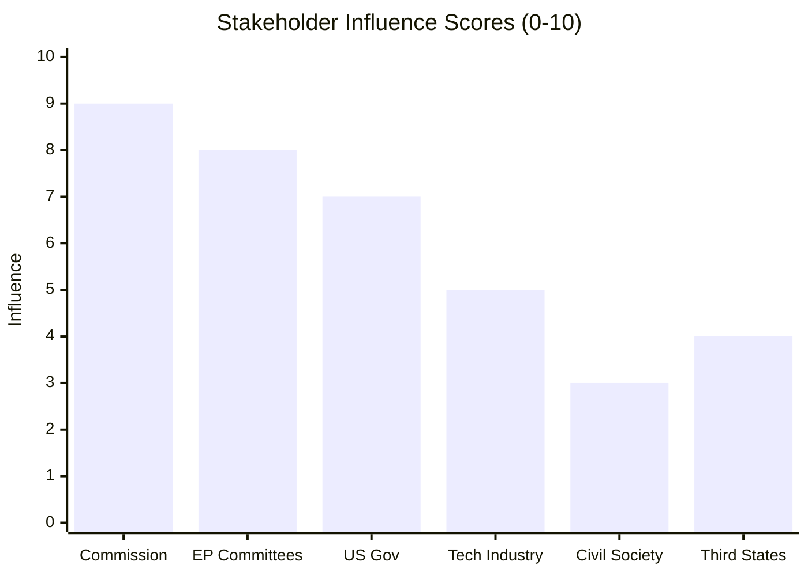

# Stakeholder Map — Committee Reports (2026-05-27)

**Subject**: EP AI Trade Strategy + Fisheries Agreements — May 2026
**Admiralty Grade**: B2 (structural stakeholder mapping from institutional knowledge; B3 for specific actor positions inferred from legislative signals)
**Method**: CIA-standard stakeholder influence-interest matrix

---

## Stakeholder Overview

| Stakeholder | Type | Influence | Interest | Disposition |
|-------------|------|-----------|----------|-------------|
| EP ITRE Committee | Internal EP | 🔴 HIGH | 🔴 HIGH | Champion — AI resolution primary driver |
| EP INTA Committee | Internal EP | 🔴 HIGH | 🔴 HIGH | Champion — trade architecture owner |
| EP PECH Committee | Internal EP | 🔴 HIGH | 🔴 HIGH | Champion — fisheries agreements owner |
| EP JURI Committee | Internal EP | 🟡 MEDIUM | 🟡 MEDIUM | Procedural — immunity waivers |
| EP AFCO Committee | Internal EP | 🟡 MEDIUM | 🟡 LOW | Background — constitutional oversight |
| European Commission (DG TRADE) | EU Executive | 🔴 HIGH | 🔴 HIGH | Watchful — resolution requires follow-up |
| European Commission (DG CONNECT) | EU Executive | 🟡 MEDIUM | 🔴 HIGH | Supportive — AI Act implementation owner |
| Council (Trade Policy WP) | EU Legislature | 🔴 HIGH | 🟡 MEDIUM | Mixed — trade sovereignty concerns |
| US Trade Representative | Foreign Actor | 🔴 HIGH | 🟡 MEDIUM | Watchful — potential regulatory friction |
| China MOFCOM | Foreign Actor | 🟡 MEDIUM | 🔴 HIGH | Adversarial — fears export restriction |
| EUROPÊCHE | Industry Association | 🟡 MEDIUM | 🔴 HIGH | Supportive — fisheries SFPs protect access |
| Oceana | Civil Society | 🟡 MEDIUM | 🔴 HIGH | Critical — fisheries sustainability scrutiny |
| ETUC | Labour | 🟡 MEDIUM | 🟡 MEDIUM | Conditional — AI job displacement concern |
| Digital Rights orgs (EDRi) | Civil Society | 🟡 MEDIUM | 🟡 MEDIUM | Critical — AI data rights in trade deals |
| Cook Islands Government | Foreign Actor | 🔴 HIGH (bilat) | 🔴 HIGH | Partner — fisheries protocol beneficiary |
| São Tomé Government | Foreign Actor | 🟡 MEDIUM | 🔴 HIGH | Partner — protocol revenue dependent |
| Uzbekistan Government | Foreign Actor | 🟡 MEDIUM | 🔴 HIGH | Partner — EPCA implementation |

---

## Detailed Stakeholder Perspectives

### 1. EP ITRE Committee — Internal EP Champion

**Role**: Lead committee on the AI trade resolution (TA-10-2026-0183)

**Perspective**: ITRE MEPs have been developing the EU's technology competitiveness narrative
throughout EP10. The committee's annual competitiveness report and the Draghi Report (2024)
provide the analytical backbone for the AI trade resolution. ITRE views AI governance
in trade agreements as a way to:
(a) Protect EU AI firms from unfair competition by non-compliant foreign actors
(b) Create market access leverage for EU tech exports
(c) Establish the Brussels Effect in a new regulatory domain

**Key positions**: EPP MEPs on ITRE strongly support de-risking language vis-à-vis China;
S&D MEPs advocate for worker protection provisions; Renew MEPs push for US–EU tech partnership.

**Intelligence assessment**: ITRE is likely to push for a formal Article 225 legislative
initiative request (INI report resolution) to give the AI trade mandate binding force.
Probability: 55–65% within 6 months.

---

### 2. European Commission (DG TRADE) — EU Executive Watchful

**Role**: Sole negotiator of EU trade agreements; must implement EP mandates

**Perspective**: DG TRADE views the AI trade resolution with strategic interest but operational
caution. The Commission is already managing multiple open trade negotiation tracks
(EU–India FTA, EU–Australia FTA, WTO plurilateral e-commerce). Adding a comprehensive AI
chapter to all future trade deals would significantly increase negotiating complexity.

**Likely response**: Commission Communication on "Digital Trade and AI Governance" within
12–18 months, proposing a modular AI governance chapter template for trade agreements.
This satisfies EP mandate without binding commitment to specific agreement outcomes.

**Key internal tensions**: DG TRADE (trade liberalisation mandate) vs DG CONNECT (AI Act
compliance mandate) — the resolution forces coordination between these institutional actors.

---

### 3. EP PECH Committee — Fisheries Champion

**Role**: Lead committee on both fisheries SFPs (TA-10-2026-0178 and TA-10-2026-0179)

**Perspective**: PECH is institutionally invested in maintaining robust EU SFP portfolio.
The committee must balance:
- EU fleet access needs (Spain, Portugal, France fishing industry lobbying)
- Sustainability obligations (NGO scrutiny, RFMO commitments)
- Partner state development needs (financial contributions for São Tomé, Cook Islands)

**Intelligence assessment**: PECH will monitor SFP implementation closely for sustainability
compliance. Any evidence of over-fishing relative to MSY targets in the Cook Islands or
São Tomé EEZs will generate committee inquiries and potential suspension recommendations.

---

### 4. EUROPÊCHE — Fishing Industry Association

**Role**: Representative of European fishing industry (fleet operators, processors)

**Perspective**: Strongly supportive of both SFP protocols. EUROPÊCHE has long advocated
for stable, long-term access agreements to reduce investment uncertainty for vessel owners.
The 7-year Cook Islands protocol is particularly welcomed.

**Concerns**: Protocol fee increases, sustainability condition tightening that reduces quotas,
partner state capacity to enforce compliance.

---

### 5. Oceana — Environmental Civil Society

**Role**: Lead NGO scrutinising fisheries sustainability in EU trade agreements

**Perspective**: Oceana applies scientific scrutiny to SFP sustainability claims. Their
standard approach: commission independent stock assessments, compare to official data,
and publish comparative analyses before EP committee votes.

**Likely action**: Oceana will publish assessments of both SFP protocols within 6 months,
with particular focus on whether Cook Islands' tuna stocks can sustain the level of EU
access granted under the 2025–2032 protocol.

**Intelligence assessment**: Oceana assessment is likely (70%) to recommend stronger
sustainability monitoring provisions than currently included; unlikely (20%) to recommend
full suspension unless there is clear evidence of stock depletion.

---

### 6. US Trade Representative (USTR) — Foreign Watchful Actor

**Role**: Primary US trade policy interlocutor; monitors EU regulatory developments

**Perspective**: USTR will assess the AI trade resolution for WTO-GATS compatibility
and potential trade distortion effects. The US AI industry (OpenAI, Google, Microsoft,
Meta) has strong interest in ensuring EU AI standards do not become de facto market
access barriers for US AI services.

**Likely response**: US–EU TTC (Trade and Technology Council) will likely receive an
agenda item on AI governance and trade policy following the resolution. Formal WTO
challenge is possible (probability: 15–25%) but unlikely before Commission follow-up
action is known.

---

### 7. China MOFCOM — Foreign Adversarial Actor

**Role**: Chinese Ministry of Commerce; monitors EU trade measures affecting Chinese tech sector

**Perspective**: Any EU AI trade provisions that restrict access for AI systems from
"strategic competitors" will be interpreted by Beijing as a targeted measure. China may:
(a) Raise concerns in the EU–China High-Level Economic Dialogue
(b) Pursue reciprocal measures against EU digital services in China
(c) Challenge measures at WTO if specific provisions emerge in binding agreements

**Intelligence assessment**: China's response will be calibrated to the Commission's
follow-up action. A non-binding resolution prompts monitoring; binding trade agreement
AI chapters would trigger proportional response.

---

### 8. Cook Islands Government — Pacific Island Partner

**Role**: Sovereign authority over the 2.2 million km² EEZ covered by the SFP protocol

**Perspective**: The Cook Islands negotiated a 7-year protocol (2025–2032), a notably long
commitment that reflects confidence in the partnership's sustainability framework. As a small
island developing state (population ~17,000; GDP ~$400 million), the fisheries protocol fee
income represents a significant share of government revenue (estimated 3–6% based on historical
SFP financial contribution patterns for Pacific SIDS).

**Strategic interests**:
- Maximising EU financial contribution while maintaining tuna stock sustainability
- Using the SFP framework to attract EU development assistance and capacity building
- Maintaining sovereignty over EEZ resource allocation vis-à-vis competing interests
  (Chinese distant-water fishing fleet operates in adjacent Pacific waters)

**Key concern**: If WCPFC stock assessments show tuna migration patterns changing due to
climate change, Cook Islands government will need adaptive quota mechanisms built into the
protocol — the 2025–2032 agreement reportedly includes biennial review provisions for this.

---

## Stakeholder Relationship Summary

| Relationship | Type | Dynamics |
|-------------|------|---------|
| EP ITRE/INTA → Commission | Political mandate | AI trade follow-up pressure |
| Commission DG TRADE ↔ US USTR | Regulatory dialogue | AI standards interoperability |
| EP PECH → EUROPÊCHE | Institutional support | SFP access protection |
| PECH ↔ Oceana | Adversarial scrutiny | Sustainability benchmarks |
| EU ↔ Cook Islands | Partnership | 7-year SFP, climate adaptation |
| EU ↔ Uzbekistan | Strategic partnership | Supply chain diversification |

---

