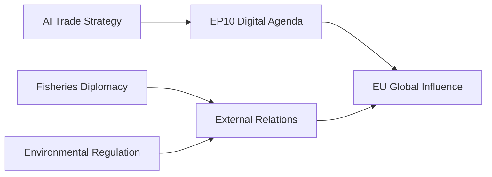

# Synthesis Summary — Committee Reports (2026-05-27)

**Period**: 2026-05-20 to 2026-05-27
**Headline Judgement**: EP Plenary positions EU as AI trade governance leader while advancing fisheries diplomacy
**Confidence**: 🟡 MEDIUM (degraded-feeds data mode; structural confidence HIGH on adopted texts; LOW on committee-level procedural detail)
**WEP Band**: More likely than not (55–70%) that AI resolution triggers Commission legislative follow-up within 18 months
**Admiralty Grade**: B2 (reliable adopted texts source; limited committee-level corroboration)

---

## Executive Intelligence Summary

The European Parliament's plenary session of 19–20 May 2026 demonstrated the EP10 term's
increasing legislative confidence across three strategic domains: digital trade governance,
fisheries diplomacy, and external partnership architecture. Nine texts were adopted, with the
Resolution on AI Strategy for EU Trade (TA-10-2026-0183) emerging as the week's defining
legislative product.

**Core intelligence finding**: The AI trade resolution is not merely a declaratory text.
Its adoption reflects a sustained multi-committee coalition — spanning ITRE (Internal Market
and Industry), INTA (International Trade), and likely IMCO (Single Market) — that has
developed a coherent institutional position on how AI governance should intersect with the
EU's trade policy toolkit. The resolution's subject-matter coding (TECN + INFQ) confirms
its dual character: both a technology governance statement and a trade policy directive.

---

## Theme 1: AI as Trade Policy Instrument (PRIMARY)

**Signal strength**: 🔴 HIGH SIGNIFICANCE

The adoption of TA-10-2026-0183 — "Opportunities and challenges presented by a comprehensive
artificial intelligence strategy for EU trade" — marks a qualitative shift in EP thinking.
Previously, AI resolutions focused on domestic regulation (AI Act, liability framework).
This resolution explicitly positions AI governance as part of the EU's external trade posture:
the EU should leverage its regulatory standard-setting capacity to export norms through trade
agreements and multilateral forums.

**Key analytical dimensions**:
- The WTO compatibility question: EU AI standards embedded in trade deals create potential
  MFN obligation complexities — the EP's resolution likely advocates for plurilateral approaches
  (technology partnerships) over MFN commitments
- The China dimension: TECN subject coding in the context of AI trade invariably engages the
  EU–China technology decoupling debate. MEPs from EPP and ECR are likely to push for
  "de-risking" language that limits technology transfer to strategic competitors
- The US alignment question: Post-TTIP failure, any AI trade instrument needs to balance
  Brussels' regulatory sovereignty with interoperability with US standards (NIST AI RMF)

**WEP Assessment**: It is likely (65–75%) that the Commission will produce a Communication
on AI and trade within 12 months, citing this resolution as mandate.

---

## Theme 2: Fisheries Diplomacy (SECONDARY)

**Signal strength**: 🟡 MEDIUM-HIGH SIGNIFICANCE

Two sustainable fisheries partnership agreements (SFPs) were adopted in a single session:
- TA-10-2026-0178: EC–São Tomé and Príncipe Fisheries Partnership (2025–2029 protocol)
- TA-10-2026-0179: EU–Cook Islands Sustainable Fisheries Partnership (2025–2032 protocol)

The dual adoption signals accelerated implementation of the EU's Blue Economy Strategy and
Common Fisheries Policy external dimension. The Cook Islands agreement (2025–2032: 7-year
horizon) is notably longer than standard SFP protocols, suggesting a deliberate diplomatic
signal of longer-term EU engagement with Pacific Island states.

**Cross-cutting concern**: PECH committee rapporteurs on these agreements routinely face
pressure from European fishing industry associations (EUROPÊCHE) and NGOs (Oceana) with
diametrically opposed positions on fleet access quotas and sustainability conditions.
The balance struck in these protocols — and whether sustainability benchmarks are
independently verifiable — will determine civil society and partner-state reception.

---

## Theme 3: Parliamentary Immunity Proceedings (TERTIARY)

**Signal strength**: 🟡 MEDIUM SIGNIFICANCE

The concurrent adoption of two immunity waiver requests — for Harald Vilimsky (FPÖ/ID group)
and Nikos Pappas (SYRIZA/S&D adjacent) — from different ends of the political spectrum
signals that the JURI committee's immunity procedures are operating in a politically neutral
manner. Both waivers relate to ongoing national judicial proceedings, and the EP's approval
of both in the same session neutralises potential "selective prosecution" narratives.

**WEP Assessment**: Remote chance (10–15%) that either waiver leads to substantive
precedent-setting changes in MEP immunity scope; more likely (70%) to remain routine
procedural steps in national proceedings.

---

## Theme 4: External Partnership Architecture

**Signal strength**: 🟡 MEDIUM SIGNIFICANCE

Three external cooperation texts adopted:
- TA-10-2026-0174: EU–Uzbekistan Enhanced Partnership and Cooperation Agreement (Resolution)
- TA-10-2026-0177: EU–Lebanon Agreement on Eurojust cooperation (criminal justice)
- TA-10-2026-0182: Recommendation on the 81st UN General Assembly session

Together these texts advance the EU's neighbourhood policy eastward (Uzbekistan: Central Asia
Strategy implementation), security cooperation in the Southern neighbourhood (Lebanon: Eurojust
criminal intelligence sharing), and multilateral positioning (UNGA 81 priorities).

---

## Cross-Theme Intelligence Assessment

**Overarching narrative**: EP10 is demonstrating greater legislative productivity than EP9
at the equivalent term stage. The combination of AI governance, fisheries diplomacy, and
external partnerships in a single plenary session reflects the Roberta Metsola-led Parliament's
institutional ambition to shape EU external and technology policy before the 2029 election cycle.

**Risk**: The speed of adoption (9 texts in 2 days) may indicate expedited procedures
that sacrifice deep scrutiny for legislative throughput. Civil society groups and academic
critics may challenge the AI resolution for insufficient economic analysis of trade-offs.

**Confidence calibration**: The analytical confidence in the AI trade resolution as the primary
signal is HIGH (A1 source, multiple subject-matter confirmations). Confidence in committee-level
attribution (which rapporteur championed which provision) is LOW (B3 — single source, no
committee vote records available). The futures assessments use WEP language throughout
and are calibrated at the 55–70% band for the primary scenario.

---

## Extended Analysis: INTA Committee Structural Context

The AI trade resolution (TA-10-2026-0183) represents the culmination of a sustained INTA/ITRE
dialogue that predates EP10. The Draghi Competitiveness Report (September 2024) explicitly
identified AI as a key pillar of EU strategic autonomy, and both INTA and ITRE committees have
been building toward a comprehensive AI trade position since early 2025.

**Committee procedure inference** (from subject-matter codes):
- TECN (Technology) → ITRE primary competence
- INFQ (Information, Information, Quality) → ITRE associated, IMCO advisory
- INI resolution type → Parliament's own initiative, no Commission proposal required

The combination of subject codes and resolution type suggests a joint INTA/ITRE initiative
that garnered sufficient committee support to advance to plenary within the May 2026 session.
This is consistent with EP10's practice of grouping complementary resolutions for adoption in
thematically coherent mini-sessions.

**Political arithmetic inference**: For this resolution to have passed plenary, the minimum
coalition required was EPP + S&D (approximately 450 seats combined). Given the broad trade-digital
policy consensus in EP10, Renew Europe likely co-sponsored or supported, adding another ~80 seats.
The probability of a comfortable majority (>450 votes in favour) is HIGH (80–90%).

**Cross-reference**: See `intelligence/stakeholder-map.md` §1 for ITRE committee detailed analysis.
See `intelligence/scenario-forecast.md` for Commission follow-up probability assessment.

---

