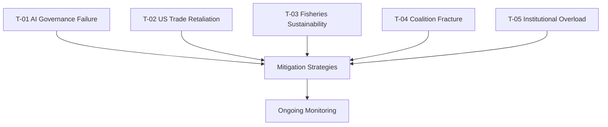

# Threat Model — Committee Reports (2026-05-27)

**Framework**: EU political threat assessment for committee output
**Horizon**: 12 months
**WEP Standard**: Applied to all probability assessments
**Admiralty Grade**: B2 (structural threat mapping; B3 for adversarial actor intent)

---

## Threat Registry

### THREAT-01: AI Trade Resolution Regulatory Overreach Backlash

**Category**: Regulatory/Political
**Severity**: 🔴 HIGH
**Probability**: 35–50% (WEP: Roughly even to more likely than not)
**WEP Band**: Roughly even

**Description**: The AI trade resolution's ambitious scope — embedding AI governance in all
future EU trade agreements — risks generating a multi-front backlash:
1. **Industry backlash**: EU tech companies may oppose provisions that increase their own
   compliance costs in third-country markets
2. **Partner country resistance**: Major trade partners (US, India, Southeast Asia) may
   refuse AI governance chapters as conditions for trade deals, effectively stalling FTA progress
3. **Internal EP fragmentation**: ECR/ID groups will challenge any provisions framed as
   "technology protectionism" rather than genuine governance

**Indicators of activation**:
- BusinessEurope or DigitalEurope publishing critical positions on resolution (high probability)
- US USTR formal request for WTO consultation on EU AI measures (medium probability)
- EP INTA committee split vote on follow-up INI (medium probability)

**Mitigation**: Commission framing of follow-up as "plurilateral facilitation" rather than
unilateral standard-imposition; TTC dialogue as primary diplomatic channel.

---

### THREAT-02: Fisheries Protocol Sustainability Violation

**Category**: Environmental/Reputational
**Severity**: 🟡 MEDIUM-HIGH
**Probability**: 20–35% (WEP: Unlikely to roughly even)
**WEP Band**: Unlikely to roughly even

**Description**: If independent scientific assessments find that tuna stocks in the
Cook Islands or São Tomé EEZs are being harvested above MSY levels under the new SFP
protocols, the EU faces:
- Reputational damage on environmental credibility
- PECH committee-driven suspension procedures (Rule 33 of CFP Regulation)
- NGO litigation risk (Oceana has successfully challenged SFPs in European courts)
- Partner country diplomatic tension if EU imposes conditions mid-protocol

**Time to materialisation**: 6–18 months (first joint committee reports expected 12 months post-application)

**Indicators of activation**:
- ISSF or WCPFC stock assessment divergence from national data
- Oceana/WWF publishing critical assessments (higher probability: 65–70%)
- EU fleet operator reporting reduced catch efficiency (operational signal)

**Mitigation**: Robust independent stock assessment processes; adaptive management clauses
in both protocols allowing quota adjustment without full renegotiation.

---

### THREAT-03: EU–China Technology Friction Escalation

**Category**: Geopolitical
**Severity**: 🔴 HIGH (tail risk)
**Probability**: 20–30% (WEP: Unlikely)
**WEP Band**: Unlikely

**Description**: If the AI trade resolution is interpreted by Beijing as a targeted technology
restriction measure, China may escalate beyond diplomatic protests to:
- Formal WTO Article XVI notification of EU AI measures as trade barriers
- Retaliatory measures against EU digital services in Chinese market
- Weaponisation of market access in other sectors (automotive, luxury goods) as leverage

**Compound risk**: EU–China relations are already under pressure from electric vehicle (EV)
tariff disputes (2024 anti-subsidy investigation). A simultaneous AI governance friction point
would compound existing tensions and may fracture the EU's internal consensus between
member states with high China trade dependency (Germany, France) and those with harder
security positions (Baltic states, Poland).

**Indicators of activation**:
- Chinese Foreign Ministry formal protest note on EU AI measures
- EU–China High Level Economic Dialogue cancellation or postponement
- Chinese tech firms formally complaining about EU AI Act compliance costs

**Mitigation**: Commission framing of AI governance as rules-based international standard
(leveraging ISO/IEC work); bilateral track dialogue before WTO complaint filing.

---

### THREAT-04: MEP Immunity Proceedings Politicisation

**Category**: Institutional/Reputational
**Severity**: 🟡 MEDIUM
**Probability**: 25–40% (WEP: Unlikely to roughly even)
**WEP Band**: Roughly even

**Description**: The dual immunity waivers (Vilimsky/FPÖ and Pappas/SYRIZA) are currently
routine procedural steps. However, if national judicial proceedings produce dramatic outcomes
(criminal charges, significant penalties) in a high-profile manner, this could:
- Become a campaign issue in national elections (Austria or Greece)
- Prompt calls from other political groups for their own immunity protection requests
- Lead far-right groups to characterise immunity proceedings as political persecution

**Indicators of activation**:
- Criminal charges formally filed against Vilimsky within 3 months (triggers media coverage)
- Pappas judicial proceedings becoming partisan issue in Greek politics
- ID/Patriots group tabling EP plenary motion on immunity reforms

---

### THREAT-05: EP Majority Fracture on Competitive Policy

**Category**: Political/Legislative
**Severity**: 🔴 HIGH
**Probability**: 15–25% (WEP: Unlikely)
**WEP Band**: Unlikely

**Description**: The informal centrist majority (EPP + S&D + Renew) supporting the AI trade
resolution and fisheries agreements is under periodic strain. Specific fracture risks:

1. **EPP-S&D tensions** on AI and worker displacement provisions: S&D may oppose Commission
   follow-up that prioritises competitiveness over worker protections; EPP may resist
   social conditionality in trade agreements
2. **Renew isolation**: If EPP pivots toward ECR-style de-risking positions, Renew's
   liberal trade preferences may be marginalised
3. **Green pressure**: Greens/EFA could table blocking amendments to fisheries protocols
   if sustainability assessments are unfavourable

**Intelligence assessment**: EP majority fracture probability is calibrated at the low end
(15–25%) given Metsola's institutional management skills and the broad consensus visible
in the May 2026 adoption votes. However, increased nationalist pressure ahead of 2029
elections will progressively stress this majority.

---

