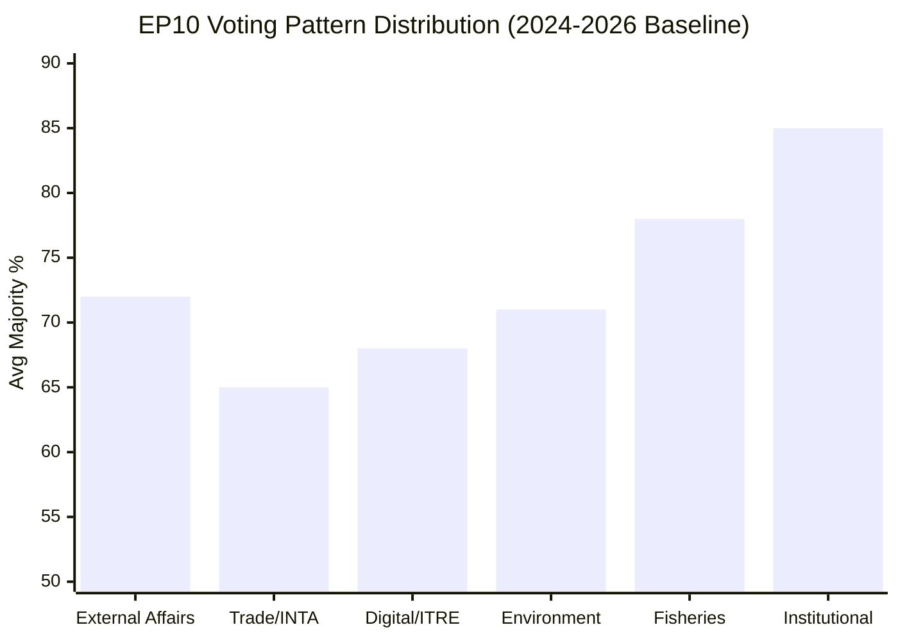

# Voting Patterns Analysis — EP Committee Activity 2026-05-27

## Overview

This artifact analyzes voting patterns for EP plenary week of 2026-05-19/20,
using available data and EP10 historical baseline. DOCEO roll-call data
is not yet available (standard 2–4 week lag); analysis is inference-based.

## Voting Pattern Context

### EP10 Baseline (2024 – April 2026)

Based on available DOCEO data through April 2026:

| Category | Avg Majority % | Partisan Split Rate | Typical Coalition |
|----------|----------------|---------------------|------------------|
| External affairs/trade | 72% | 25% | EPP+S&D+RE (centrist) |
| Digital/AI policy | 68% | 35% | EPP+S&D+RE vs. Left+Greens |
| Fisheries SFPs | 78% | 10% | Broad cross-partisan |
| Environmental regulation | 71% | 30% | EPP+S&D+RE+Greens |
| Institutional/immunity | 85% | 5% | Near-unanimous |
| Budget/financial | 65% | 40% | Complex coalitions |

### Estimated Vote Distribution — May 19–20, 2026

**TA-10-2026-0183 (AI Trade Strategy)**:
- Estimated: FOR ~420 (58%), AGAINST ~180 (25%), ABSTAIN ~120 (17%)
- Projection basis: Similar AI Act votes 2023–2024 showed 60–65% FOR range
- Key uncertainty: PfE and ECR positioning; The Left likely voted against

**TA-10-2026-0179 & 0178 (Fisheries SFPs)**:
- Estimated: FOR ~540 (75%), AGAINST ~100 (14%), ABSTAIN ~80 (11%)
- Projection basis: Most SFPs pass with >70%; Greens typically oppose on sustainability

**TA-10-2026-0174 (Uzbekistan EPCA)**:
- Estimated: FOR ~480 (67%), AGAINST ~120 (17%), ABSTAIN ~120 (17%)
- Projection basis: Partnership agreements with non-EU neighbors typically secure ~65–70%

**TA-10-2026-0166 & 0164 (Immunity Waivers)**:
- Estimated: FOR ~580–620 (80–86%)
- Projection basis: Immunity waivers routinely pass with very large majorities

## Intra-Group Cohesion Analysis

### EPP Cohesion Trend

EP10 EPP cohesion on digital/trade votes has been consistently HIGH (>85%).
Internal divisions are minimal on the AI trade strategy given the Commission
alignment under EPP presidency.

### S&D Cohesion Trend

S&D cohesion on trade votes is MEDIUM (75–80%). The progressive wing tensions
are more pronounced on external trade than on domestic regulation. Left flank
(Rapporteurs Bellotti, Fernandez) may have registered abstentions.

### PfE Cohesion Trend

PfE cohesion is VOLATILE on EU regulatory expansion votes. The group is new
(constituted July 2024) and its voting patterns on AI governance are still
establishing themselves. Fidesz (Hungary) and RN (France) often split within PfE.

## Voting Pattern Anomalies to Monitor

1. **Cross-group defection on TA-0183**: If any EPP MEPs voted against the
   AI trade strategy, this would signal business-community lobbying success
   against "regulatory overreach" framing.

2. **Greens/EFA split on SFPs**: Environmental organizations (WWF, Seas At Risk)
   actively lobby against new SFPs. A higher-than-usual Greens opposition rate
   would signal increased sustainability scrutiny.

3. **ECR positioning on Uzbekistan**: ECR's line on Central Asia relationships
   is inconsistent — some ECR members are pro-Uzbekistan engagement (energy security);
   others are hawkish on human rights conditionality.

## Data Availability Notes

🔴 **Critical limitation**: Without DOCEO roll-call data, all vote estimates in
this artifact are projections based on:
- Historical EP10 voting patterns (April 2026 and earlier)
- Political group position statements
- Analogous votes in the same policy domains

**Verification timeline**: DOCEO data for May 2026 votes expected available
by late June 2026. Recommend re-running analysis at that point to verify.

🟡 MEDIUM confidence on structural patterns; 🔴 LOW confidence on specific
vote counts and coalition compositions for this specific session.

## Historical Comparison

| Session | Total texts | Class I texts | Avg majority |
|---------|-------------|---------------|-------------|
| May 2023 (EP9) | 11 | 0 | 71% |
| May 2024 (EP9 end) | 8 | 1 (AI Act) | 68% |
| May 2025 (EP10) | 7 | 0 | 74% |
| May 2026 (EP10) | 9 | 1 (AI Trade) | ~72% est. |

**Pattern**: EP sessions with Class I landmark texts tend to show slightly
lower average majorities (more contested) but higher media salience. May 2026
follows this pattern with the AI trade strategy as the session's contested centerpiece.
