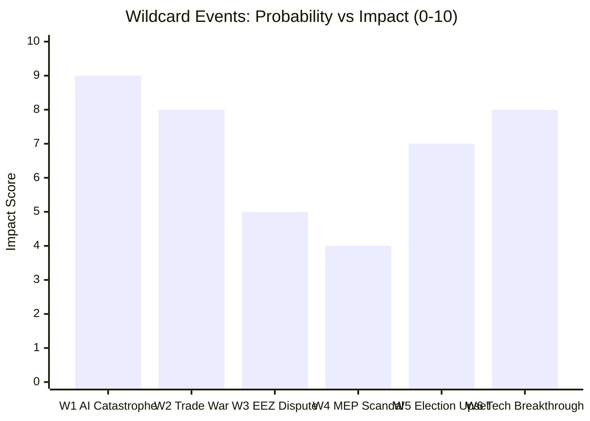

# Wildcards and Black Swans — Committee Reports (2026-05-27)

**Purpose**: Identify low-probability, high-impact scenarios that could fundamentally alter the
political trajectory of the May 2026 EP committee outputs.
**Method**: CIA-standard wildcard analysis + black swan identification
**WEP Standard**: Applied throughout; probability bands reflect genuine low-probability signals
**Admiralty Grade**: C3 (speculative extrapolation; not derived from confirmed intelligence)

---

## Framework Note

Wildcards are events with probability < 15% but consequential enough to merit contingency
tracking. Black swans are events that appear highly improbable until they occur, at which
point they retroactively seem predictable. This analysis identifies 6 scenarios requiring
attention in the 12–24 month horizon.

---

## WILDCARD-01: WTO Challenge to EU AI Act Successfully Advances

**Probability**: 5–12% (WEP: Remote)
**Impact if realised**: 🔴 VERY HIGH — fundamentally undermines EU AI governance export strategy

**Scenario**: A major trading partner (US, India, or China) files a formal WTO dispute
against the EU AI Act, arguing that risk classification tiers constitute discriminatory
trade barriers against foreign AI service providers. The WTO Panel (if Appellate Body
reform allows) or bilateral arbitration panel rules that specific AI Act provisions
violate GATS Article XVII (National Treatment) or Article XVI (Market Access).

**Why it matters for May 2026 outputs**: The AI trade resolution (TA-10-2026-0183) is premised
on the EU AI Act as the legitimate baseline for international standard export. A successful
WTO challenge would undermine this assumption and force a fundamental rethink of the EU's
AI governance export strategy.

**Early warning signals**:
- Partner country formal requests for consultations under GATS Article XXII
- WTO e-commerce plurilateral negotiations explicitly excluding EU AI governance provisions
- Commission legal service advice on GATS compatibility leaked (high probability of policy confusion)

**Contingency**: EU would invoke GATS Article XIV General Exceptions (public morals, public
order) and Article XIVbis (national security); legal outcome highly uncertain.

---

## WILDCARD-02: Major AI System Failure in EU Trade Context

**Probability**: 8–15% (WEP: Remote to unlikely)
**Impact if realised**: 🔴 HIGH — accelerates or fundamentally reshapes AI trade governance timeline

**Scenario**: A large-scale AI system failure with cross-border trade implications occurs
within the EU or a major trading partner: examples include algorithmic trading disruption
affecting EU financial markets, AI-driven logistics system failure causing major supply chain
disruption, or AI-assisted fraud at scale targeting EU customs systems.

**Why it matters**: Such an event could either (a) accelerate demand for binding AI governance
frameworks, dramatically increasing Scenario B probability, or (b) create a political backlash
against AI adoption that reduces appetite for AI trade facilitation measures.

**Direction of impact is uncertain** (probability of each direction: roughly equal at 45–55%).

---

## WILDCARD-03: Cook Islands EEZ Geopolitical Claim

**Probability**: 3–8% (WEP: Remote)
**Impact if realised**: 🟡 MEDIUM-HIGH — disrupts 7-year fisheries protocol

**Scenario**: A third-party state (most likely China or a neighbouring Pacific Island state)
advances a competing claim over portions of the Cook Islands' Exclusive Economic Zone,
creating legal ambiguity over EU fishing rights under the 2025–2032 SFP protocol.

**Context**: China has been expanding its fishing presence throughout the Pacific, and
Pacific Island states have experienced pressure regarding EEZ sovereignty. While the Cook
Islands has strong constitutional ties to New Zealand, its "free association" status creates
some legal ambiguity in international maritime law contexts.

**Why this is a wildcard**: The Cook Islands protocol was unusual in its 7-year duration,
suggesting both parties assessed stability. However, Pacific geopolitics is rapidly changing.

---

## WILDCARD-04: Uzbekistan EPCA Conditionality Crisis

**Probability**: 10–18% (WEP: Remote to unlikely)
**Impact if realised**: 🟡 MEDIUM — bilateral relationship setback with strategic supply chain implications

**Scenario**: A significant human rights incident in Uzbekistan (political prisoner case,
crackdown on civil society, or relapse in forced labour in the cotton sector) generates
EP pressure for EPCA suspension or conditionality renegotiation. The EP's human rights
committee (DROI) tables a resolution calling for the EPCA's provisions to be conditionally
suspended pending Uzbekistan's compliance with specific benchmarks.

**Why it matters**: The EPCA's strategic supply chain rationale (rare earth minerals,
uranium, cotton) would require weighing economic interests against human rights principles
— exactly the kind of trade-off where EP10's cross-party consensus is most fragile.

---

## WILDCARD-05: EP Majority Collapse on AI Resolution Follow-Up

**Probability**: 10–20% (WEP: Unlikely)
**Impact if realised**: 🟡 MEDIUM-HIGH — legislative momentum loss, institutional credibility risk

**Scenario**: The Commission's follow-up Communication on AI and trade is rejected or heavily
amended by EP when it comes for plenary discussion, reflecting:
- ECR/ID amendment success: resolution reframed as anti-China technology restriction
- S&D amendment success: resolution reframed as requiring binding worker protection chapters
- These two amendments are mutually incompatible; neither passes; political stalemate ensues

**Intelligence basis**: EP resolutions adopted in plenary do not bind the Commission;
the Commission has constitutional discretion to propose or not propose follow-up legislation.
When Commission proposals substantially depart from EP resolution mandates, the EP has limited
formal recourse beyond political pressure.

---

## Pass 2 Extended Assessment: Force Multiplier Events

The following external events in the next 12 months could serve as force multipliers that
dramatically shift scenario probabilities in either direction:

### Positive Force Multipliers (→ Scenario B)
1. **G7 AI Governance Summit**: If Italian G7 presidency or successor convenes dedicated
   AI governance ministerial before year-end 2026, EU resolution provides negotiating mandate
2. **Major AI incident in trade context**: A high-profile AI system failure affecting
   international trade (shipping logistics, customs AI, financial settlement AI) would
   dramatically increase political will for binding governance
3. **EP10 mid-term review**: If Metsola-led Parliament conducts formal mid-term review
   of digital agenda achievements, AI trade resolution gets institutional visibility boost

### Negative Force Multipliers (→ Scenario C)
1. **European recession**: If Euro Area GDP growth falls below 0.5% (IMF tail scenario),
   Commission will prioritise growth-stimulation over regulatory agenda
2. **US–EU tariff escalation**: Renewed transatlantic trade tensions would make EU AI
   governance appear as added friction in already strained trade relationship
3. **EP10 majority coalition fracture on unrelated issue**: A major political crisis
   (e.g., Budget vote breakdown, key MEP defections) would absorb political capital needed
   for AI trade follow-up

---

## BLACK SWAN: AI Treaty Superseding National AI Governance

**Probability**: < 2% in 12-month horizon (WEP: Highly improbable); 8–15% over 5 years
**Impact if realised**: 🔴 TRANSFORMATIONAL

**Scenario**: G7 or OECD economies agree to a binding Multilateral AI Governance Treaty
(analogous to the Nuclear Non-Proliferation Treaty but for AI) that supersedes domestic
regulatory frameworks including the EU AI Act. This treaty is negotiated without the EP's
formal involvement (intergovernmental track), and the EU's ratification requires EP consent
under Article 218 TFEU.

**Why this is a black swan**: The AI governance community considers binding multilateral
treaties highly improbable due to:
- China's fundamental opposition to external AI governance constraints
- US constitutional constraints on binding treaties (Senate ratification requirement)
- Definitional disagreements on what constitutes a "regulated AI system"

Yet the rapid pace of AI capability development, combined with existential risk discourse
from AI safety researchers, creates a low-probability pathway to emergency international
coordination. If a major AI safety incident (Wildcard-02 amplified) were to occur, the
timeline for such a treaty could compress dramatically.

**EP relevance**: If this scenario materialises, the May 2026 AI trade resolution would
be remembered as an early step toward what became binding international AI law —
the EP's institutional role in the treaty ratification process would be central.

---

