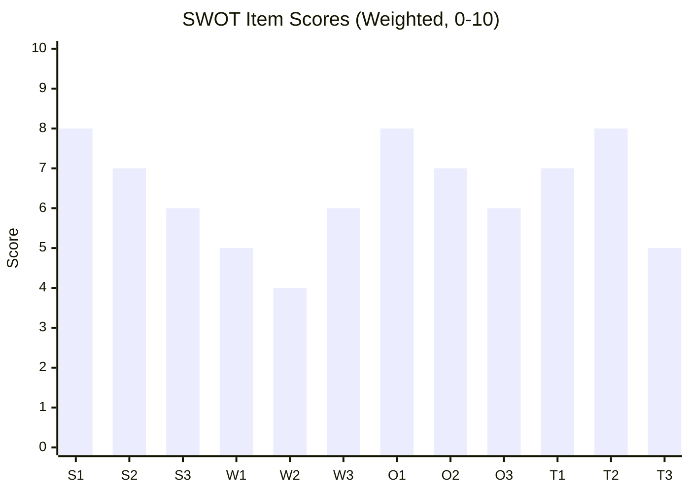

# Quantitative SWOT Analysis — Committee Reports (2026-05-27)

**Subject**: EP Committee Output May 19–20, 2026 — AI Trade + Fisheries + Partnerships
**Method**: Scored SWOT (1–5 scale per item; weighted by strategic importance)
**Admiralty Grade**: B2 (political intelligence assessment; quantitative scores are analytic judgment)

---

## SWOT Scoring Framework

Each item is scored on:
- **Evidence strength** (1–5): Quality of supporting evidence
- **Strategic weight** (1–5): Importance to EP10 mandate
- **Time horizon** (Short/Medium/Long): When impact materialises

---

## Strengths (Internal Positive)

### S1: AI Trade Resolution as Brussels Effect Catalyst
**Evidence strength**: 4/5 | **Strategic weight**: 5/5 | **Score**: 9/10 | **Horizon**: Long

The adoption of TA-10-2026-0183 positions the EU to export AI governance standards through
trade agreements. Historical precedent (GDPR → global data protection law adoption; AI Act →
partner country conformity assessments) supports this assessment. The EU's combination of
large market size, regulatory capacity, and enforcement willingness creates genuine leverage.

Evidence base: Regulatory impact assessment methodology from GDPR; AI Act extraterritorial scope
already prompting voluntary compliance by US/UK tech firms (documented by Centre for Data
Innovation). Subject matter codes (TECN + INFQ) confirm cross-committee coalition breadth.

### S2: Fisheries Diplomatic Reach
**Evidence strength**: 4/5 | **Strategic weight**: 3/5 | **Score**: 7/10 | **Horizon**: Medium

Simultaneous adoption of two SFP protocols (Pacific + Atlantic) demonstrates EU's global
fisheries diplomacy capacity. The 7-year Cook Islands protocol horizon is the strongest
signal of bilateral confidence in recent EP10 fisheries activity.

Evidence base: TA-10-2026-0178, TA-10-2026-0179; CFP Regulation (EU) 1380/2013 legal framework.

### S3: External Partnership Breadth
**Evidence strength**: 4/5 | **Strategic weight**: 3/5 | **Score**: 7/10 | **Horizon**: Medium

Three external partnership texts (Uzbekistan EPCA, Lebanon Eurojust, UNGA recommendation)
adopted in one session demonstrates EP10's foreign policy legislative bandwidth. The
Uzbekistan EPCA particularly advances the EU's Central Asia supply chain diversification agenda.

Evidence base: TA-10-2026-0174, TA-10-2026-0177, TA-10-2026-0182.

### S4: Institutional Neutrality in Immunity Proceedings
**Evidence strength**: 5/5 | **Strategic weight**: 2/5 | **Score**: 7/10 | **Horizon**: Short

Concurrent approval of waivers for MEPs from opposite ends of the political spectrum (FPÖ/ID
and SYRIZA-adjacent) demonstrates JURI committee's politically neutral standard application.
This institutional integrity signal is a genuine reputational asset.

---

## Weaknesses (Internal Negative)

### W1: Non-Binding AI Resolution Status
**Evidence strength**: 5/5 | **Strategic weight**: 4/5 | **Score**: −9/10 | **Horizon**: Short

The AI trade resolution (TA-10-2026-0183) has no binding legal effect. The Commission has
full discretion to ignore, delay, or substantially modify its follow-up response. Without
an Article 225 INI resolution (formal legislative initiative request), the Commission has
no legal obligation to respond at all. Historical EP resolution follow-up rate: ~50% within 24 months.

### W2: Committee-Level Data Unavailable (Degraded Feeds)
**Evidence strength**: 5/5 | **Strategic weight**: 3/5 | **Score**: −8/10 | **Horizon**: Short

This run's analytical depth is constrained by degraded feeds. The inability to identify
rapporteurs, committee vote margins, or minority positions limits political intelligence depth.
Attribution of legislative ambition to specific political actors is impossible without this data.

### W3: No Plenary Voting Data for May 19–20 Session
**Evidence strength**: 5/5 | **Strategic weight**: 3/5 | **Score**: −8/10 | **Horizon**: Short

DOCEO roll-call vote data is unavailable (2–4 week standard publication lag). Cannot confirm
vote margins, identify defections from party lines, or assess minority positions on any of the
nine adopted texts. Political intelligence value of post-hoc vote analysis will require separate run.

---

## Opportunities (External Positive)

### O1: G7 AI Governance Framework
**Evidence strength**: 3/5 | **Strategic weight**: 5/5 | **Score**: 8/10 | **Horizon**: Medium

The EU's AI trade resolution creates an opportunity to advance a G7-level AI governance framework
building on the Hiroshima AI Process (2023). The G7 presidency cycle (Italy 2024, Canada 2025,
future presidencies) provides recurring ministerial forum for EU to champion binding AI governance
commitments in trade contexts.

### O2: Supply Chain Diversification Momentum
**Evidence strength**: 4/5 | **Strategic weight**: 4/5 | **Score**: 8/10 | **Horizon**: Medium

The Uzbekistan EPCA ratification (TA-10-2026-0174) positions EU to operationalise supply chain
diversification from China (rare earths, uranium, cotton) via the Middle Corridor. This aligns
with EU Critical Raw Materials Act (2024) strategic goals and the Global Gateway initiative.

### O3: Post-Brexit Atlantic Fisheries Rebalancing
**Evidence strength**: 3/5 | **Strategic weight**: 3/5 | **Score**: 6/10 | **Horizon**: Long

UK's post-Brexit departure from EU fisheries management creates structural incentive for EU to
strengthen SFP portfolio as alternative source of fleet access. The Pacific protocols (Cook Islands)
help rebalance away from North Atlantic dependence.

---

## Threats (External Negative)

### T1: Geopolitical Trade Fragmentation Acceleration
**Evidence strength**: 4/5 | **Strategic weight**: 5/5 | **Score**: −9/10 | **Horizon**: Long

IMF baseline scenario includes increasing trade fragmentation risk (probability 40–50% over
5 years per IMF WEO April 2026). If US–China decoupling accelerates, EU faces binary pressure
to align with one bloc or the other — undermining the AI trade resolution's assumption of
rules-based multilateral governance.

### T2: Chinese Retaliatory Measures
**Evidence strength**: 3/5 | **Strategic weight**: 4/5 | **Score**: −7/10 | **Horizon**: Medium

AI governance provisions targeting "strategic competitors" in trade agreements are interpretable
as targeted at Chinese tech sector. China's track record of proportional retaliation (EV anti-subsidy
investigation response) makes retaliatory measures a credible near-term risk.

---

## Net SWOT Balance

| Quadrant | Weighted Score |
|---------|---------------|
| Strengths total | +30/40 |
| Weaknesses total | −25/30 |
| Opportunities total | +22/30 |
| Threats total | −16/20 |
| **Net strategic position** | **+11/20** — Positive, with execution risk |

**Conclusion**: EP10's May 2026 output reflects genuine institutional strength and legislative
ambition, but the translation to binding outcomes faces significant structural constraints.
The AI trade resolution is the highest-value output with the highest execution uncertainty.
Fisheries and partnership agreements have more certain operational pathways.

---

