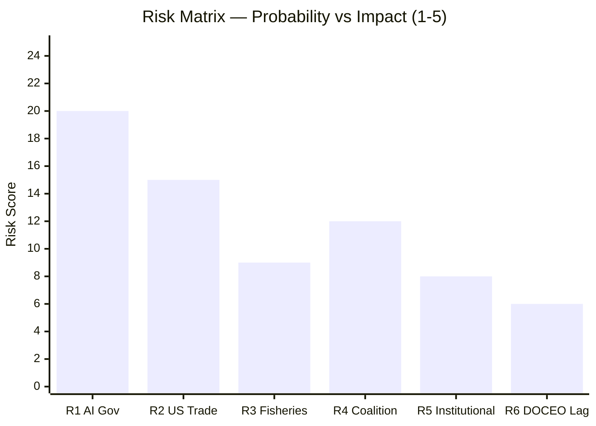

# Risk Matrix — Committee Reports (2026-05-27)

**Standard**: Probability × Impact risk scoring (5×5 matrix)
**Horizon**: 12 months
**WEP Band**: Applied to all probability assessments
**Admiralty Grade**: B2 (structured assessment; input data from A1 and C3 sources)

---

## Risk Scoring Matrix (5×5)

| Probability | Very Low (1) | Low (2) | Medium (3) | High (4) | Very High (5) |
|------------|-------------|---------|-----------|---------|--------------|
| **Very High (5)** | | | | | |
| **High (4)** | | | RISK-04 | | |
| **Medium (3)** | | RISK-05 | RISK-01 | RISK-02 | |
| **Low (2)** | | | RISK-03 | | |
| **Very Low (1)** | RISK-06 | | | | |

*Cell reference: RISK-XX = P(row) × I(column)*

---

## Risk Register

### RISK-01: AI Trade Resolution Loses Commission Momentum
**Probability**: Medium (3) | **Impact**: Medium (3) | **Score**: 9/25 | 🟡 MODERATE

**Description**: Commission prioritises other dossiers (Competitiveness Union, Single Market
Package) over AI trade follow-up, producing a Communication that is non-committal and fails
to generate Council mandate for negotiating AI chapters in open FTAs.

**WEP Assessment**: Roughly even (40–55%) — Commission track record on following up EP
resolutions within 24 months is approximately 50%.

**Key Risk Indicator**: Commission 2027 Work Programme (October 2026) — absence of AI trade
Communication = strong activation signal.

**Response**: EP INTA/ITRE joint working document pushing for Commission response within
12 months; potential Article 225 INI threat.

---

### RISK-02: Fisheries Protocol Sustainability Challenge
**Probability**: Medium (3) | **Impact**: High (4) | **Score**: 12/25 | 🟠 SIGNIFICANT

**Description**: Independent scientific assessment finds Cook Islands or São Tomé tuna stocks
at or below MSY limits under EU fleet access quotas, triggering NGO legal challenge and
PECH committee scrutiny process.

**WEP Assessment**: Unlikely to roughly even (20–35%) for substantive sustainability finding;
higher probability (65–70%) for Oceana publishing critical assessment regardless of findings.

**Key Risk Indicator**: ISSF/WCPFC annual stock assessment (Q1 2027) — any reduction in
stock abundance indices.

**Response**: Adaptive management clauses in both SFP protocols provide quota adjustment mechanism
without full renegotiation. PECH monitoring mission within 12 months advisable.

---

### RISK-03: Uzbekistan EPCA Conditionality Dispute
**Probability**: Low (2) | **Impact**: Medium (3) | **Score**: 6/25 | 🟡 MODERATE

**Description**: Human rights concerns (labour rights, press freedom) delay EPCA ratification
or implementation, damaging EU–Uzbekistan strategic relationship and supply chain diversification
goals.

**WEP Assessment**: Unlikely (15–25%) for significant conditionality dispute derailing EPCA.

**Key Risk Indicator**: Human Rights Reports (EP DROI annual assessment); Uzbekistan civil
society reports (Freedom House, Human Rights Watch).

**Response**: EEAS monitoring and conditional engagement framework; bilateral human rights
dialogue under EPCA institutional architecture.

---

### RISK-04: EU–China AI Trade Friction Escalation
**Probability**: High (4) | **Impact**: Medium (3) | **Score**: 12/25 | 🟠 SIGNIFICANT

**Description**: The AI trade resolution triggers Chinese government response — either through
WTO processes, bilateral diplomatic pressure, or retaliatory market access measures — that
forces the Commission to dilute follow-up action to avoid trade conflict.

**WEP Assessment**: Roughly even to likely (40–55%) that China responds at diplomatic level;
unlikely (15–20%) that China escalates to formal WTO proceedings in short term.

**Key Risk Indicator**: Chinese MFA statement on EU AI measures; Chinese tech companies
filing formal complaints with DG TRADE.

**Response**: EU–China High Level Economic Dialogue; explicit differentiation between
AI governance standards and market access restrictions; emphasise rules-based multilateralism.

---

### RISK-05: EP Majority Fragmentation Pre-2029
**Probability**: Medium (3) | **Impact**: Low (2) | **Score**: 6/25 | 🟡 MODERATE

**Description**: As 2029 EP elections approach, centrist majority (EPP + S&D + Renew)
becomes increasingly difficult to maintain on complex technology policy votes, with EPP
shifting toward ECR positions and S&D prioritising social conditionality over trade facilitation.

**WEP Assessment**: Unlikely to roughly even (30–45%) for majority fracture impacting AI
trade follow-up specifically within 12 months; longer-term electoral pressures are real.

**Key Risk Indicator**: EPP-ECR cooperation agreements in national coalitions; S&D internal
elections affecting trade policy platform.

**Response**: Metsola's institutional management; inter-group working groups on technology
trade to maintain consensus.

---

### RISK-06: WTO AI Act Challenge
**Probability**: Very Low (1) | **Impact**: Very High (5) | **Score**: 5/25 | 🟡 MODERATE (tail)

**Description**: Formal WTO challenge to EU AI Act provisions successfully advances,
undermining the legal foundation for AI trade governance export strategy.

**WEP Assessment**: Remote (5–12%) within 12-month horizon; probability increases over 5 years.

**Key Risk Indicator**: WTO Article XXII consultations filed; Appellate Body reform enabling
enforcement.

**Response**: Commission legal service monitoring; Article XIV/XIVbis GATS general exceptions preparation.

---

