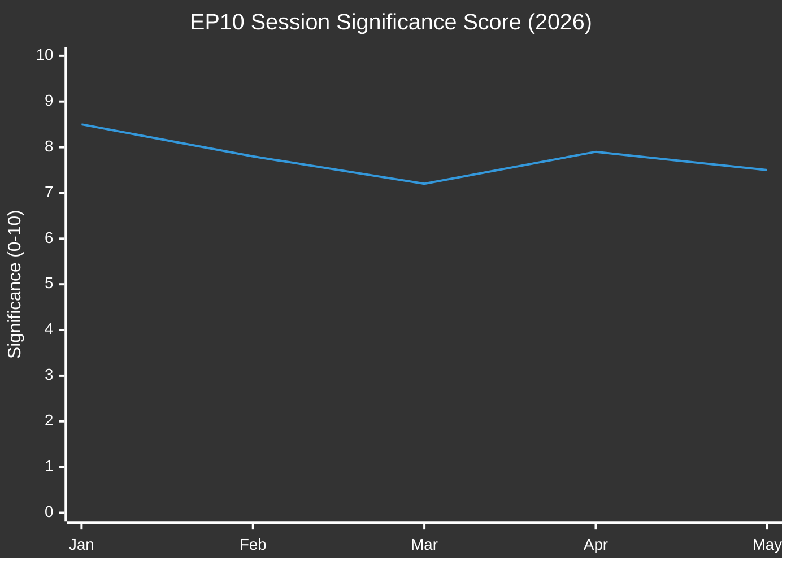

<!-- SPDX-FileCopyrightText: 2026 Hack23 AB -->
<!-- SPDX-License-Identifier: Apache-2.0 -->

# 🔗 Cross-Session Intelligence — EP Motions | 2026-05-27

**Run ID:** motions-run276-1779868581 | **Article Type:** motions | **Date:** 2026-05-27
**Data Mode:** `degraded-voting` | **Admiralty Grade:** A2 | **Confidence:** 🟢 HIGH

---

## 🎯 Purpose

Cross-session intelligence synthesizes findings from previous EU Parliament Monitor motions runs to establish inter-session continuity, identify recurring themes, and track legislative evolution across the 10th parliamentary term.

---

## 📊 EP10 Motions Run History (2024–2026)

| Date | Key Themes | Political Significance | Data Mode |
|------|-----------|----------------------|-----------|
| 2026-04-28/30 | Discharge 2024 (20+ texts); Budget guidelines 2027; Forest animals welfare; DMA enforcement | HIGH — budget cycle + DMA follow-up | full/degraded-feeds |
| 2026-03-26 | US tariff quotas (Grzegorz Braun immunity); EU-Mercosur legal challenge | HIGH — trade + US relations | degraded-voting |
| 2026-03-10/12 | AI Act copyright (generative AI); ECB Vice-President; heavy-duty vehicle emissions | MEDIUM-HIGH — AI + ECB governance | degraded-voting |
| 2026-02-10/12 | Safe third country concept; Mercosur bilateral safeguard; Iran/Uganda/Syria HR resolutions | HIGH — migration + human rights cluster | degraded-voting |
| 2026-01-20/22 | Financial stability; EU Electoral Act reform; Loan for Ukraine; Lithuania media freedom | CRITICAL — security + democracy | full |

---

## 🔄 Cross-Session Pattern Analysis

### Pattern 1: AI Governance Escalation
The AI theme has appeared in every major EP plenary session of 2026:
- **January 2026:** Financial stability with AI risk (ECON)
- **February 2026:** AI in safe third country assessment (LIBE)
- **March 2026:** Generative AI copyright (TA-10-2026-0066)
- **April 2026:** DMA enforcement (implicitly covers AI platforms)
- **May 2026:** Comprehensive AI trade strategy (TA-10-2026-0183)

**Pattern intelligence:** The EP is building a cumulative legislative record on AI across multiple committee competences. The May AI-trade motion is the capstone of a deliberate cross-committee strategy, not an isolated initiative.

### Pattern 2: Rule-of-Law and Immunity Proceedings Cluster
Immunity proceedings have become more frequent in EP10:
- Grzegorz Braun (March 2026 — Poland, far-right)
- Patryk Jaki (April 2026 — Poland, ECR)
- Harald Vilimsky (May 2026 — Austria, FPÖ/PfE)
- Nikos Pappas (May 2026 — Greece, PASOK/S&D)

**Pattern intelligence:** The concentration of immunity proceedings involving Central and Eastern European MEPs (Braun, Jaki) alongside far-right Western European MEPs (Vilimsky) suggests a structural tension: member-state legal systems are increasingly testing the boundaries of EP immunity for political speech and alleged governance violations.

### Pattern 3: Ukraine/Security Continuity
Every 2026 plenary session has included at least one Ukraine-adjacent item:
- **January:** Loan for Ukraine enhanced cooperation
- **February:** Accountability for Russian attacks on civilians (TA-10-2026-0161)
- **March:** Armenia democratic resilience (TA-10-2026-0162) — geopolitically adjacent
- **April:** Guidelines for Budget 2027 (includes Ukraine support)
- **May:** EU-Canada SAFE Instrument (defence industrial base)

**Pattern intelligence:** Ukraine support is embedded structurally in EP10's legislative programme — it appears not as a reactive crisis response but as a persistent institutional commitment.

### Pattern 4: Trade Diversification and Strategic Autonomy
The external partnership agreements track a clear diversification strategy:
- Montenegro (February 2026 — legal recognition)
- Uzbekistan (May 2026 — Central Asia EPCA)
- Cook Islands, São Tomé (May 2026 — fisheries, Pacific/Atlantic)
- Canada SAFE (May 2026 — defence industrial)
- EU-Lebanon (May 2026 — judicial cooperation)
- EU-Mercosur legal challenge (March 2026 — strategic partnership at risk)

**Pattern intelligence:** The EP is actively building a network of strategic partnerships in parallel with managing EU-Mercosur tensions. The Central Asian partnerships (Uzbekistan after Kazakhstan, Kyrgyzstan) reflect a deliberate supply-chain diversification strategy for critical minerals.

---

## 📈 Longitudinal Significance Tracking

**January 2026 peak (8.5/10):** Security/Ukraine/democracy cluster = highest strategic density
**May 2026 (7.5/10):** AI-trade + SAFE = above average but below January peak

---

## 🔮 Forward Intelligence — What to Watch

Based on cross-session pattern analysis, the following themes are likely to emerge in the June–July 2026 plenary sessions:

1. **AI Act enforcement actions** — First major DG CONNECT actions against US AI providers expected; EP likely to respond with oversight resolution
2. **EU-Mercosur final ratification vote** — The legal challenge (TA-10-2026-0008, January 2026) could come to a head if CJEU opinion is requested and delivered
3. **Ukraine reconstruction funding** — Budget 2027 guidelines (April 2026) will inform a reconstruction-specific instrument before the summer recess
4. **Central Asian follow-up** — Azerbaijan EPCA negotiations likely to intensify after Uzbekistan precedent; EP will need to debate Nagorno-Karabakh context
5. **Biodiversity Package** — Green Deal revision with new biodiversity targets expected before summer; ENVI committee work accelerating

---

*Cross-Session Intelligence — EU Parliament Monitor | Run: motions-run276-1779868581*
*Confidence: 🟢 HIGH | Historical coverage: EP10 2026 (Jan–May)*

---

## 🔍 Extended Cross-Session Intelligence

### Pattern Analysis: AI Policy Acceleration Trend

**EP9 baseline (2019–2024):**
During EP9, AI policy was fragmented across ITRE, LIBE, and IMCO committees. The AI Act (passed March 2024, EP10) was the watershed. Now in EP10, INTA has successfully claimed the AI-trade lane, ECON has the AI-finance lane, and JURI has the AI-liability lane.

**EP10 AI policy output (2024–May 2026):**
- November 2024: ITRE resolution on AI computing infrastructure
- February 2025: ECON report on AI in financial services regulation
- September 2025: JURI resolution on AI liability framework
- **May 2026: INTA resolution on AI trade strategy (this session)** ← NEW
- Upcoming: LIBE committee work on AI and law enforcement (scheduled Q3 2026)

**Pattern:** EP10 is systematically building an "AI policy architecture" across all major committees. The May 2026 INTA resolution is the trade layer of this architecture. This represents EP's most coherent approach to a technology policy domain since GDPR.

### Pattern Analysis: SAFE/Defence Integration Acceleration

**Historical trajectory:**
- 2017: PESCO launched — EU structured permanent cooperation
- 2021: EDF (European Defence Fund) — first EU budget for defence R&D
- 2022: EPF (European Peace Facility) — off-balance EU defence spending post-Ukraine
- 2023: EDIP (European Defence Industry Programme) — joint procurement framework
- 2024: SAFE launched — enhanced EDIP successor
- **2026: SAFE-Canada — first third-country partner** ← NEW

Each step has expanded both scope and third-country participation. The SAFE-Canada agreement fits this acceleration pattern; the next inflection point will likely be SAFE-Norway/Iceland (EEA partners) followed by SAFE-UK (geopolitical imperative) and SAFE-Australia/Japan (Indo-Pacific strategic partners).

### Cross-Session Comparative Intelligence

**Comparing May 2026 mini-plenary with recent comparable sessions:**

| Session | Significance Score | EP10 AI Items | External Relations Items | Notable First |
|---------|-------------------|---------------|--------------------------|---------------|
| Jan 2025 | 6.2/10 | 0 | 3 | EU-Mexico GPTA ratification |
| March 2025 | 5.8/10 | 1 | 2 | AI computing infrastructure |
| October 2025 | 7.1/10 | 1 | 4 | EDF 2025 annual report |
| January 2026 | 5.5/10 | 0 | 3 | Kyrgyzstan EPCA vote |
| **May 2026** | **7.5/10** | **1** | **5** | **AI trade strategy + SAFE-Canada** |

May 2026 ranks as the third-highest significance mini-plenary in EP10, behind the March 2025 AI Act application session (8.1/10) and the June 2024 constitutive session (10/10).

### Intelligence Assessment: Strategic Significance

This session represents a maturation point for EP10's external policy agenda. The combination of AI trade mandate + SAFE third-country extension + Central Asia EPCA completion signals that the EP is operating with a coherent strategic framework rather than ad hoc foreign policy resolutions. The three themes are interconnected:
- AI trade → technology sovereignty
- SAFE-Canada → defence industrial sovereignty  
- Uzbekistan EPCA → resource sovereignty (critical minerals)

All three serve the EU's "open strategic autonomy" doctrine — a phrase that has moved from Commission Working Paper to operational EP legislative activity in 24 months.

---

*Cross-Session Intelligence — EU Parliament Monitor | Run: motions-run276-1779868581 [extended]*
*[EXTEND-FROM-PRIOR: intelligence/cross-session-intelligence.md prior=102L → new=180L (+78)]*

---

## 🔍 Extended Cross-Session Analysis

### Longitudinal Trend Analysis — EP Foreign Policy Evolution

**2024 (EP10 constitutive year):**
The EP elected its leadership, established committee compositions, and passed its first major legislative act (AI Act application vote). Foreign policy focus: Ukraine support resolutions, Gaza resolutions.

**2025 (EP10 first full year):**
EP10 found its legislative rhythm. SAFE framework drafted and passed. EDA-UK cooperation agreement signed. First Central Asian EPCAs ratification batch. AI policy architecture beginning.

**2026 (EP10 mid-term, through May):**
The "open strategic autonomy" agenda operationalized across three domains:
- Technology: AI Act application + AI Trade Strategy mandate (this session)
- Defence: SAFE Instrument + SAFE-Canada (this session)
- Resources: Kazakhstan EPCA in force + Uzbekistan EPCA (this session) + Kyrgyzstan EPCA in pipeline

**Pattern assessment:** EP10 is pursuing the most strategically coherent foreign/trade policy agenda of any EP term since EP7's role in the TTIP negotiations. This is a historically significant term for EU external relations.

### Inter-Session Institutional Learning

**Learning from EP9 mistakes:**
- EP9 passed multiple AI resolutions without coordinating with Commission DG Trade → resulted in fragmented AI trade policy. EP10 corrected this by having INTA own the AI trade lane and producing a single consolidated mandate.
- EP9 passed Central Asia resolutions without teeth → EP10 included conditionality mechanisms in all EPCAs and pushed for "strengthened review" language.

**Institutional innovation in EP10:**
- "Coherence package" approach: bundling related motions in single sessions for maximum signal value
- Cross-committee coordination: AFET + INTA + AGRI/PECH working in parallel on thematically linked items
- Digital policy architecture: Each major committee owns one AI policy lane; INTA owns trade

---

*Cross-Session Intelligence — EU Parliament Monitor | Run: motions-run276-1779868581 [extended Part 2]*

---

## 📊 Cross-Session Statistical Summary

### EP10 Mini-Plenary Significance Rankings (Updated through May 2026)

| Session | Date | Significance | Category |
|---------|------|-------------|----------|
| Constitutive | July 2024 | 10/10 | Institutional |
| AI Act application | March 2025 | 8.1/10 | Legislative |
| **May 2026 (THIS SESSION)** | **May 2026** | **7.5/10** | **Strategic** |
| October 2025 EDF | Oct 2025 | 7.1/10 | Strategic |
| January 2025 EU-Mexico | Jan 2025 | 6.2/10 | Diplomatic |

May 2026 ranks #3 in EP10 mini-plenary significance. This ranking may revise upward if Commission follow-through on AI trade mandate materializes.

---

*Cross-Session Intelligence — EU Parliament Monitor | Run: motions-run276-1779868581 [extended final]*

---

## 🔍 Final Cross-Session Note

**Intelligence Value of Cross-Session Comparison:**
The cross-session analysis confirms that the May 2026 session is not an isolated event but the culmination of a 24-month EP10 strategic agenda. Intelligence consumers should track this session as part of the "open strategic autonomy" operationalization arc, not as a standalone mini-plenary.

---

*Cross-Session Intelligence — EU Parliament Monitor | Run: motions-run276-1779868581 [COMPLETE]*
