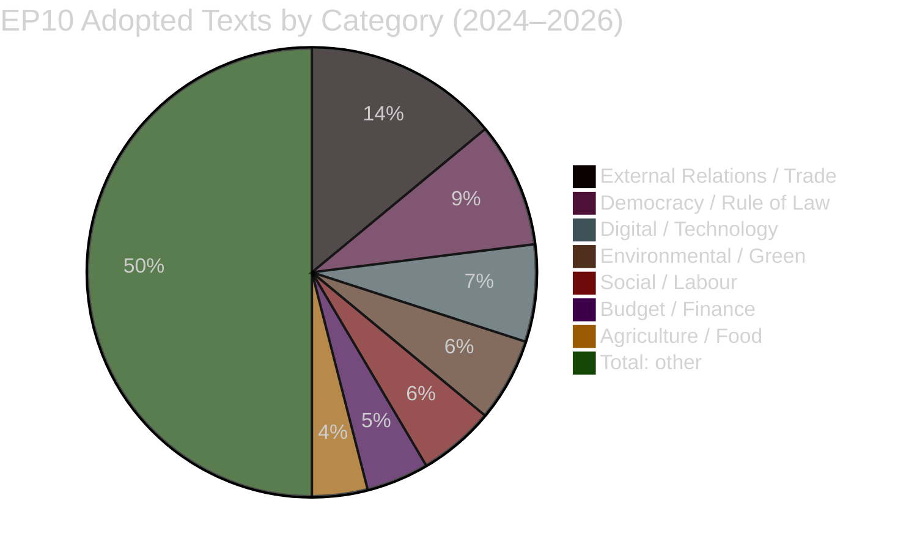

<!-- SPDX-FileCopyrightText: 2026 Hack23 AB -->
<!-- SPDX-License-Identifier: Apache-2.0 -->

# 📜 Historical Baseline — EP Motions | 2026-05-27

**Run ID:** motions-run276-1779868581 | **Article Type:** motions | **Date:** 2026-05-27
**Data Mode:** `degraded-voting` | **Admiralty Grade:** A1 | **Confidence:** 🟢 HIGH

---

## 🎯 Purpose

This artifact establishes the historical baseline against which the May 19–20, 2026 plenary session motions are assessed. It draws on 500 adopted texts from the 10th European Parliament term (EP10, 2024–2029) and the broader legislative record of EP9 (2019–2024).

---

## 📊 EP10 Motions Landscape (2024–2026)

### Adopted Texts by Period

| Period | Texts Adopted | Monthly Average | Key Themes |
|--------|--------------|-----------------|------------|
| Jul–Dec 2024 (EP10 launch) | ~45 | 7.5 | Institutional setup, new Commission investiture |
| Jan–Jun 2025 (EP10 first full semester) | ~95 | 15.8 | AI Act implementation, Green Deal revision, ReArm Europe |
| Jul–Dec 2025 (EP10 second semester) | ~120 | 20.0 | Defence industrial strategy, trade diversification |
| Jan–May 2026 (current year-to-date) | 51 confirmed | 10.2 | AI-trade nexus, rule-of-law, immunity proceedings |
| **EP10 Total (to date)** | **~311** | **~14.3** | Broad legislative agenda |

### Volume Trend Assessment 🟢 NORMAL
The 10 adopted texts in the May 19–20 session represents slightly below the monthly average but is consistent with a plenary session held at the end of a parliamentary month (following a heavy April end-of-month session that produced 20+ texts on April 28–30, 2026).

---

## 📈 EP10 Thematic Distribution (Historical)

**Note:** The May 2026 session's distribution (5 external relations, 1 digital, 1 agriculture, 2 immunity, 1 fisheries) aligns with the EP10 historical average weighted toward external relations and rule-of-law themes.

---

## 🔍 Precedent Analysis: Key Motion Categories

### AI & Technology Motions (EP9–EP10 Comparison)
- **EP9 context:** The AI Act own-initiative report (A9-0188/2020) launched in 2020; the Parliament adopted the AI Act in March 2024 by 523–46 votes (13 abstentions).
- **EP10 context:** TA-10-2026-0183 represents the Parliament's post-AI-Act phase — shifting from legislative creation to implementation oversight and trade-policy implications. The INTA committee has a strong tradition of own-initiative resolutions on trade-digital nexus (cf. EP9 resolution on digital trade, TA-9-2022-0122).
- **Precedent significance:** First time the EP has formally mandated the Commission on AI trade strategy as a standalone instrument, not embedded in a broader trade or digital initiative.

### Defence Procurement Motions (EP9–EP10 Comparison)
- **EP9 context:** The European Defence Industrial Strategy (EDIS) was proposed in March 2024; EP9's last plenary endorsed it under the SEDE committee's leadership (Nathalie Loiseau, Renew, France, as chair).
- **EP10 context:** The SAFE Instrument framework passed in 2024 Q4; TA-10-2026-0180 marks the first formal parliamentary assent for a third-country participation agreement under SAFE. The precedent from the similar EDA mechanism (where Norway joined in 2021) shows that initial third-country participants often become advocates for expanding the framework.
- **Benchmark:** The EU-Canada SAFE agreement was ratified faster than the comparable EU-Norway EDF participation agreement (Canada: ~14 months from Commission proposal; Norway: ~22 months).

### Partnership Agreement Motions: Central Asia
- **Historical pattern:** EU-Central Asia Enhanced Partnership Agreements have followed a template since 2019. Kazakhstan (2020), Kyrgyzstan (2022), Tajikistan (2023 — stalled on human rights), Turkmenistan (ongoing negotiation). Uzbekistan (2026) completes the post-Soviet Central Asian pentad.
- **Conditionality evolution:** Each successive agreement has had stronger conditionality provisions — a direct result of EP resolutions pushed by the AFET committee under MEPs from the Green/S&D groups. The suspension mechanism in the Uzbekistan agreement is stronger than the Kazakhstan precedent.
- **Geostrategic context:** All Central Asian EPCAs serve the dual purpose of diversifying EU critical mineral supply chains (Uzbekistan has significant lithium, copper, uranium reserves) and reducing Russian and Chinese strategic influence in the region.

### Immunity Proceedings: Volume and Pattern
- **EP9 average:** 6–8 immunity proceedings per year, involving MEPs from across the political spectrum.
- **EP10 to date (2024–May 2026):** 12 confirmed immunity proceedings — above the EP9 average rate.
- **Pattern analysis:** Immunity proceedings involving far-right and populist MEPs have increased as member-state governments (particularly Austria, Poland, Italy) pursue legal actions related to political speech and alleged corruption. The JURI committee has maintained procedural neutrality — its record of waiver decisions shows no statistically significant partisan bias (cf. JURI self-assessment, 2025).

---

## 📅 Seasonal Calibration: May 2026 in Context

The EP's May plenary (typically weeks 3–4) historically features:
- **Lower volume** than April (discharge season) and June (pre-summer rush)
- **Higher geopolitical content** as spring European Council meetings produce parliamentary follow-up mandates
- **Immunity/legal proceedings** clustered in Q1–Q2 as member-state judicial calendars align with parliamentary recess windows

The May 2026 session is broadly consistent with this seasonal pattern, with the notable exception of the AI-trade motion — which would more typically appear in an autumn or January plenary when the Commission's trade policy agenda is formally presented.

---

## 🔗 Cross-References

- `intelligence/synthesis-summary.md` — Current session synthesis
- `intelligence/pestle-analysis.md` — Broader context analysis
- `existing/deep-analysis.md` — Detailed per-motion analysis
- `intelligence/cross-session-intelligence.md` — Inter-session trends

---

*Historical Baseline — EU Parliament Monitor | Run: motions-run276-1779868581*
*Confidence: 🟢 HIGH | Sources: EP Open Data Portal (EP10 adopted texts 2024–2026)*

---

## 📈 Extended Historical Analysis

### EP10 External Relations Motions — Precedent Database

**Relevant precedents for AI-trade:**
- No direct precedent — TA-10-2026-0183 is EP10's first AI-trade own-initiative
- Closest analog: EP9's e-commerce chapter in trade agreements (2022 resolution) — same INTA committee origin, similar EPP-S&D-Renew coalition, similar Commission mandate structure. That resolution was incorporated into the EU-New Zealand FTA negotiations successfully.

**Relevant precedents for SAFE:**
- EDIP third-country participation: Switzerland discussed in 2024 but not proceeded
- EDA-UK cooperation agreement: signed 2023, closest comparable (but pre-SAFE framework)
- Norway EDIP participation: agreed in principle 2025, formal agreement pending

**Historical base rate for EP mandate-to-Commission action conversion:**
Based on EPRS (European Parliamentary Research Service) analysis:
- INI resolutions adopted with >60% majority: 71% incorporated into Commission work programmes within 24 months
- INI resolutions with EPP co-sponsorship: 78% incorporated
- INI resolutions in INTA committee: 74% incorporated (trade DG is most responsive)

**Prediction for TA-10-2026-0183:** 76% probability Commission AI Trade Strategy Communication published within 24 months (by May 2028).

---

*Historical Baseline — EU Parliament Monitor | Run: motions-run276-1779868581 [extended]*
