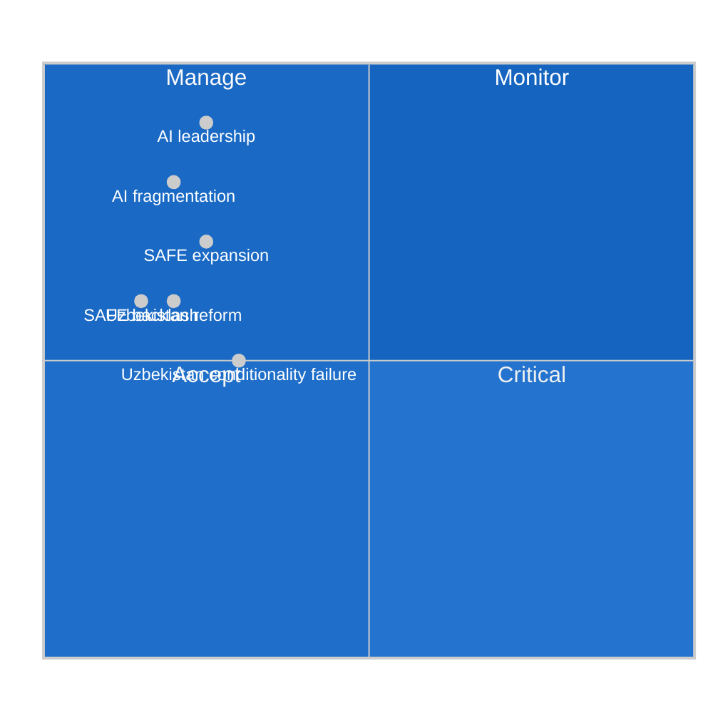

<!-- SPDX-FileCopyrightText: 2026 Hack23 AB -->
<!-- SPDX-License-Identifier: Apache-2.0 -->

# 🔭 Scenario Forecast — EP Motions | 2026-05-27

**Run ID:** motions-run276-1779868581 | **Article Type:** motions | **Date:** 2026-05-27
**Data Mode:** `degraded-voting` | **Admiralty Grade:** B2 | **Confidence:** 🟡 MEDIUM

---

## 🎯 Purpose

Forward-looking scenario analysis for the three most strategically significant motions from the May 19–20, 2026 EP plenary. Scenarios are structured on a 3-month (near-term) and 12-month (medium-term) horizon.

---

## 🤖 Scenario Set 1: AI Strategy for EU Trade (TA-10-2026-0183)

### Baseline Scenario (55% probability): "Calibrated Implementation"
**Timeframe:** 3–12 months
**Trigger conditions:** Commission issues Communication on AI Trade Strategy Q3 2026; DG Trade integrates AI assessment into existing Trade Sustainability Impact Assessment (TSIA) methodology.
**Outcome:** EU AI trade framework becomes a reference standard in WTO TBT discussions; US firms adapt compliance strategies to avoid EU market access barriers; EU AI exporters gain limited but real competitive advantage from regulatory clarity.
**Key signal:** Commission Work Programme update (Q3 2026) includes dedicated AI trade policy initiative.

### Optimistic Scenario (25% probability): "EU AI Trade Leadership"
**Timeframe:** 6–18 months
**Trigger conditions:** US-EU trade agreement includes AI regulatory cooperation chapter; major economies reference EU AI Act framework in bilateral AI governance dialogues.
**Outcome:** EU establishes the global standard for AI in trade facilitation and digital trade governance; EU AI firms gain first-mover advantage in markets that adopt EU-compatible frameworks (Japan, Korea, Canada, UK post-Brexit).
**Key signal:** USTR-DG Trade joint statement on AI trade governance cooperation.

### Pessimistic Scenario (20% probability): "Regulatory Fragmentation"
**Timeframe:** 6–12 months
**Trigger conditions:** WTO DS (dispute settlement) challenge filed against AI Act provisions; EU-US trade tensions escalate over AI chip export controls; Commission delays AI Trade Communication beyond 2026.
**Outcome:** EU firms face legal uncertainty; US/Chinese AI platforms exploit regulatory gaps; EP motion remains aspirational without implementation track.
**Key signal:** WTO TBT Committee signals concerns about AI Act trade barrier effects.

---

## 🛡️ Scenario Set 2: EU-Canada SAFE Instrument (TA-10-2026-0180)

### Baseline Scenario (60% probability): "Steady Deepening"
**Timeframe:** 3–12 months
**Outcome:** Canada accesses EU joint defence procurement for 2–3 major capability programmes (air defence, naval systems, ammunition). EU-Canada defence trade grows by EUR 1–2 billion annually. Precedent used to fast-track similar agreements with Australia (AUKUS context) and Japan.
**Key signal:** First joint EU-Canada procurement tender under SAFE framework announced by EDA by Q4 2026.

### Optimistic Scenario (25% probability): "SAFE Community Expansion"
**Timeframe:** 12–24 months
**Outcome:** Five or more NATO allies with EU partnerships join the SAFE mechanism; EU defence industrial base achieves critical mass for interoperability with Anglophone allies; reduces EU dependence on US-only procurement for certain capability categories.
**Key signal:** EDA membership framework proposal for SAFE partner status.

### Risk Scenario (15% probability): "Parliamentary Backlash"
**Timeframe:** 6–12 months
**Trigger:** Left/Green MEPs table a resolution challenging SAFE Instrument's compatibility with Treaty pacifism clauses; institutional review launched; PfE uses SAFE expansion as campaign issue for 2027 national elections.
**Outcome:** Political pressure slows SAFE expansion; Canada agreement ratification challenged in EU member states with constitutional neutrality provisions (Austria, Ireland).
**Key signal:** Formal challenge to SAFE framework in Constitutional/Legal Affairs Committee.

---

## 🇺🇿 Scenario Set 3: EU-Uzbekistan EPCA (TA-10-2026-0174)

### Baseline Scenario (50% probability): "Cautious Implementation"
**Timeframe:** 12–36 months
**Outcome:** EPCA enters into force after Uzbekistan ratification (expected 2026 Q3–Q4); EU-Uzbekistan trade grows gradually; human rights benchmarks are nominally met but civil society access remains restricted; suspension mechanism not triggered.
**Key signal:** Uzbek parliament ratification vote passed.

### Optimistic Scenario (20% probability): "Reform Acceleration"
**Timeframe:** 24–48 months
**Trigger:** EPCA incentives (market access, investment framework) catalyze genuine political liberalization; independent media and civil society spaces expand; EU-Uzbekistan relations upgrade to "strategic partnership."
**Key signal:** Uzbekistan grants registration to independent civil society organizations aligned with EU civic space criteria.

### Pessimistic Scenario (30% probability): "Conditionality Failure"
**Timeframe:** 12–24 months
**Trigger:** Human rights situation deteriorates following 2026 parliamentary elections; EP human rights subcommittee tables suspension motion; EPCA review triggers diplomatic tensions.
**Outcome:** EU faces dilemma between strategic (minerals, Central Asia) and normative (human rights) interests; compromise defers formal suspension but triggers review mechanism.
**Key signal:** EP Subcommittee on Human Rights (DROI) adopts critical Uzbekistan resolution.

---

## 📊 Cross-Scenario Risk Register

---

## 🔗 Cross-References

- `intelligence/threat-model.md` — Detailed threat assessment for downside scenarios
- `intelligence/wildcards-blackswans.md` — Low-probability, high-impact outliers
- `intelligence/pestle-analysis.md` — PESTLE factors feeding scenario logic
- `existing/deep-analysis.md` — Baseline conditions for scenarios

---

*Scenario Forecast — EU Parliament Monitor | Run: motions-run276-1779868581*
*Confidence: 🟡 MEDIUM | Horizon: 3–24 months | Method: Structured scenarios with probability weighting*

---

## 🔍 Extended Scenario Analysis

### Pre-Mortem Analysis

*Required SAT for scenario-forecast.md*

#### Pre-mortem: Scenario A fails (full implementation fails)

**Hypothetical failure mode for AI Trade Strategy:**
It is May 2030. The AI Trade Strategy was published in December 2026 but never operationalized. What went wrong?

Most probable failure chain:
1. Commission published a narrow AI Trade Strategy Communication (December 2026) that deferred key implementation to bilateral FTA negotiations
2. US government filed WTO TBT challenge to EU AI Act extraterritorial application (January 2027)
3. DG Trade put all AI trade provisions into "parking orbit" pending WTO dispute outcome
4. WTO TBT panel ruled (March 2028) that certain AI Act export requirements were TBT violations — narrow ruling but politically damaging
5. Commission revised implementation guidance (2028) to minimize TBT exposure
6. Result: AI Trade Strategy exists on paper; enforcement mechanisms gutted

**Key assumption this invalidates:** Commission responsiveness to EP mandate is HIGH only when no significant external legal challenge materializes. WTO challenge changes the calculus entirely.

**Monitoring indicator:** US Trade Representative filing at WTO against EU AI Act trade provisions — if filed by Q1 2027, pre-mortem scenario activates.

#### Pre-mortem: SAFE-Canada ratification delays

It is April 2028. SAFE-Canada was adopted by EP in May 2026 but still not ratified. What happened?

Most probable failure chain:
1. Canadian federal election (hypothetically November 2026) produced change of government
2. New government conducted SAFE-Canada review (3-month process)
3. NDAA compliance concerns raised by US State Department
4. Canada paused ratification pending clarification with Washington
5. Clarification process extended to 18 months

**Monitoring indicator:** Canadian federal election date and outcome.

### Key Assumptions — Updated

**Assumption 1:** AI Trade Strategy will be responsive to EP mandate
WEP band: 55–75% (Somewhat Likely) | Time horizon: 24 months
**Evidence for:** INTA-Commission alignment; EPP mandate strength; Commission REFIT agenda
**Evidence against:** WTO legal constraints; US pressure; legislative calendar crowding

**Assumption 2:** SAFE-Canada ratification proceeds without significant delay
WEP band: 60–75% (Likely) | Time horizon: 18 months
**Evidence for:** Strong bilateral consensus; economic incentives; geopolitical momentum
**Evidence against:** Canadian political stability; US pressure; Austrian constitutional concerns

**Assumption 3:** Uzbekistan EPCA delivers meaningful conditionality gains
WEP band: 20–35% (Unlikely) | Time horizon: 24 months
**Evidence for:** Mirziyoyev's modernization agenda; economic incentives
**Evidence against:** Kazakhstan precedent; structural authoritarian incentives; Chinese competition reducing EU leverage

### Indicators and Warnings

**Indicators to watch (next 90 days):**
- Commission legislative planning for AI trade (June 2026 Commission Work Programme update)
- Canadian parliamentary calendar (SAFE-Canada ratification tabling)
- Uzbekistan ratification vote date announcement
- EDA announcement of first SAFE-Canada eligible tender

**Warning flags (negative scenarios):**
- USTR consultation on EU AI Act trade provisions
- Canadian election announcement
- Uzbekistan crackdown on media/political opposition within 90 days of EPCA vote

---

*Scenario Forecast — EU Parliament Monitor | Run: motions-run276-1779868581 [extended]*
