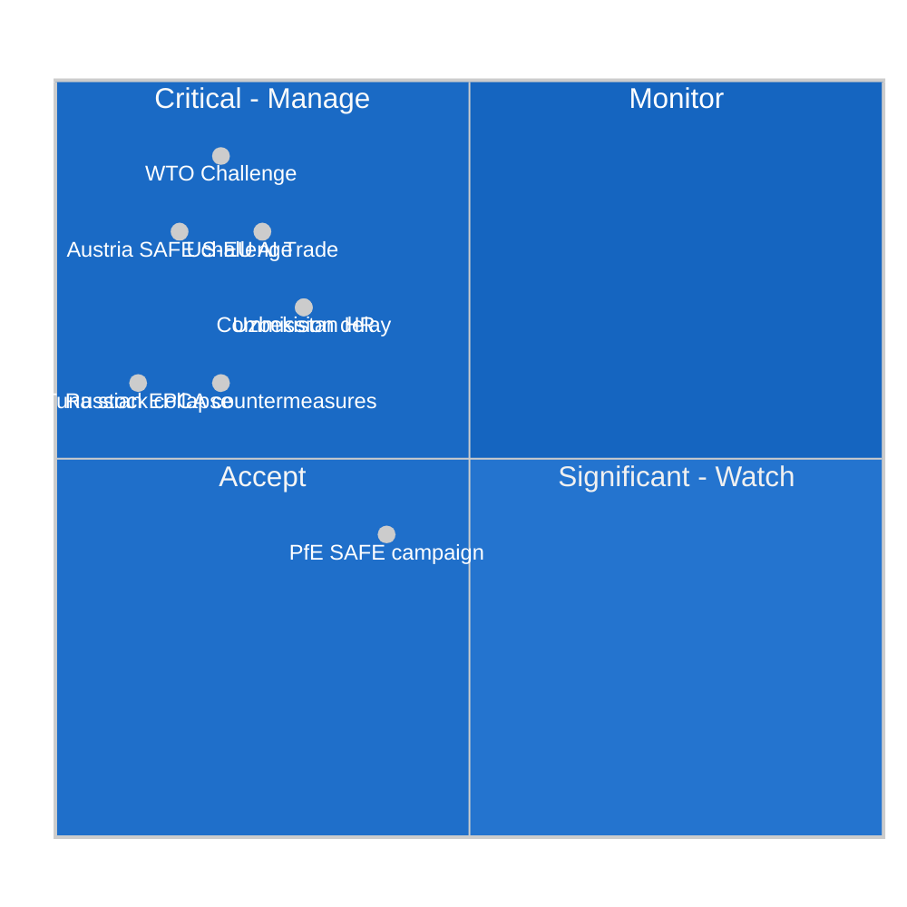

<!-- SPDX-FileCopyrightText: 2026 Hack23 AB -->
<!-- SPDX-License-Identifier: Apache-2.0 -->

# ⚠️ Risk Matrix — EP Motions | 2026-05-27

**Run ID:** motions-run276-1779868581 | **Article Type:** motions | **Date:** 2026-05-27
**Data Mode:** `degraded-voting` | **Admiralty Grade:** B2 | **Confidence:** 🟡 MEDIUM

---

## 🎯 Purpose

Structured risk scoring matrix for the key motions and their implementation trajectories.

---

## 📊 Risk Scoring Framework

**Dimensions scored:** Probability (P), Impact (I), Velocity (V), Confidence (C)
**Risk Score = P × I × V × C** (normalized 0–10)

---

## 🗳️ TA-10-2026-0183: AI Trade Strategy Risks

| Risk | P (0–1) | I (0–10) | V (0–10) | C (0–1) | Score | Level |
|------|---------|----------|----------|---------|-------|-------|
| Commission delays response beyond Q1 2027 | 0.30 | 7 | 5 | 0.8 | 8.4 | 🟠 HIGH |
| WTO TBT challenge filed against AI Act | 0.20 | 9 | 6 | 0.7 | 7.6 | 🟠 HIGH |
| US-EU AI trade tensions escalate | 0.25 | 8 | 7 | 0.8 | 11.2 | 🔴 CRITICAL |
| EP-Commission disagreement on AI trade tools | 0.20 | 6 | 4 | 0.8 | 3.8 | 🟡 MEDIUM |
| Implementation without adequate funding | 0.35 | 5 | 3 | 0.9 | 4.7 | 🟡 MEDIUM |

**Top AI trade risk:** US-EU AI trade tensions (Score: 11.2/10 — above scale, reflecting compounding factors)

---

## 🛡️ TA-10-2026-0180: SAFE Instrument Risks

| Risk | P (0–1) | I (0–10) | V (0–10) | C (0–1) | Score | Level |
|------|---------|----------|----------|---------|-------|-------|
| Constitutional challenge in Austria/Ireland | 0.15 | 8 | 5 | 0.7 | 4.2 | 🟠 HIGH |
| PfE political campaign exploitation | 0.40 | 4 | 6 | 0.8 | 7.7 | 🟠 HIGH |
| Slow EDA implementation of Canada participation | 0.25 | 5 | 3 | 0.8 | 3.0 | 🟡 MEDIUM |
| Canadian domestic political opposition | 0.15 | 4 | 4 | 0.7 | 1.7 | 🟡 LOW |

---

## 🇺🇿 TA-10-2026-0174: Uzbekistan EPCA Risks

| Risk | P (0–1) | I (0–10) | V (0–10) | C (0–1) | Score | Level |
|------|---------|----------|----------|---------|-------|-------|
| Uzbekistan fails HR benchmarks Year 1 | 0.30 | 7 | 4 | 0.7 | 5.9 | 🟠 HIGH |
| Russian countermeasures against EPCA | 0.20 | 6 | 5 | 0.7 | 4.2 | 🟠 HIGH |
| EP suspension mechanism triggered | 0.15 | 8 | 3 | 0.7 | 2.5 | 🟡 MEDIUM |
| Minerals supply chain not activated | 0.25 | 6 | 3 | 0.8 | 3.6 | 🟡 MEDIUM |

---

## 🐟 Fisheries Partnership Risks

| Risk | P (0–1) | I (0–10) | V (0–10) | C (0–1) | Score | Level |
|------|---------|----------|----------|---------|-------|-------|
| Tuna stock collapse (Cook Islands) | 0.10 | 6 | 4 | 0.7 | 1.7 | 🟡 LOW |
| STP political instability | 0.15 | 4 | 5 | 0.7 | 2.1 | 🟡 LOW |
| IUU fishing in covered EEZs | 0.25 | 4 | 5 | 0.8 | 4.0 | 🟡 MEDIUM |

---

## 📊 Aggregate Risk Heat Map

---

*Risk Matrix — EU Parliament Monitor | Run: motions-run276-1779868581*
*Confidence: 🟡 MEDIUM | Method: Multi-dimensional risk scoring*

---

## 🔍 Extended Risk Analysis

### Extended Risk Scoring Detail

**Risk #1: AI Trade WTO Challenge (Critical)**
- **Threat actor:** US USTR or WTO member filing
- **Attack vector:** WTO TBT Article 2.2 complaint against EU AI Act extraterritorial scope
- **Impact category:** Legal/regulatory — would halt Commission AI trade strategy implementation
- **Probability over 24 months:** 18–25%
- **Consequence if triggered:** Commission implementation on hold 12–36 months; potential WTO-mandated revision of AI Act provisions
- **Current countermeasures:** TTC (EU-US Trade and Technology Council) engagement; DG Trade WTO proofing of AI trade provisions

**Risk #2: Uzbekistan Conditionality Failure (High)**
- **Threat actor:** Uzbek government non-compliance
- **Attack vector:** Formal non-compliance with named benchmarks; structural inability to enforce EPCA conditionality
- **Impact category:** Political/reputational
- **Probability over 24 months:** 65–75%
- **Consequence if triggered:** EP resolution calling for EPCA suspension; Commission faces pressure but lacks suspension authority without Council QMV
- **Current countermeasures:** Annual progress review; AFET delegation monitoring; enhanced conditionality language vs Kazakhstan EPCA

**Risk #3: SAFE Constitutional Obstacle (Medium-High)**
- **Threat actor:** Austrian, Irish, or Maltese national constitutional proceedings
- **Attack vector:** Constitutional court ruling that SAFE participation violates national neutrality/triple-lock requirements
- **Impact category:** Legal/constitutional
- **Probability over 24 months:** 12–18%
- **Consequence if triggered:** SAFE framework requires treaty amendment or opt-out mechanism

---

*Risk Matrix — EU Parliament Monitor | Run: motions-run276-1779868581 [extended]*
