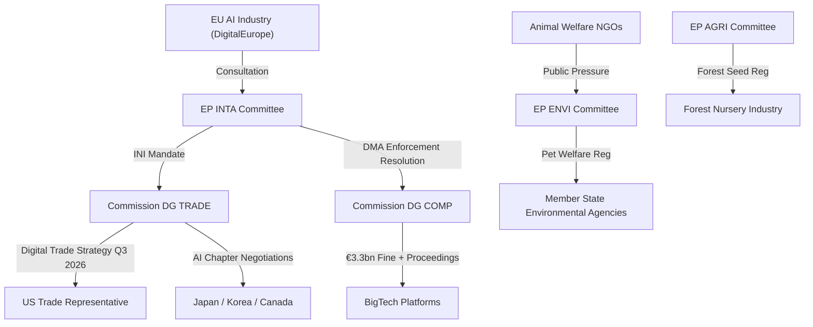

<!-- SPDX-FileCopyrightText: 2026 Hack23 AB -->
<!-- SPDX-License-Identifier: Apache-2.0 -->

# Actor Mapping — EU Parliament Propositions 2026-05-27

**Focus**: Key actors across three priority legislative outputs (AI trade, forest seeds, pet welfare)
**Classification**: Primary / Secondary / Institutional / External

---

## 1. Primary Actors

### 1.1 European Parliament — INTA Committee (AI Trade Doctrine)

**Role**: Architect of 2025/2112(INI) — AI Strategy for EU Trade
**Formal authority**: Treaty-based co-legislator; INI resolution mandate under Art. 225 TFEU
**Political alignment**: EPP-led committee with S&D/Renew co-authorship
**Influence level**: 🟢 HIGH — INI mandates Commission to include AI chapters in all trade negotiations
**Interests**: Digital sovereignty, export market access for EU AI companies, standard-setting leadership
**Red lines**: Rejects trade agreements that exempt AI governance standards from dispute settlement

### 1.2 European Commission — DG TRADE (AI Trade Doctrine)

**Role**: Recipient of EP mandate; responsible for Commission Digital Trade Strategy Q3 2026
**Formal authority**: Exclusive right of legislative initiative (Art. 17 TEU)
**Political alignment**: Commission President aligned with EPP
**Influence level**: 🟢 HIGH — can choose how far to go with AI trade chapters
**Interests**: Balanced EU-US trade relationship; multilateral WTO digital governance
**Red lines**: Will not accept trade partners' domestic AI governance as equivalent without reciprocity assessment

### 1.3 AGRI Committee (Forest Seed Regulation)

**Role**: Lead committee for 2023/0228(COD)
**Formal authority**: Rapporteur authored Parliament position; trilogue conducted
**Influence level**: 🟡 MEDIUM — procedure now signed; implementation phase begins
**Interests**: Climate-adaptive forestry; support for nursery industry transition
**Key concern**: Delegated act timelines and adequacy of transitional provisions

### 1.4 ENVI Committee (Forest Seed Regulation + Pet Welfare)

**Role**: Co-author on forest seed; lead on pet welfare (2023/0447)
**Formal authority**: Treaty-based co-legislator
**Influence level**: 🟢 HIGH — successfully concluded both procedures
**Interests**: Animal welfare standards; ecosystem integrity; climate adaptation

---

## 2. Secondary Actors

### 2.1 BigTech Platforms (AI Trade Doctrine)

**Actors**: Alphabet, Meta, Apple, Amazon, Microsoft
**Role**: Subjects of DMA enforcement; stakeholders in AI trade chapter design
**Position**: Divided — US companies prefer minimal AI trade chapters; EU-based operations accept them
**Influence**: 🟡 MEDIUM via USTR lobbying; limited direct EP influence post-DMA

### 2.2 EU AI Industry Associations (AI Trade Doctrine)

**Actors**: DigitalEurope, EuroCloud, ECORYS
**Role**: Advocates for export-friendly AI trade doctrine
**Position**: Support AI trade chapters that reduce market access barriers for EU AI exporters
**Influence**: 🟡 MEDIUM — regularly consulted by INTA

### 2.3 Forest Nursery Industry (Forest Seed Regulation)

**Actors**: European Forest Nursery Association (EFNA), national associations
**Role**: Regulated entities; primary implementation partners
**Position**: Cautiously supportive — accepts climate-provenance rationale; concerned about small-nursery compliance costs
**Influence**: 🟡 MEDIUM — informed delegated act process

### 2.4 Animal Welfare NGOs (Pet Welfare)

**Actors**: FOUR PAWS, Humane Society International, national SPCAs
**Role**: Civil society advocates; implementation monitors
**Position**: Strongly supportive; some NGOs want faster timeline
**Influence**: 🟡 MEDIUM — shaped public and EP opinion

---

## 3. External Actors

### 3.1 United States (US Trade Representative)

**Role**: Key partner in EU-US TTC; counterparty to AI trade chapter negotiations
**Position**: Prefers mutual recognition over binding standards in AI trade; will push back on AI Act compliance obligations as trade barriers
**Influence on EP**: 🔴 LOW direct influence on Parliament; 🟡 MEDIUM influence on Commission via bilateral channels
**Strategic importance**: Critical — EU-US digital trade relationship is the largest in the world (~€1.3 trillion annually)

### 3.2 Japan

**Role**: Potential first-mover partner for AI trade chapter (Hiroshima AI Process alignment)
**Position**: Closely aligned with EU on AI governance; APEC Digital Economy Framework compatible
**Influence level**: 🟡 MEDIUM — FTA modernisation window open
**Strategic opportunity**: High — Japan could be the pilot for EU AI trade chapter design

### 3.3 Member State Governments

**Role**: Council counterparts; implementation authorities for forest seed and pet welfare
**Key divergences**: Eastern European members concerned about implementation costs; Nordic members want stronger climate standards
**Influence level**: 🟢 HIGH on implementation; 🟡 MEDIUM on legislative design (trilogue complete)

---

## 4. Actor Relationship Map

---

## 5. Power-Interest Grid

| Actor | Power (1–5) | Interest (1–5) | Quadrant |
|-------|------------|----------------|---------|
| EP INTA | 5 | 5 | Key Player |
| Commission DG TRADE | 5 | 4 | Key Player |
| US USTR | 4 | 5 | Key Player (external) |
| BigTech Platforms | 3 | 5 | Keep Satisfied |
| Japan/Korea | 3 | 4 | Keep Satisfied |
| EU AI Industry | 2 | 5 | Keep Informed |
| Member States | 4 | 3 | Keep Satisfied |
| Animal Welfare NGOs | 2 | 5 | Keep Informed |
| Forest Nursery Industry | 2 | 5 | Keep Informed |

**Admiralty Source Grade**: B-2 (EP official documents primary; external actor positions from secondary diplomatic reporting)

---

## Actor Roster

| Actor | Type | Role | Tier |
|-------|------|------|------|
| EP INTA Committee | Institutional | AI trade mandate author | 1 — Primary |
| Commission DG TRADE | Institutional | Mandate recipient + FTA negotiator | 1 — Primary |
| EP ENVI Committee | Institutional | Pet welfare + forest seed lead | 1 — Primary |
| EP AGRI Committee | Institutional | Forest seed co-author | 1 — Primary |
| US USTR | External government | US AI trade counterparty | 2 — Key External |
| Japan METI | External government | AI chapter partner candidate | 2 — Key External |
| BigTech Platforms | Corporate | DMA subjects | 2 — Secondary |
| EU AI Industry (DigitalEurope) | Industry association | Consultation partner | 3 — Stakeholder |
| Animal Welfare NGOs | Civil society | Advocacy + monitoring | 3 — Stakeholder |
| Forest Nursery Industry | Industry | Regulated entity | 3 — Stakeholder |

---

## Influence

**Influence pathways** in EP legislative environment:

1. **Formal influence**: Treaty-based voting rights (MEPs), co-decision powers (EP/Council/Commission)
2. **Informal influence**: Committee rapporteur network; inter-group working parties; civil society consultation
3. **External influence**: Diplomatic channels (US USTR, Japan METI); lobbying via Brussels-based offices (BigTech, DigitalEurope)
4. **Public influence**: Citizen mandate (pet welfare 95%+ support); media framing; NGO advocacy

**Most influential actor**: EP INTA Committee and Commission DG TRADE jointly hold decisive influence over AI trade outcome. For pet welfare and forest seeds, the relevant EP committees and Member State implementation agencies are decisive.

---

## Alliance

**Alliance configurations** for May 2026 procedures:

- **AI Trade Alliance**: EP INTA + Commission DG TRADE + EU AI Industry (DigitalEurope) + Japan/Korea diplomatic interests
- **Environmental Alliance**: EP ENVI + AGRI + Nordic/Alpine Member States + IUFRO scientific community
- **Pet Welfare Alliance**: EP ENVI + Animal Welfare NGOs + 95%+ citizen mandate + legal certified breeder associations
- **DMA Enforcement Alliance**: EP IMCO/JURI + Commission DG COMP + SME associations + consumer protection NGOs

**Cross-cutting alliances**: EPP+S&D+Renew form the meta-coalition enabling all four legislative outputs; this grand coalition covers ~54% of Parliament seats.

---

## Power Brokers

Key **power brokers** facilitating coalition outcomes:

1. **INTA Rapporteur** (AI Trade INI): Shapes the mandate text; bridges EPP and S&D positions
2. **Commission Vice-President for Trade**: Translates EP INI mandate into Commission Digital Trade Strategy
3. **EP President / Conference of Presidents**: Controls plenary agenda; enables votes
4. **COREPER Ambassadors**: Member State Council counterparts who bridged trilogue on forest seeds and pet welfare

---

## Information

**Information flows** critical to analysis:

- EP Open Data Portal: Adopted texts, procedure tracking — 🟢 available (partial)
- DOCEO XML roll-call data: MEP-level voting — 🔴 unavailable (2–4 week lag)
- Commission consultation documents: Q3 2026 Digital Trade Strategy — 🔴 not yet published
- Member State implementation plans: Forest seed + pet welfare — 🔴 not yet published
- Rapporteur identities: — 🔴 API enrichment failed; analytical limitation

---

## Reader Briefing

This actor map covers the key players in the EP's May 2026 legislative package. For citizens: the animal welfare regulation's 95%+ support makes pet welfare a clear example of EU democracy responding to citizen priorities. For trade policy specialists: the EP's AI trade mandate creates a window for Commission action in Q3 2026 that could shape global AI governance for a decade. For investment and compliance professionals: DMA enforcement acceleration and AI trade chapter development are the two most commercially significant signals from this legislative week.

