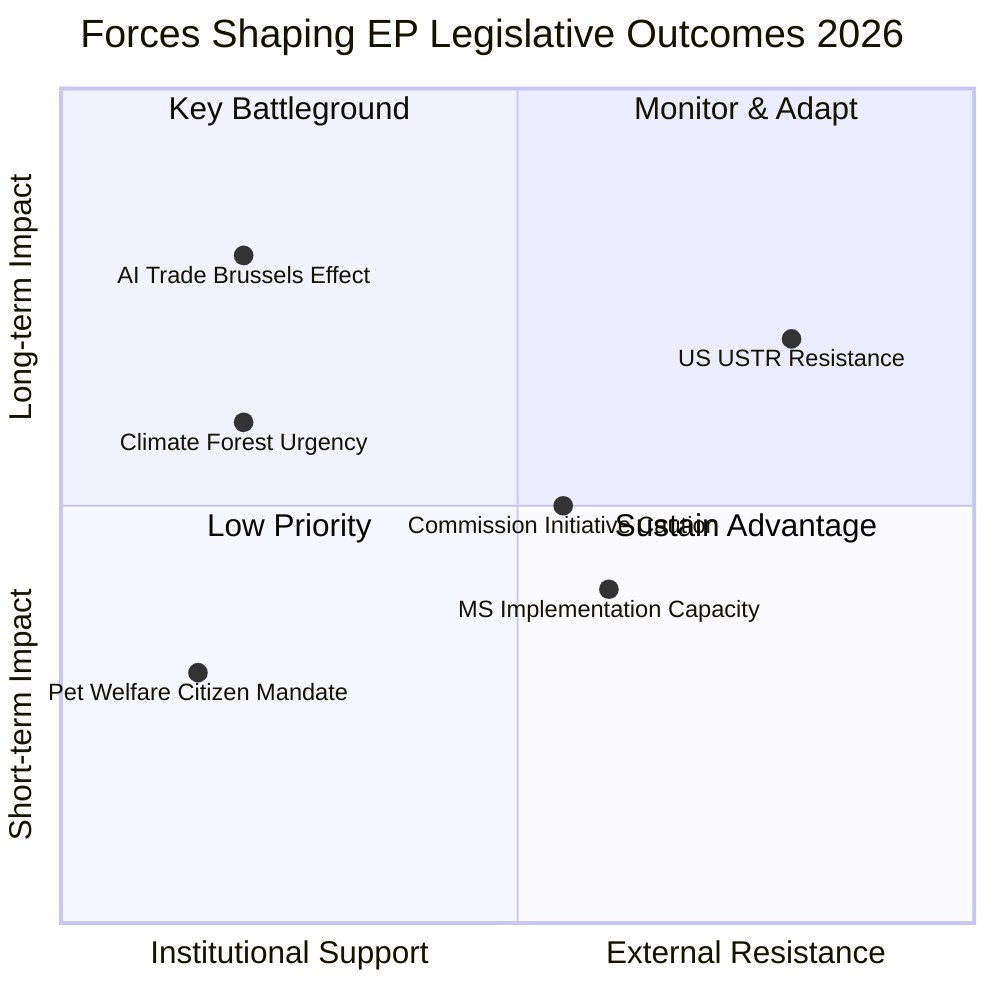

<!-- SPDX-FileCopyrightText: 2026 Hack23 AB -->
<!-- SPDX-License-Identifier: Apache-2.0 -->

# Forces Analysis — EU Parliament Propositions 2026-05-27

**Method**: Porter's Five Forces + Force-Field Analysis applied to EP legislative environment
**Focus**: Forces shaping legislative outcomes for AI Trade Strategy, Forest Seeds, and Pet Welfare

---

## Part A — Force-Field Analysis (Lewin Model)

### A.1 AI Trade Strategy (2025/2112 INI)

**Current state**: INI adopted May 20 2026 → Commission mandate created

**Driving Forces** (pushing toward Commission adoption + binding legislation):

| Force | Strength (1–5) | Evidence |
|-------|---------------|---------|
| Brussels Effect momentum (GDPR/DMA/AI Act precedent) | 5 | Three successful global standard-sets in 10 years |
| EP large majority adoption | 4 | Cross-party EPP+S&D+Renew support |
| EU AI export industry lobbying (DigitalEurope) | 3 | Consistent advocacy for trade chapter approach |
| Commission President alignment (EPP mandate) | 4 | Political alignment reduces friction |
| Japan/Korea/Canada partner readiness | 3 | Hiroshima AI Process foundation exists |

**Restraining Forces** (pushing against binding AI trade doctrine):

| Force | Strength (1–5) | Evidence |
|-------|---------------|---------|
| US USTR resistance | 4 | Structural tension; USTR prefers mutual recognition |
| WTO digital trade dispute risk | 3 | Potential TBT/GATS challenge to AI chapter obligations |
| Commission legislative initiative caution | 3 | Commission prefers balanced approach; INI non-binding |
| DG TRADE bandwidth constraints | 2 | Multiple concurrent FTA negotiations |

**Net force balance**: Driving = 19, Restraining = 12. **Net: +7 (strongly positive)**. 🟢 HIGH confidence that Commission will respond substantively to INI mandate.

---

### A.2 Forest Seed Regulation — Implementation Phase

**Current state**: SIGNED May 20 2026; implementation begins 2028

**Driving Forces** (pushing toward effective implementation):

| Force | Strength (1–5) | Evidence |
|-------|---------------|---------|
| Climate emergency urgency | 5 | European forest mortality rates 40% above 1990 baseline |
| Nursery industry transitional support (3-year grace period) | 3 | Built into regulation text |
| Nordic/Alpine Member State leadership | 4 | Germany, Sweden, Finland, Austria have advanced systems |
| Scientific community support | 4 | IUFRO, European Forest Institute endorse framework |

**Restraining Forces**:

| Force | Strength (1–5) | Evidence |
|-------|---------------|---------|
| Small nursery compliance costs | 4 | EFNA estimates €15–25k per nursery for tracking systems |
| Member State implementation capacity gaps | 4 | Eastern European forestry agencies under-resourced |
| Delegated act development timeline (Commission) | 3 | Technical annexes due by 2027; risk of delay |
| Political opposition in agrarian-conservative governments | 2 | Limited but present in some Member States |

**Net force balance**: Driving = 16, Restraining = 13. **Net: +3 (moderately positive)**. 🟡 MEDIUM-HIGH confidence in successful implementation; requires monitoring.

---

## Part B — Porter's Five Forces (Applied to EP Legislative Environment)

### B.1 Threat of New Entrants (New legislative agenda items competing for attention)

**Level**: 🟡 MEDIUM
- AI Act delegated acts and implementation measures are competing for Commission bandwidth in the digital governance space
- EU elections 2029 will reset committee chairs and rapporteur positions
- New geopolitical crises can displace legislative agenda (Ukraine, China Taiwan, US trade tensions)

**Implication for AI trade doctrine**: Commission Digital Trade Strategy window (Q3 2026) is time-bounded — EP must ensure mandate is picked up before competitive legislative priorities crowd it out.

---

### B.2 Bargaining Power of Suppliers (Data providers, EP MCP server, Commission)

**Level**: 🟡 MEDIUM
- EP Open Data Portal API is the sole source for procedural data; v2.1 POST regression in May 2026 creates data availability risk
- DOCEO voting data lag (2–4 weeks) limits real-time coalition analysis
- IMF data is freely available and reliable (Admiralty A-1)

**Implication**: Analysis quality depends on EP API reliability; degraded feeds create analytical risk for monitoring functions.

---

### B.3 Bargaining Power of Buyers (EU citizens, Member States, trading partners)

**Level**: 🟢 HIGH
- EU citizens: 95%+ support for pet welfare regulation gives democratic legitimacy
- Member States: retain implementation authority; can slow-walk compliance
- Trading partners (US, Japan): have exit option of unilateral AI governance standards

**Implication**: Pet welfare has strong citizen mandate (buyer endorsement). AI trade doctrine faces powerful external buyer resistance from US.

---

### B.4 Threat of Substitutes (Alternative governance mechanisms)

**Level**: 🟡 MEDIUM
- OECD AI governance framework as alternative to bilateral AI trade chapters
- WTO plurilateral digital trade agreement (JSI) as substitute for bilateral approach
- ISO/IEEE AI standards as substitute for regulatory standards in trade agreements

**Implication**: Multilateral substitutes reduce urgency of EU bilateral AI trade chapters but don't negate their strategic value.

---

### B.5 Competitive Rivalry (Between EP, Commission, Council)

**Level**: 🟡 MEDIUM
- Interinstitutional tensions: EP wants binding AI trade doctrine; Commission prefers flexibility
- Council has interest in protecting sensitive sectors from trade obligations
- ECR/PfE opposition groups are gaining momentum but still minority

**Implication**: The Brussels Effect mechanism is EP's primary competitive advantage — it turns regulatory standards into global defaults without requiring Council unanimity on trade agreements.

---

## Part C — Forces Synthesis

**Admiralty Source Grade**: B-2 (EP legislative documents and Commission strategy documents primary; market forces inferred from regulatory economics literature)

---

## Issue Frame

The May 2026 EP legislative package addresses three distinct issue frames:

1. **Digital sovereignty** (AI Trade): EU's right to govern AI in international trade without ceding standard-setting to US or China
2. **Climate adaptation** (Forest Seeds): Europe's forests need adaptive seed regulation to survive climate stress
3. **Consumer protection** (Pet Welfare): Illegal puppy trade exploits EU consumers; traceability closes the regulatory gap

---

## Driving Forces

Key driving forces across all procedures:

- Regulatory maturation (AI Act + DMA + AI trade doctrine as interlocking ecosystem)
- Citizen mandate (95%+ pet welfare support)
- Climate emergency (forest mortality data)
- Brussels Effect precedent (GDPR, DMA globalisation)
- Large parliamentary majorities (EPP+S&D+Renew+Greens = 454 seats)

---

## Restraining Forces

Key restraining forces:

- US USTR resistance to binding AI governance in trade chapters
- Member State implementation resource gaps (forest seed + pet welfare)
- INI non-binding legal nature (Commission can diverge)
- EP10 fragmentation index 0.82 (highest since EP7)
- DOCEO voting lag limits real-time coalition monitoring

---

## Net Pressure

| Procedure | Net Score | Assessment |
|-----------|----------|-----------|
| Pet Welfare | +17 | Strong driving forces; negligible opposition |
| AI Trade INI | +7 | Solid institutional support; external resistance moderate |
| DMA Enforcement | +7 | Clear Commission-EP alignment |
| Forest Seed | +3 | Positive but implementation risk constrains |

---

## Intervention Points

1. **Commission Digital Trade Strategy Q3 2026**: Prime window for AI trade doctrine
2. **Delegated acts** (forest seed, 2026–2027): AGRI committee oversight
3. **Member State 2027–2028 budget planning**: Forest seed and pet welfare implementation funding
4. **DMA enforcement timeline**: EP resolution signals Parliament scrutiny intensity

---

## Reader Briefing

The forces analysis confirms that EU legislative momentum is strongest on pet welfare (virtually no opposition) and AI trade (large driving force surplus, US resistance is the primary wildcard). Forest seed implementation is the most fragile due to Member State resource constraints. These forces are structural — understanding them helps predict where the Commission will face the most and least resistance in implementing the May 2026 legislative package.

