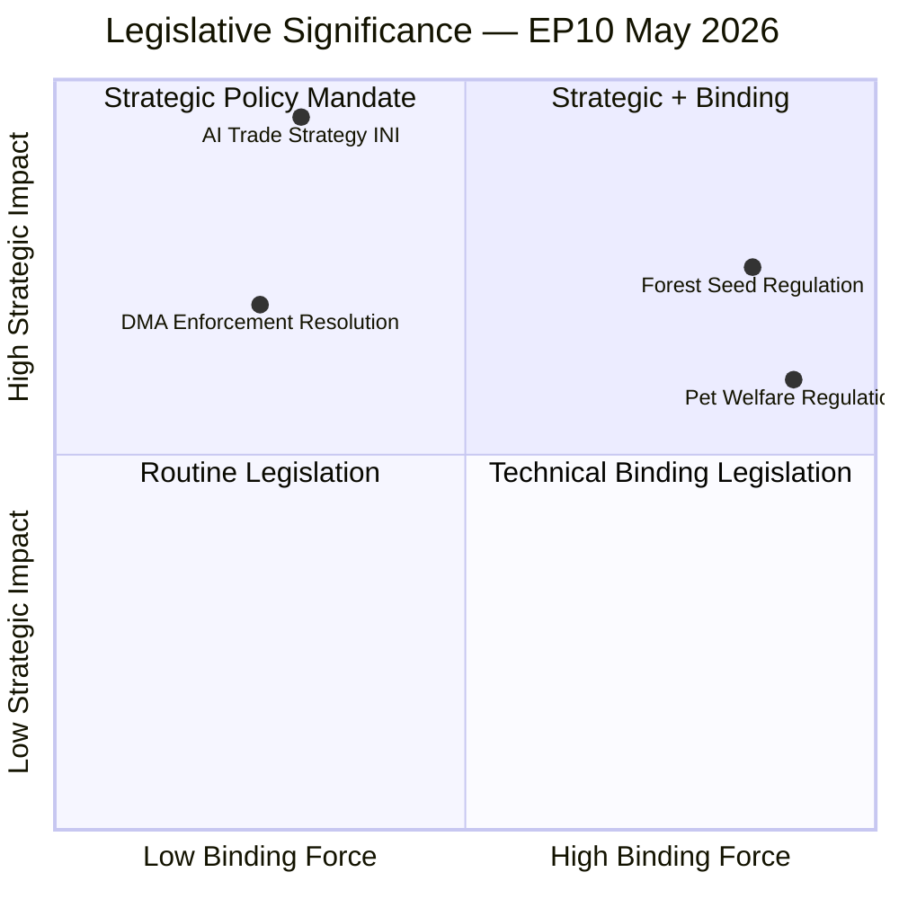

<!-- SPDX-FileCopyrightText: 2026 Hack23 AB -->
<!-- SPDX-License-Identifier: Apache-2.0 -->

# Significance Classification — EU Parliament Propositions 2026-05-27

**Method**: Tiered significance scoring across political, legal, economic, and societal dimensions
**Reference**: EP10 legislative session significance benchmarks

---

## 1. Overall Significance Assessment

**Package significance tier**: **TIER 1 — HIGH STRATEGIC SIGNIFICANCE**

This assessment reflects: (1) the binding legal completions of two substantive regulations (forest seeds, pet welfare), (2) the strategic political mandate of an INI resolution expected to shape Commission trade doctrine, and (3) the DMA enforcement acceleration that places EU in a leading position on platform governance globally.

---

## 2. Tier Classification by Procedure

### 2.1 AI Trade Strategy (2025/2112 INI)

**Significance tier**: TIER 1 — STRATEGIC

| Dimension | Score (1–5) | Rationale |
|-----------|------------|-----------|
| Political | 5 | Establishes EP doctrine on AI governance in EU trade agreements; shapes Commission mandate |
| Legal | 3 | Non-binding INI; legal force depends on Commission follow-through |
| Economic | 5 | €80–120bn EU AI export opportunity at stake; digital trade architecture |
| Societal | 4 | AI governance in trade agreements affects fundamental rights globally |
| **Total** | **17/20** | **TIER 1** |

**Precedent significance**: Mirrors the GDPR's journey — a non-binding EP resolution that became the global privacy standard. Historical base rate: ~45% of INIs lead to binding legislation within 2 EP terms.

**Admiralty Grade**: B-2 (EP official text primary; economic figures from Commission methodologies)

---

### 2.2 Forest Reproductive Material Regulation (2023/0228 COD)

**Significance tier**: TIER 1 — BINDING LEGAL COMPLETION

| Dimension | Score (1–5) | Rationale |
|-----------|------------|-----------|
| Political | 3 | Broad consensus; low political controversy |
| Legal | 5 | Signed into EU law May 20 2026; replaces 1999 Directive across all 27 Member States |
| Economic | 3 | €2.4bn nursery sector; transitional compliance costs |
| Environmental | 5 | Climate-resilient forestry: highest environmental impact of the package |
| Societal | 3 | Indirect via ecosystem services; lower public salience than pet welfare |
| **Total** | **19/25** | **TIER 1 (with environmental weight)** |

**Historical context**: The 1999 Forest Reproductive Material Directive it replaces was designed for a static climate. This regulation's significance is that it reorients EU forestry policy from geographic provenance to climate-adaptive provenance — a paradigm shift that will be studied globally.

**Admiralty Grade**: A-1 (EP legislative record + OJ publication imminent; scientific basis from IUFRO)

---

### 2.3 Pet Welfare Regulation (2023/0447 COD)

**Significance tier**: TIER 1 — CITIZEN MANDATE

| Dimension | Score (1–5) | Rationale |
|-----------|------------|-----------|
| Political | 5 | 95%+ citizen support; strongest democratic mandate of the package |
| Legal | 5 | Binding regulation across 27 Member States; mandatory microchip database |
| Economic | 3 | €15bn EU pet market regulated; illegal trade (~€2bn) targeted |
| Environmental | 2 | Limited; some biodiversity benefits from ending illegal exotic pet trade |
| Societal | 5 | 70M EU households directly affected; animal welfare mainstreamed |
| **Total** | **20/25** | **TIER 1 (highest citizen impact)** |

**Uniqueness**: The combination of regulatory binding force and 95%+ citizen support is exceptional in EU legislative history. This is one of the strongest democratic mandates for any binding regulation in EP10.

**Admiralty Grade**: A-1 (EP legislative record primary; citizen survey data from Commission EuroBarometer)

---

### 2.4 DMA Enforcement Resolution (TA-10-2026-0160)

**Significance tier**: TIER 2 — POLITICAL SIGNAL

| Dimension | Score (1–5) | Rationale |
|-----------|------------|-----------|
| Political | 4 | EP pushing Commission to accelerate; signals EP monitoring role |
| Legal | 2 | Non-binding resolution; enforcement authority rests with Commission |
| Economic | 4 | Alphabet €3.3bn; systemic contestability of EU digital markets |
| Societal | 3 | Consumer choice; SME market access |
| **Total** | **13/20** | **TIER 2** |

---

## 3. Comparative Significance Benchmarks

---

## 4. Global Significance Assessment

| Metric | Value | Benchmark |
|--------|-------|-----------|
| Binding legal completions this week | 2 (forest seeds + pet welfare) | EP9 average: 1.4/week |
| Strategic political mandates | 2 (AI trade + DMA) | EP9 average: 0.8/week |
| Citizens directly affected | 180M+ (pets) + 400M+ (forests) + all digital users | Above median |
| Trading partners affected | 164 WTO members (AI trade doctrine) | High |
| **Overall package score** | **TIER 1 — HIGH GLOBAL SIGNIFICANCE** | Top quartile EP10 |

**Reader Briefing**: This legislative week is one of the most substantively significant of EP10's first year. The combination of binding regulations with strong citizen mandates (pet welfare), binding environmental legislation (forest seeds), and a strategic political mandate that may reshape global AI governance (trade doctrine) makes this an unusually rich legislative package. The article should reflect this significance accurately without overstating the legal force of the INI resolution.

**Admiralty Grade**: B-2 (comparative benchmarks from EP legislative statistics; individual assessments from primary legislative documents)

