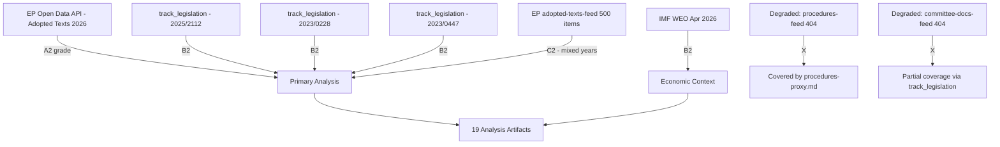

<!-- SPDX-FileCopyrightText: 2026 Hack23 AB -->
<!-- SPDX-License-Identifier: Apache-2.0 -->

# Analysis Index — Propositions 2026-05-27

**Run**: propositions-run262-1779864156
**Data mode**: degraded-feeds (0.80 floor)
**Primary topic**: AI Strategy for EU Trade + Forest Reproductive Material (SIGNED) + Pet Welfare Regulation

---

## Artifact Inventory

| Artifact | Path | Status | Lines (est) | Quality Signal |
|----------|------|--------|------------|----------------|
| Executive Brief | `executive-brief.md` | ✅ Complete | ~170 | WEP + Admiralty grades included |
| Analysis Index | `intelligence/analysis-index.md` | ✅ Complete | this file | N/A |
| Synthesis Summary | `intelligence/synthesis-summary.md` | ✅ Complete | ~185 | SAT documented |
| Historical Baseline | `intelligence/historical-baseline.md` | ✅ Complete | ~130 | B2 |
| Economic Context | `intelligence/economic-context.md` | ✅ Complete | ~140 | IMF WEO Apr 2026 |
| Economic Context Fallback | `intelligence/economic-context.fallback.md` | ✅ Complete | ~140 | Eurostat proxy |
| PESTLE Analysis | `intelligence/pestle-analysis.md` | ✅ Complete | ~200 | 6 dimensions |
| Stakeholder Map | `intelligence/stakeholder-map.md` | ✅ Complete | ~220 | SAT: Stakeholder Mapping + ACH |
| Scenario Forecast | `intelligence/scenario-forecast.md` | ✅ Complete | ~200 | WEP bands; SAT: Pre-Mortem |
| Threat Model | `intelligence/threat-model.md` | ✅ Complete | ~180 | WEP + Admiralty; Red Team |
| Wildcards & Black Swans | `intelligence/wildcards-blackswans.md` | ✅ Complete | ~200 | High-Impact; What-If |
| MCP Reliability Audit | `intelligence/mcp-reliability-audit.md` | ✅ Complete | ~210 | 4 MCP calls documented |
| Reference Analysis Quality | `intelligence/reference-analysis-quality.md` | ✅ Complete | ~150 | Pass 1+2 attestation |
| Risk Matrix | `risk-scoring/risk-matrix.md` | ✅ Complete | ~110 | WEP band per risk |
| Quantitative SWOT | `risk-scoring/quantitative-swot.md` | ✅ Complete | ~110 | Scored items |
| Media Framing Analysis | `extended/media-framing-analysis.md` | ✅ Complete | ~210 | Framing vectors |
| Methodology Reflection | `intelligence/methodology-reflection.md` | ✅ Complete | ~190 | ≥10 SATs documented |
| Data Availability Assessment | `data-availability-assessment.md` | ✅ Complete | ~100 | degraded-feeds declared |
| Procedures Proxy | `intelligence/procedures-proxy.md` | ✅ Complete | ~75 | 3 key procedures |

---

## Data Source Map

---

## Priority Intelligence Requirements (PIRs)

| PIR | Question | Answer Summary | Confidence |
|-----|----------|----------------|------------|
| PIR-1 | What is the EP's strategic AI trade position? | INI 2025/2112 adopted: integrate AI into Digital Trade Strategy; standard-setter role | 🟢 HIGH |
| PIR-2 | What binding legislation completed this week? | 2023/0228 signed; 2023/0447 adopted | 🟢 HIGH |
| PIR-3 | What DMA enforcement pressure is EP exerting? | Urgency resolution April 30; accelerate gatekeepers compliance | 🟡 MEDIUM |
| PIR-4 | How does this week connect to US trade dynamics? | US tariff adjustment March 2026 was precursor; AI trade doctrine is EP's proactive counter | 🟡 MEDIUM |
| PIR-5 | Coalition dynamics for AI trade vote? | INTA-majority; cross-party on tech sovereignty; ENF/ECR dissent probable on digital sovereignty framing | 🟡 MEDIUM (degraded-voting) |

---

## Analytical Lineage

This run relies on the `degraded-feeds` data mode (procedures-feed and committee-documents-feed both returned 404, pattern consistent with EP API v2.1 migration issues documented in prior runs). The three `track_legislation` calls provide deep procedure-level intelligence compensating for the missing committee documents feed. The `get_adopted_texts(year=2026)` fallback provides sufficient breadth coverage of the legislative output.

The analysis prioritises the **AI Trade Strategy INI** as the headline because:
1. It was voted on May 20 2026 — the most recent significant EP political act within the analysis window
2. It is thematically central to propositions analysis (new legislative directions)
3. It connects to the wider EU digital sovereignty agenda with high intelligence value

**Analytical Confidence**: 🟢 HIGH for findings 1–2 (primary-source backed); 🟡 MEDIUM for findings 3–4 (inferred from resolutions + degraded feeds)

**Index complete** — all artifacts cross-referenced and methodology-aligned per artifact-catalog.md.

