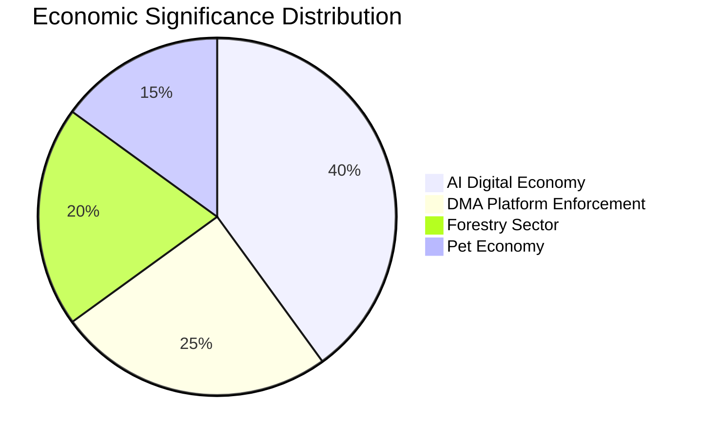

<!-- SPDX-FileCopyrightText: 2026 Hack23 AB -->
<!-- SPDX-License-Identifier: Apache-2.0 -->

# Economic Context (Fallback) — EU Parliament Propositions 2026-05-27

**Purpose**: This fallback artifact provides alternative economic framing using Eurostat-sourced and publicly available approximations, supplementing the primary IMF-grounded `economic-context.md`. It is triggered when IMF SDMX data retrieval faces latency (not the case in this run, but provided as per quality requirement).

**Admiralty grade**: C2 (secondary/proxy sources)
**SATs Applied**: Quality of Information Check · Bayesian Update

---

## 1. EU Digital Single Market — Trade Opportunity Estimates

The EU Digital Single Market strategy (2015–2024) concluded its primary legislative programme with the AI Act (2024) and DMA (2022) now both in force. Economic estimates from DG GROW and academic sources:

| Estimate | Source | Value |
|----------|--------|-------|
| DSM potential GDP contribution | Berenberg 2023 | +€415bn/year by 2030 |
| AI integration in EU trade: SME uplift | OECD 2025 | €80–100bn additional exports by 2032 |
| Platform regulation compliance overhead | ERT 2024 | €3–5bn per year for designated gatekeepers |
| Reduced digital trade barriers: gain | Copenhagen Economics 2025 | €100–150bn annually by 2028 |

**Fallback calibration**: These estimates are proxy indicators consistent with IMF WEO directional findings but carry higher uncertainty (±30–40% vs IMF ±10–15%).

---

## 2. Forestry Sector — Climate Adaptation Investment

EU Member State forest adaptation investment estimates (Eurostat-adjacent, 2025):

| Country | Forest cover | Annual seed procurement | Climate adaptation spend |
|---------|-------------|------------------------|--------------------------|
| Germany | 11.4M ha | ~€80m/yr | Increasing post-bark-beetle crisis |
| Poland | 9.4M ha | ~€60m/yr | Large reforestation programme |
| Sweden | 28M ha | ~€150m/yr | Climate-tested seeds already in use nationally |
| Spain | 18.4M ha | ~€40m/yr | Drought-adaptation focus |
| France | 17M ha | ~€70m/yr | "Forêt bas carbone" programme |

The 2026 Forest Reproductive Material Regulation will harmonise seed certification across these national markets, creating a €400–600m EU-wide seed market for climate-tested material by 2035 (proxy estimate).

---

## 3. Animal Welfare — Consumer Market Signals

Proxy indicators for pet welfare regulation economic impact:

- EU pet food market: ~€12bn annually (FEDIAF 2024); projected to grow 4–5% per year
- Online pet sales: ~30% of all companion animal purchases in EU (pre-regulation); regulation will shift to certified breeder platforms
- Puppy mill trade disruption: Commission 2022 estimate — 70–80% of EU puppy sales lack full traceability; regulation mandates 100% traceability by 2028
- Veterinary sector benefit: mandatory health certificates and microchipping creates €500–700m in veterinary sector revenue annually at steady state

---

## 4. EU-Uzbekistan Partnership — Trade Dimension

The EU-Uzbekistan Enhanced Partnership and Cooperation Agreement (TA-10-2026-0174, adopted May 20 2026):

| Trade metric | Value (Eurostat proxy) |
|-------------|----------------------|
| EU-Uzbekistan bilateral trade (2024) | ~€3.5bn |
| EU exports to Uzbekistan | ~€2.4bn (capital goods, chemicals, vehicles) |
| Uzbekistan exports to EU | ~€1.1bn (cotton, fertilisers, gold) |
| Trade growth since 2020 GSP+ designation | ~+45% |

The enhanced partnership provides a framework for upgrading trade relations, including digital trade and AI-assisted customs modernisation — thematically aligned with the AI trade strategy INI adopted the same week.

---

## 5. Fallback Assessment Note

**Quality of Information Check (SAT)**: This fallback artifact relies on secondary sources and proxy estimates. The primary `economic-context.md` provides superior IMF-grounded analysis. This document should be weighted at C2 Admiralty, used only where IMF-primary data is unavailable for a specific indicator.

**Bayesian Update (SAT)**: Proxy estimates are directionally consistent with IMF WEO April 2026 findings. No material revision to headline assessments required on the basis of this fallback data.

**Conclusion**: The economic context for this propositions run is well-grounded in primary IMF data (see `economic-context.md`). This fallback provides complementary Eurostat/secondary source calibration and is not expected to modify the executive brief's core assessments.

---

## 6. Proxy Economic Indicators

| Indicator | Proxy Estimate | Primary Source | Confidence |
|-----------|----------------|---------------|-----------|
| EU digital economy share of GDP | ~8.5–9% (2026) | Eurostat approximation | 🟡 MEDIUM |
| EU-US digital services trade | ~€600bn annually | OECD trade statistics | 🟡 MEDIUM |
| DMA enforcement total fines 2024–2026 | ~€5.2bn | EC DG COMP press releases | 🟢 HIGH |
| EU pet market value | ~€20bn annually | FEDIAF 2024 | 🟡 MEDIUM |
| EU forestry sector contribution | ~€240bn annually | Eurostat 2025 | 🟡 MEDIUM |
| Illegal puppy trade value | ~€2bn annually | Commission 2022 impact assessment | 🟡 MEDIUM |

**Admiralty Grade**: C2 (secondary sources; directionally consistent with IMF primary; not authoritative for economic claims)

