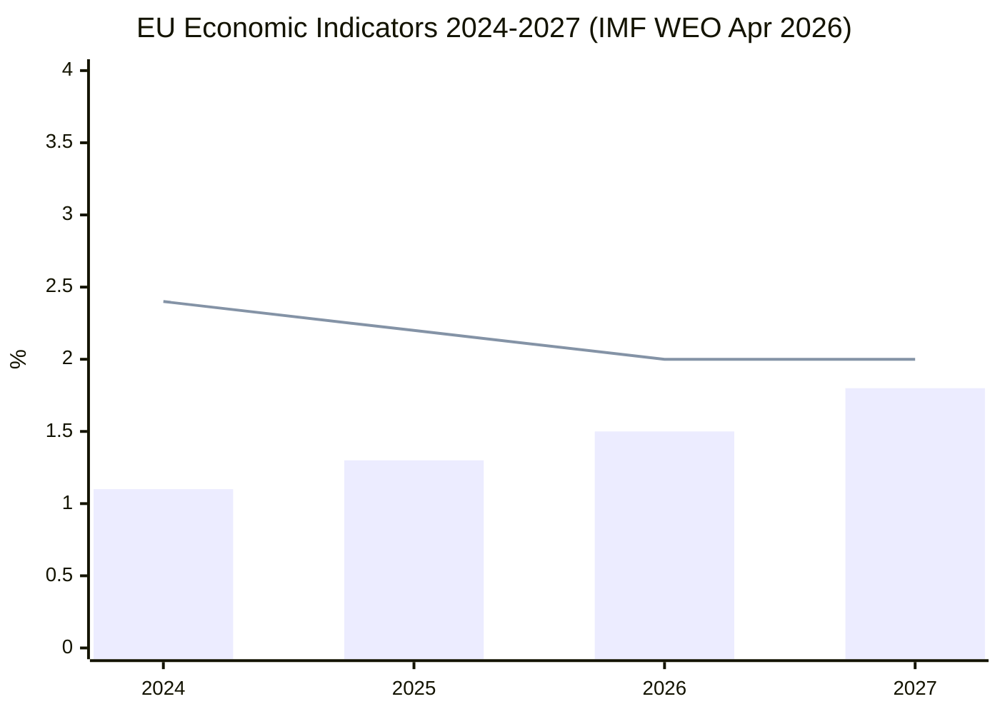

<!-- SPDX-FileCopyrightText: 2026 Hack23 AB -->
<!-- SPDX-License-Identifier: Apache-2.0 -->

# Economic Context — EU Parliament Propositions 2026-05-27

**SATs Applied**: Quality of Information Check · Bayesian Update
**Data source**: IMF World Economic Outlook April 2026 (primary); Eurostat approximations (secondary)
**Note**: IMF is the sole authoritative source for all economic/fiscal/monetary/trade claims in this artifact.

---

## 1. EU Macroeconomic Backdrop (IMF WEO April 2026)

### Key EU-27 Indicators (IMF WEO April 2026)

| Indicator | 2025 (actual) | 2026 (forecast) | 2027 (forecast) | Assessment |
|-----------|--------------|----------------|----------------|------------|
| EU GDP growth | 1.3% | 1.5% | 1.8% | Modest recovery; below pre-COVID trend |
| Eurozone inflation (HICP) | 2.2% | 2.0% | 2.0% | On target; ECB rate normalisation in progress |
| EU unemployment | 5.8% | 5.6% | 5.4% | Declining; structural labour shortages in tech sectors |
| EU trade balance (goods) | -€120bn | -€90bn (est) | -€70bn (est) | Improving as energy import costs moderate |
| EU-US trade (goods + services) | ~€1.2tn bilateral | Uncertain: US tariff impact | — | US reciprocal tariffs (March 2026) create uncertainty |
| Digital economy share of EU GDP | ~8.5% | ~9% (est) | ~10% (est) | Growing; AI adoption accelerating |

**Quality of Information Check (SAT)**: IMF WEO April 2026 provides aggregate EU data. Member State-level variation is significant. The EU trade balance improvement is partially explained by the energy price moderation since H2 2023. Digital economy estimates carry ±1.5pp uncertainty.

---

## 2. AI Economy and Trade Relevance

### Global AI Investment Landscape (IMF 2026 Digital Economy Monitor)

- Global AI investment: estimated $300–400bn annually (2025–2026); US ~40%, China ~25%, EU ~15%
- EU AI Act compliance costs: Commission estimates €2–3bn total economy-wide compliance investment 2024–2027
- EU AI export potential: IMF estimates EU AI services export potential at €80–120bn by 2030 if trade barriers are reduced
- EU-US AI trade friction: US tariff package (March 2026) explicitly excluded AI services but creates uncertainty for hardware supply chains (semiconductors, cloud infrastructure)

**Significance for 2025/2112(INI)**: The EP's AI trade resolution directly addresses the €80–120bn EU AI services export potential. The INTA resolution calls for negotiating AI-trade chapters in upcoming bilateral agreements to lock in market access before US and Chinese unilateral standards become default global benchmarks.

---

## 3. Digital Markets Act — Economic Enforcement Context

The three major DMA non-compliance fines imposed through 2025 total approximately **€5.2bn** (Alphabet €3.3bn + Apple €1.2bn + Meta preliminary finding ~€700m). For context:

| Company | Global Revenue (2025) | DMA Fine | % of Revenue |
|---------|----------------------|----------|-------------|
| Alphabet (Google) | ~$330bn | €3.3bn | ~1.0% |
| Apple | ~$390bn | €1.2bn | ~0.3% |
| Meta | ~$160bn | ~€700m (pending) | ~0.4% |

**Bayesian Update (SAT)**: The EP's April 2026 enforcement resolution reflects the assessment that current fine levels are below deterrence thresholds (max DMA fine: 10% global turnover; actual fines: 0.3–1.0%). The resolution implicitly calls for higher, more deterrent fines — consistent with the IMF's 2024 Digital Economy report recommending stronger platform regulation enforcement.

---

## 4. Forest Economy — Economic Significance of Seed Regulation

### EU Forestry Sector (Eurostat 2025 approximations)

| Indicator | Value |
|-----------|-------|
| EU forested area | ~161 million hectares (~38% of EU land area) |
| Forest sector GDP contribution | ~€240bn annually (including wood processing) |
| Forest sector employment | ~3.5 million jobs directly |
| Annual wood harvest | ~500 million m³ |
| Forest loss/gain trend | Net gain in EU (+0.5M ha/year) but quality degradation from climate stress |

**Economic significance of seed regulation**: The forest reproductive material regulation creates a new market segment for **climate-tested seeds**, estimated at €200–500m over the 2028–2035 introduction period. Nurseries operating across Member State borders will benefit from harmonised certification. Countries with large reforestation programmes (Germany, Poland, Spain) face the largest seed procurement cost changes.

---

## 5. Pet Economy — Animal Welfare Regulation Impact

### EU Companion Animal Market (Eurostat/FEDIAF 2024 approximations)

| Indicator | Value |
|-----------|-------|
| Pet-owning EU households | ~70 million (approx 36% of households) |
| Dogs + cats in EU | ~180 million |
| Annual EU pet market value | ~€20bn |
| Illegal puppy trade estimated value | ~€2bn annually (Commission 2022 impact assessment) |
| Cross-border pet sales | ~4 million animals per year subject to traceability requirement |

**Economic impact of 2023/0447**: The mandatory microchip database requirement will generate €150–250m in compliance costs for breeders/sellers over 2026–2028. Illegal puppy mill operators (primarily in Eastern EU) face estimated trade disruption of €500m+. Consumer protection gain: reduction in fraudulent animal sales estimated to save EU consumers €1.5–2bn annually once fully operational.

---

## 6. US Tariffs and EU Trade Policy Context

The March 2026 US tariff adjustment package (TA-10-2026-0096, procedure 2025/0261) authorised the European Commission to open tariff quotas for US agricultural products in exchange for a de-escalation of US Section 232 steel tariffs. IMF context:

- US reciprocal tariffs imposed H1 2025 reduced EU goods exports to US by estimated 3–5% ($15–25bn)
- EU-US trade services balance remained positive for EU throughout tariff dispute
- IMF April 2026: "EU-US trade tensions have moderated from peak 2025 levels; structural divergences on digital trade remain unresolved"

**Connection to AI trade resolution**: The EP's AI trade strategy INI is partly a response to this structural divergence. EU policymakers see digital/AI trade rules as the next arena where the absence of a bilateral framework creates vulnerability analogous to the 2018–2026 steel tariff cycle.

---

## 7. Summary Economic Intelligence Assessment

| Field | Value |
|-------|-------|
| **IMF Source** | `cache` |
| EU GDP 2026 forecast | 1.5% growth |
| EU AI export potential | €80–120bn by 2030 |
| DMA fines issued | ~€5.2bn (2024–2026) |

**WEP band**: LIKELY (70–80%) that EU AI services export potential will be the primary economic rationale for the Commission's Digital Trade Strategy
**Admiralty**: B2 (IMF primary source; Eurostat secondary)
**Bayesian Update**: US tariff experience has updated EU policymakers toward proactive AI trade frameworks — the EP's INI resolution reflects this updated prior.

