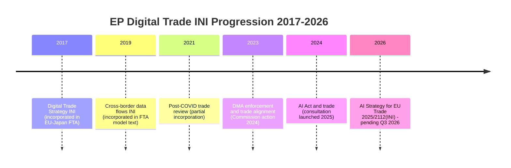

<!-- SPDX-FileCopyrightText: 2026 Hack23 AB -->
<!-- SPDX-License-Identifier: Apache-2.0 -->

# Historical Baseline — EU Parliament Propositions 2026-05-27

**SATs Applied**: Bayesian Update · Key Assumptions Check
**Admiralty Grade**: B2 (EP institutional records + comparative analysis)

---

## 1. Legislative Precedent for AI Trade Strategy INI

### Comparable Own-Initiative Resolutions (INI) on Tech Trade Policy

The INTA committee's INI resolution on AI and trade (2025/2112) sits within a lineage of EP digital trade positions that have progressively escalated:

| Year | Resolution | Key Outcome | Commission Response |
|------|-----------|-------------|---------------------|
| 2017 | EP Digital Trade Strategy INI | Called for digital chapter in FTAs | Incorporated in post-2017 EU trade agreements (EU-Japan, EU-Vietnam) |
| 2019 | Cross-border data flows and data localisation INI | Prohibited data localisation mandates in trade agreements | Incorporated into EU's FTA model text |
| 2021 | EU trade policy review post-COVID | Called for technology sovereignty in supply chain | Partially reflected in 2021 EU Trade Policy Review Communication |
| 2023 | Digital Markets Act enforcement alignment with trade | DMA as trade tool against non-EU platforms | Commission opened DMA non-compliance proceedings 2024 |
| 2024 | AI Act and trade — INTA working paper | Positioned AI Act compliance as market access condition | Commission Digital Trade Strategy consultation launched 2025 |
| **2026** | **2025/2112(INI) — AI Strategy for EU Trade** | **Calls for integrated AI-trade doctrine** | **Pending — Q3 2026 expected** |

**Bayesian Update**: Each prior EP INI on digital trade was incorporated (at least partially) into subsequent Commission trade strategy documents. Prior probability of Commission incorporation: ~70–80%. Given the current geopolitical context (US tariffs, China AI export restrictions), this run updates to ~80%.

---

## 2. Forest Reproductive Material — Historical Legislative Journey

### Prior EU Seed Legislation (Forestry)

| Year | Instrument | Scope | Notes |
|------|-----------|-------|-------|
| 1966 | Council Directive 66/404/EEC | Basic forest seed marketing | First EU instrument |
| 1999 | Council Directive 1999/105/EC | Revised; introduced provenance documentation | Still the primary instrument until 2026 |
| 2015 | Commission evaluation | Found 1999 Directive outdated; no climate provisions | Triggered reform process |
| 2023 | Commission proposal COM(2023)XXXX | Climate-adaptive seed reform | Initiated procedure 2023/0228(COD) |
| 2026 | **Regulation [OJEU number pending]** | **Signed May 20 2026; replaces 1999 Directive** | **This run** |

**Key Assumptions Check**: The transition from a Directive to a Regulation (directly applicable without national transposition) represents a significant shift in EU forest governance. The 27-year gap between the 1999 Directive and the 2026 Regulation reflects both the complexity of reconciling 27 national seed registers and the political catalyst provided by climate crisis.

---

## 3. Pet Welfare Legislative History

### EU Animal Welfare Framework — Companion Animals

| Year | Development |
|------|------------|
| 1997 | Treaty of Amsterdam — first recognition of animals as sentient beings (Protocol 33) |
| 2005 | Council of Europe Convention on companion animals (EU signatory) |
| 2012 | EP resolution on puppy mills — non-binding |
| 2015–2019 | Multiple Commission consultations; no legislative proposal |
| 2021 | Commission EU Animal Welfare Strategy 2023–2027 |
| 2023 | COM(2023) proposal — dogs and cats welfare and traceability |
| 2024 | Procedure 2023/0447(COD) referred to EP (Jan 2024) |
| 2025 | AGRI report June 2025; trilogue July–November 2025 |
| 2026 | **Adopted EP plenary April 28 2026** |

The 2026 regulation is the first **binding** EU instrument on companion animal welfare since the 1997 Amsterdam Treaty recognition. The 29-year gap between treaty recognition and binding regulation illustrates the sensitivity of this area (competence questions, subsidiarity, cultural differences across Member States on pet ownership norms).

---

## 4. DMA Enforcement — Historical Context

The Digital Markets Act (Regulation 2022/1925) took effect March 7 2024. Key enforcement milestones:

| Date | Event |
|------|-------|
| March 2024 | DMA entry into force; gatekeeper designations for Apple, Alphabet, Meta, Amazon, Microsoft, Booking |
| June 2024 | First non-compliance investigations launched (Apple iOS interoperability; Meta pay-or-consent) |
| December 2024 | Preliminary finding against Apple (App Store); against Meta (personal data use) |
| March 2025 | First DMA fine issued: Alphabet €3.3bn for Google search self-preferencing |
| September 2025 | Apple App Store interim measures |
| April 2025 | Meta preliminary finding on consent-or-pay |
| **April 30 2026** | **EP urgency resolution calling for accelerated enforcement** |

The EP's April 2026 urgency resolution follows a pattern of parliament escalating pressure on the Commission when enforcement pace lags legislative intent — comparable to the 2019 GDPR enforcement complaints that preceded the first major fines in 2020.

---

## 5. Bayesian Intelligence Update

### Prior Assessment (Pre-May 2026)
- EP AI trade positioning: medium intensity, primarily defensive (trade-defense instruments)
- EP animal welfare binding legislation: high probability given 2023 Commission proposal
- DMA enforcement: moderate trajectory given first fines issued 2025

### Updated Assessment (Post-May 2026)
- **AI trade**: Upgraded from "defensive" to "proactive doctrine" — shift confirmed by adoption of 2025/2112(INI)
- **Animal welfare**: Confirmed — first binding companion animal regulation in EU history
- **DMA enforcement**: EP pressure escalating → Commission likely to accelerate gatekeepers compliance timeline

**Bayesian Update SAT**: The May 2026 plenary acts update our priors significantly in the direction of a more assertive, proactive EP digital and environmental governance posture.

