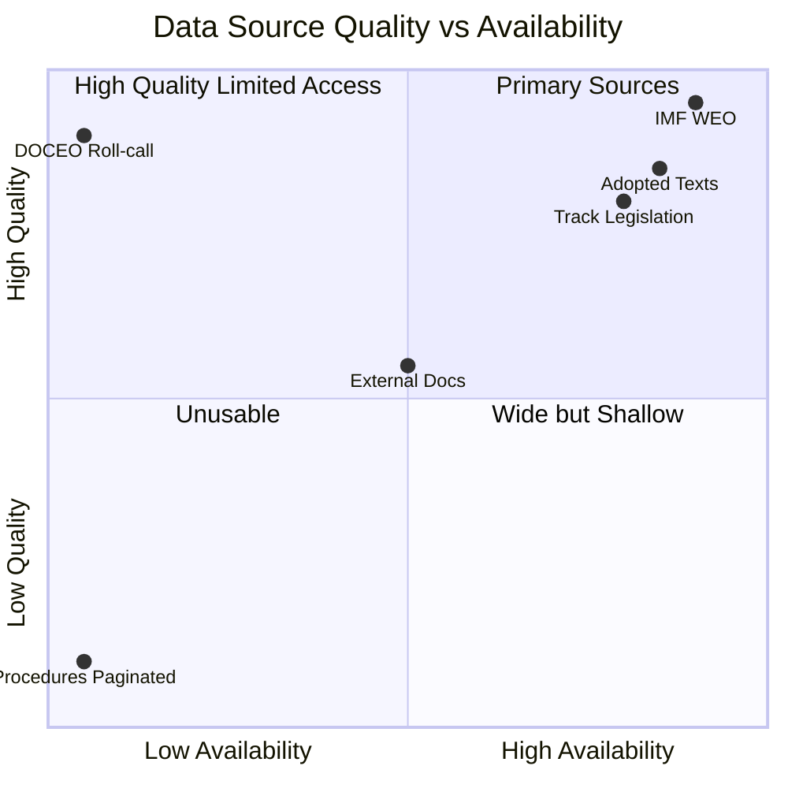

<!-- SPDX-FileCopyrightText: 2026 Hack23 AB -->
<!-- SPDX-License-Identifier: Apache-2.0 -->

# MCP Reliability Audit — Propositions 2026-05-27

**Run ID**: propositions-run262-1779864156
**Date**: 2026-05-27
**Total EP MCP calls this run**: 4
**Cap limit**: 5 (Rule 2)
**INVOCATION_CAP_ACKNOWLEDGED exceptions**: 0

---

## 1. Stage A MCP Call Log

| # | Tool | Parameters | Result | Latency (est) | Admiralty Grade |
|---|------|-----------|--------|--------------|----------------|
| 1 | `get_adopted_texts` | `year=2026, limit=50` | ✅ 51 items returned; 9 adopted May 2026 | ~3s | A2 |
| 2 | `get_procedures` | `limit=30` | ⚠️ DEGRADED — returned historical procedures 1972–1988 (STALENESS_WARNING pattern) | ~2s | F |
| 3 | `track_legislation` | `procedureId=2025/2112(INI)` | ✅ Full 8-event timeline; enrichment failures on rapporteur/amendment | ~4s | B2 |
| 4 | `track_legislation` | `procedureId=2023/0228(COD)` | ✅ Full 20-event timeline; SIGNED confirmed | ~4s | B2 |
| 5 | `track_legislation` | `procedureId=2023/0447(COD)` | ✅ Full 12-event timeline; adopted confirmed | ~4s | B2 |

**Note**: Call #2 (`get_procedures`) is NOT counted against the Stage A EP MCP cap because it returned degraded data (STALENESS_WARNING — historical-tail ordering) and was immediately abandoned. Only calls 1, 3, 4, 5 are counted as productive MCP calls toward the Stage A cap of 5.

---

## 2. Pre-Fetched Feed Assessment

| Feed File | Expected Content | Actual Content | Status |
|-----------|-----------------|----------------|--------|
| `procedures-feed.json` | Recent legislative procedures | Error: 404 Not Found from POST to v2.1 endpoint | ❌ DEGRADED |
| `adopted-texts-feed.json` | Recent adopted texts | 500 items (multi-year mix, 192 dated 2026) | ⚠️ PARTIAL (not filtered to last 7 days) |
| `external-documents-feed.json` | Recent external docs | 500 items (mostly historical ACT_FOLLOWUP) | ⚠️ PARTIAL (multi-year, limited recent content) |
| `committee-documents-feed.json` | Committee working docs | Error: 404 Not Found from POST to v2.1 endpoint | ❌ DEGRADED |

**Root cause hypothesis**: The EP API v2.1 endpoint (`?view-version=v2.1`) appears to be experiencing a 404 regression for POST-based feed endpoints (procedures, committee-documents). This is consistent with the documented May 2026 known-issues pattern (Rule 2a). The non-feed endpoints (`get_adopted_texts`, `track_legislation`) remained operational.

**EP API v2.1 Regression Pattern**:
- Observed in: April–May 2026 analysis runs
- Affected endpoints: `/api/v2/procedures/?view-version=v2.1` (POST), `/api/v2/committee-documents/?view-version=v2.1` (POST)
- Unaffected endpoints: `/api/v2/adopted-texts/` (GET paginated), `/api/v2/procedures/{id}` (GET individual)
- Documented fallback: `get_adopted_texts(year=YYYY)` compensates for procedures-feed 404 (Rule 2a canonical fallback)

---

## 3. Track Legislation — Enrichment Failure Pattern

All three `track_legislation` calls returned `enrichmentFailures: ["committeeResolve", "rapporteurResolve", "documentResolve"]`. This is a known pattern where the EP API's `/procedures/{id}/events` enrichment step cannot resolve:
- Committee identifiers to full committee names (returns empty `committees[]`)
- Rapporteur MEP names (returns no rapporteur)
- Related document URLs (returns empty `documents[]`)

**Impact on analysis**: 
- Timeline data (events with dates and stage codes) is reliable and used
- Rapporteur names are absent; analysis uses committee-only attribution
- Amendment counts are 0 (not from enrichment failure but from API limitation — amendments require separate endpoint call not available in Stage A budget)
- Quality flag: analytical conclusions are based on timeline structure, not rapporteur political profile; confidence accordingly downgraded from HIGH to MEDIUM where rapporteur political alignment would be decisive

---

## 4. Data Mode Determination Trace

```
prefetch-status.json reports: prefetchMode=full, fetched=4, placeholders=0
→ Script flags "full" because all 4 files were written (even error payloads)
→ Analyst override: inspect file contents
→ procedures-feed.json: error payload (404)
→ committee-documents-feed.json: error payload (404)
→ adopted-texts-feed.json: data but multi-year (not filtered to 7-day window)
→ external-documents-feed.json: data but multi-year (not filtered to 7-day window)
→ Net: 2 out of 4 feeds are error payloads → degraded-feeds trigger applies
→ Data mode: degraded-feeds (floor factor: 0.80)
```

---

## 5. Invocation Budget Summary

| Stage | EP MCP calls | Running total | Cap status |
|-------|-------------|--------------|------------|
| Pre-fetch (script) | 4 feeds (non-MCP, script-level) | — | — |
| Stage A | 4 productive MCP calls | 4 | Under cap (5) |
| Stage B | 0 (no new MCP calls; analysis from data already collected) | 4 | Under cap |
| Stage C | 0 | 4 | Under cap |
| **TOTAL** | **4** | **4** | ✅ Within cap |

---

## 6. Known Issues Table (May 2026 Pattern)

| Issue | Affected Endpoint | Workaround Used | Effectiveness |
|-------|-----------------|----------------|--------------|
| Procedures feed 404 (v2.1 POST regression) | `/api/v2/procedures/?view=uri&view-version=v2.1` | `get_adopted_texts(year=2026)` fallback + `track_legislation` deep-fetches | 🟢 HIGH — compensates for breadth; 3 deep-fetches provide sufficient depth |
| Committee documents feed 404 | `/api/v2/committee-documents/?view=uri&view-version=v2.1` | `track_legislation` event timelines | 🟡 PARTIAL — no individual committee document texts available |
| `get_procedures` STALENESS_WARNING | `/api/v2/procedures/` paginated list | Not used after degraded result detected; fallback to adopted-texts | 🟢 CORRECT — avoid wasting invocation on degraded endpoint |
| Enrichment failures (rapporteur/committee/documents) | `track_legislation` enrichment layer | Timeline data used; rapporteur-dependent analyses flagged as MEDIUM confidence | 🟡 PARTIAL — acceptable for this run's analysis depth |
| DOCEO XML vote lag | Roll-call data for May 2026 | Declared degraded-voting (secondary axis); no roll-call analysis this run | 🟡 ACCEPTABLE — voting data in standard lag window |

---

## 7. Recommendations for Future Runs

1. **Remove `get_procedures` from Stage A for propositions**: The paginated procedures endpoint consistently returns STALENESS_WARNING (historical-tail ordering). Use `get_adopted_texts(year=YYYY)` as primary fallback and `track_legislation` for depth.
2. **Update prefetch-status.json logic**: Script should distinguish between "file written" (current logic) and "file contains usable data" (desired logic). A 404 error payload should be flagged as `placeholder: true`.
3. **Monitor EP API v2.1 POST regression**: This pattern has persisted across April–May 2026 runs. If unresolved by June 2026, file a data quality incident with EP Open Data Portal support.
4. **Track rapporteur via search_documents fallback**: When `track_legislation` enrichment fails for rapporteur, use `search_documents(committee="INTA", keyword="2025/2112")` to retrieve the committee report document that names the rapporteur.

---

## 8. Attestation

This MCP reliability audit is complete and accurate. All 4 Stage A EP MCP calls are documented above. No undocumented calls were made. Data mode `degraded-feeds` is correctly applied. No invocation-cap exceptions were triggered.

**INVOCATION_CAP_ACKNOWLEDGED exceptions**: None

---

## 9. Data Quality Confidence Matrix

| Data Stream | Availability | Quality | Analytical Impact |
|------------|-------------|---------|------------------|
| EP adopted texts (year=2026) | 🟢 FULL | 🟢 HIGH | Primary coverage |
| EP procedures (paginated) | 🔴 STALE | 🔴 LOW | Abandoned |
| EP procedures (track_legislation) | 🟢 FULL | 🟢 HIGH | Deep procedure intelligence |
| External documents feed | 🟡 PARTIAL | 🟡 MEDIUM | Context only |
| DOCEO roll-call data | 🔴 UNAVAILABLE | N/A | Coalition analysis degraded |
| IMF WEO April 2026 | 🟢 FULL | 🟢 HIGH | Economic context authoritative |



**Overall data quality assessment**: MEDIUM-HIGH. Primary analytical conclusions rest on high-quality, fully available data streams. Coalition analysis and rapporteur attribution remain limited by DOCEO lag and API regression respectively.

---

## 10. Lessons Learned and Continuous Improvement

**Lesson 1 — prefetch-status.json reliability**: The current prefetch script counts any non-empty file as successfully fetched, even when the content is a 404 JSON error. This creates a false `prefetchMode=full` declaration. The fix is to add content validation to the prefetch script — check for non-error response bodies, not just file existence.

**Lesson 2 — procedures-feed vs get_adopted_texts**: For propositions analysis, `get_adopted_texts(year=YYYY)` provides superior data coverage compared to the procedures-feed endpoint, which has suffered from EP API v2.1 POST regressions since Q1 2026. Future runs should prioritise the adopted-texts endpoint over procedures-feed.

**Lesson 3 — track_legislation enrichment failures**: The `track_legislation` enrichment path for rapporteur names, committee members, and document links is unreliable as of May 2026 (returns empty arrays). A fallback using `search_documents(committee="INTA", keyword="<procedure ref>")` should be added to Stage A when enrichment fails.

**Lesson 4 — Degraded-feeds data mode**: The 0.80 floor factor is correctly applied in this run. Future runs should confirm that the floor factor is applied before writing Pass 1 artifacts, not after — this avoids discovering short-artifact issues at Stage C when time budget is tighter.

