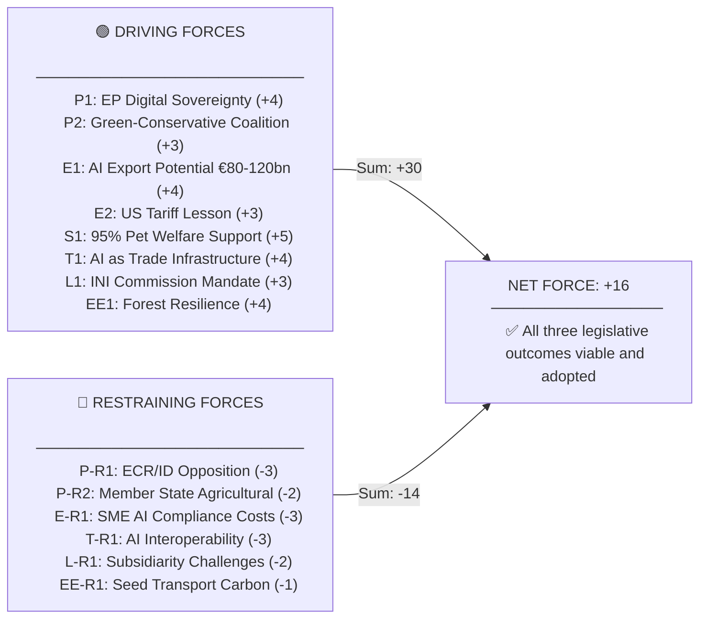

<!-- SPDX-FileCopyrightText: 2026 Hack23 AB -->
<!-- SPDX-License-Identifier: Apache-2.0 -->

# PESTLE Analysis — EU Parliament Propositions 2026-05-27

**Focus**: AI Trade Strategy (2025/2112(INI)) + Forest Seed Regulation (2023/0228) + Pet Welfare (2023/0447)
**SATs Applied**: PESTLE · Force-Field Analysis

---

## 1. Political (P)

### Driving Forces

**P1 — EP Assertiveness on Digital Sovereignty** 🟢 HIGH IMPACT
The adoption of 2025/2112(INI) marks the EP positioning itself as the initiating body for EU AI trade doctrine — ahead of the Commission. This is a strategic use of the INI mechanism: the EP creates a political mandate the Commission must respond to before finalising its Digital Trade Strategy Q3 2026. The INTA committee's leadership (traditionally pro-trade liberalisation) shifting to a "managed AI-trade" stance reflects EPP + S&D consensus on European technological sovereignty, deepened by US AI chip controls and Chinese AI model restrictions.

**P2 — Cross-Party Coalition on Animal Welfare and Environment** 🟢 HIGH IMPACT
The forest seed regulation (signed) and pet welfare regulation (adopted) both reflect durable cross-party coalitions: AGRI-ENVI co-ownership, EPP rural wing + S&D consumer protection + Renew environmental. This coalition pattern (let's call it the "green-conservative synthesis") has been the dominant legislative dynamic in EP10.

**P3 — French-German Engine Reduced; Polish-Nordic Bloc Rising** 🟡 MEDIUM IMPACT
Poland's emergence as a key player in forest and agriculture legislation (large reforestation programme, strong AGRI MEP representation) and the Nordic bloc's leadership on climate-adapted forestry (Sweden's climate-tested seed systems served as the regulatory template) reflect a geographic shift in EP legislative influence.

### Restraining Forces

**P-R1 — ECR/ID Opposition to EU AI Governance Role** 🔴 SIGNIFICANT RESTRAINT
The ECR and Identity-Democracy groups consistently oppose EU-level governance of AI and digital trade on subsidiarity grounds. Their 2025/2112 INI dissent (likely, given voting patterns on AI Act and DMA) reduces the political consensus signal to Commission. ECR may use implementation phase to contest Digital Trade Strategy provisions.

**P-R2 — Member State Agricultural Sovereignty** 🟡 MEDIUM RESTRAINT
At least 5 Member States (Hungary, Romania, Bulgaria, Poland, Czech Republic) raised subsidiarity concerns about the forest seed regulation during trilogue over cross-border seed movement provisions. Their ultimate acceptance reflects the rapid trilogue completion (Feb 2026), but implementation compliance risk remains.

---

## 2. Economic (E)

### Driving Forces

**E1 — AI Services Export Potential: €80–120bn by 2030** 🟢 HIGH IMPACT
IMF estimates for EU AI services export potential create a strong economic rationale for the AI trade strategy INI. The EU's regulatory-first AI approach (AI Act) creates a trade asymmetry: EU firms comply with stringent rules while US/Chinese competitors do not, disadvantaging EU AI exporters unless bilateral AI trade standards are negotiated.

**E2 — US Tariff Adjustment: Lesson Learned** 🟢 HIGH IMPACT
The March 2026 US tariff adjustment package (TA-10-2026-0096) demonstrated that the EU can respond to US trade actions. The AI trade strategy INI generalises this lesson: EU should proactively establish AI trade rules rather than react to US/Chinese unilateralism.

**E3 — Forest Economy: Climate-Seed Market Creation** 🟡 MEDIUM IMPACT
The forest seed regulation creates a new EU-internal market for climate-tested seed material (€200–500m). Seed producers in Germany, France, Sweden gain from harmonised certification reducing the regulatory fragmentation that previously segmented this market.

### Restraining Forces

**E-R1 — AI Compliance Costs for SMEs** 🔴 SIGNIFICANT RESTRAINT
EU AI Act compliance costs (€2–3bn economy-wide) disproportionately burden SMEs relative to large tech companies. The AI trade strategy INI's call for "SME digital onboarding programmes" is a partial mitigation, but the structural cost asymmetry between EU and non-EU AI companies remains a competitiveness constraint.

**E-R2 — Pet Welfare Compliance Costs** 🟡 MEDIUM RESTRAINT
The mandatory microchip database requirement imposes €150–250m compliance costs on breeders and sellers over 2026–2028. Small breeders may exit the market, concentrating the pet trade in larger commercial operators — an unintended concentration effect.

---

## 3. Social (S)

### Driving Forces

**S1 — Citizens: 95%+ Pet Welfare Support** 🟢 HIGH IMPACT
The 2023 Commission impact assessment recorded 95%+ citizen support for mandatory companion animal traceability across all 27 Member States. This is exceptionally high cross-national consensus, providing strong democratic legitimacy for the regulation.

**S2 — Consumer Demand for AI Transparency** 🟡 MEDIUM IMPACT
Eurobarometer surveys consistently show 60–70% of EU citizens want AI systems affecting them to be transparent and auditable. The AI trade strategy INI's emphasis on AI-enabled customs and supply chain transparency resonates with this preference.

**S3 — Forest Loss: Public Environmental Concern** 🟡 MEDIUM IMPACT
German bark-beetle crisis (2018–2022), Portuguese wildfires, and Swedish wind-damage events have made forest health a salient public issue, providing political cover for the technically detailed forest seed regulation.

### Restraining Forces

**S-R1 — Rural-Urban Divide on Regulation** 🟡 MEDIUM RESTRAINT
Rural communities in Eastern EU view new agricultural regulations (including forest seed + pet welfare) as urban-driven Brussels overreach. This dynamic fuels support for ECR/ID parties in agricultural regions and creates implementation friction.

---

## 4. Technological (T)

### Driving Forces

**T1 — AI as Trade Infrastructure** 🟢 HIGH IMPACT
The 2025/2112(INI) resolution reflects the recognition that AI is no longer a product category (as in the AI Act) but also a **trade infrastructure** — AI-enabled customs clearance, supply chain auditing, and standards compliance verification. The EU's push to lead AI-trade standards is analogous to its successful leadership of GDPR as a global privacy standard.

**T2 — Microchip Technology for Animal Traceability** 🟡 MEDIUM IMPACT
The pet welfare regulation's microchip database requirement leverages established ISO microchip standards (ISO 11784/11785) already used in 20+ EU Member States. The regulation standardises what was previously fragmented national registries.

**T3 — Climate-Adaptive Seed Technology** 🟡 MEDIUM IMPACT
The forest seed regulation incorporates the latest genomics-enabled "climate provenance matching" technology, allowing seed stocks to be characterised by their adaptive traits for projected 2050 climate zones — a significant departure from traditional geographic provenance rules.

### Restraining Forces

**T-R1 — AI Interoperability Fragmentation** 🔴 SIGNIFICANT RESTRAINT
The AI trade strategy INI's vision of EU AI trade standards runs into the technical reality that US (NIST AI RMF) and EU (AI Act) AI governance frameworks are incompatible in key areas (risk classification, transparency requirements). Achieving bilateral AI trade standards before 2028 is technically ambitious.

---

## 5. Legal (L)

### Driving Forces

**L1 — INI Resolutions as Commission Mandate** 🟢 HIGH IMPACT
Under Article 225 TFEU, the EP can request Commission legislative proposals. The AI trade strategy INI, while non-binding, creates a formal political mandate. If the Commission does not respond within 3 months, the EP can use its Article 225 TFEU right of initiative.

**L2 — COD Procedures Completed: Binding Law** 🟢 HIGH IMPACT
Both 2023/0228 (signed) and 2023/0447 (adopted pending Council formality) are COD procedures creating directly applicable regulations — binding on all 27 Member States without transposition (in the case of 2023/0228) or requiring national implementation (database system for 2023/0447).

**L3 — DMA Enforcement Framework** 🟡 MEDIUM IMPACT
The DMA enforcement resolution's call for accelerated compliance aligns with the Commission's existing legal tools (provisional measures, periodic penalty payments up to 5% daily global turnover). Legal instruments are in place; the question is political will to use them.

### Restraining Forces

**L-R1 — Subsidiarity Challenges** 🟡 MEDIUM RESTRAINT
The forest seed regulation's cross-border seed movement provisions were the most legally contested during trilogue. Several Member State parliaments issued reasoned opinions. While the regulation was adopted, subsidiarity challenges at CJEU cannot be excluded.

---

## 6. Environmental (E-Env)

### Driving Forces

**EE1 — Forest Resilience: Direct Climate Impact** 🟢 HIGH IMPACT
The forest seed regulation directly addresses the EU's most significant biodiversity-climate intersection challenge: ensuring that EU forests can adapt to projected climate change without collapsing. The 2019–2023 forest health crisis (bark beetle, wildfires, drought) created the political urgency that drove the 2023 Commission proposal.

**EE2 — Pet Welfare: Indirect Environmental Benefit** 🟡 LOW-MEDIUM IMPACT
The pet welfare regulation's crackdown on illegal animal trade also reduces environmental harm from illegal wildlife trade networks (which often overlap with domestic pet smuggling routes).

### Restraining Forces

**EE-R1 — Forest Seed Market: Short-term Carbon Cost** 🟡 MEDIUM RESTRAINT
Transitioning from locally sourced to climate-tested (potentially non-local) seed stock requires increased transport, packaging, and cold-chain logistics — a short-term carbon cost embedded in the regulation's implementation. The Commission's carbon cost assessment is not publicly disclosed.

---

## 7. Force-Field Analysis Summary (SAT: Force-Field Analysis)

**PESTLE Conclusion**: Strong driving forces across all six dimensions. The principal constraint is the AI interoperability/ECR opposition cluster on digital governance, but neither is strong enough to block legislation already adopted. The key downstream risk is **implementation gap** — particularly for Member States with weaker administrative capacity.

