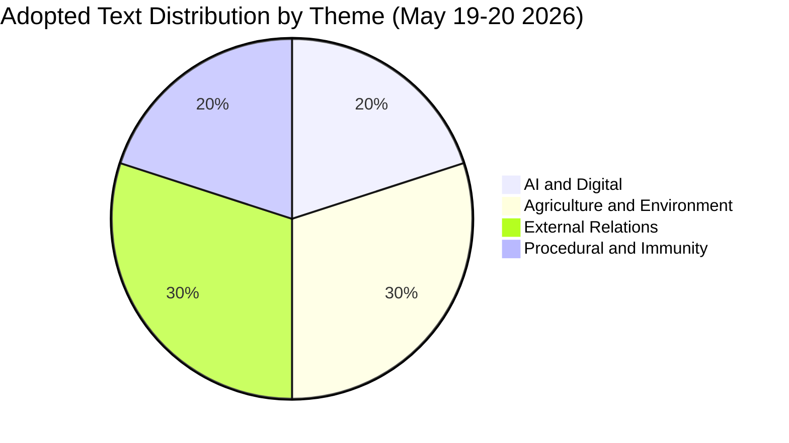

<!-- SPDX-FileCopyrightText: 2026 Hack23 AB -->
<!-- SPDX-License-Identifier: Apache-2.0 -->

# Procedures Proxy — Propositions 2026-05-27

**Context**: Primary procedures feed returned 404. This document reconstructs
active-procedure intelligence from the `get_adopted_texts(year=2026)` fallback
and three `track_legislation` deep-fetches.

---

## Priority Procedures — May 2026

### P1 — 2025/2112(INI): AI Strategy for EU Trade

| Field | Value |
|-------|-------|
| Adopted text | TA-10-2026-0183 |
| Type | INI (Own-initiative resolution) |
| Committee | INTA (International Trade) |
| Voted in plenary | 2026-05-20 |
| Stage | COMPLETED (adopted) |
| Subject | TECN, INFQ (technology, digital infrastructure) |

**Timeline summary**: Referred June 2025 → INTA committee tabled report Feb 2026 → amendments Feb 2026 → committee adopted April 16 2026 → tabled for plenary April 27 → plenary debate May 19 → plenary vote May 20 2026.

This is a high-significance INI resolution positioning EU AI integration as a strategic trade instrument. Unlike binding legislation, INI resolutions communicate political will and shape the Commission's upcoming Digital Trade Strategy.

---

### P2 — 2023/0228(COD): Production and Marketing of Forest Reproductive Material

| Field | Value |
|-------|-------|
| Adopted text | TA-10-2026-0168 |
| Type | COD (Ordinary legislative procedure) |
| Committee | AGRI with ENVI opinion |
| Voted in plenary | 2026-05-19 (Council position approval) |
| Signed | 2026-05-20 |
| Stage | SIGNED — enters into force |

**Timeline summary**: Proposed Oct 2023 → AGRI report Nov 2023 → AGRI adopted March 2024 → EP first-reading position April 2024 → trilogue Dec 2025 → provisional agreement Feb 2026 → AGRI report April 2026 → committee adopted May 5 → plenary approved May 19 → **SIGNED May 20 2026**.

This is binding regulation modernising EU rules on seed/seedling production for forests, incorporating climate resilience and biodiversity targets.

---

### P3 — 2023/0447(COD): Welfare of Dogs, Cats and Their Traceability

| Field | Value |
|-------|-------|
| Adopted text | TA-10-2026-0115 |
| Type | COD |
| Committee | AGRI with ENVI opinion |
| Voted | 2026-04-28 |
| Stage | PLENARY ADOPTED |

**Timeline summary**: Referred Jan 2024 → ENVI opinion April 2025 → AGRI report June 2025 → EP first-reading June 2025 → referred to trilogue June 2025 → trilogue July–Nov 2025 → provisional agreement Jan 2026 → plenary vote April 28 2026.

Establishes EU-wide traceability register for dogs and cats, restricts puppy-mill trade practices, aligns welfare standards across Member States.

---

## Other Significant Recent Adopted Texts (May 2026)

| Ref | Title | Date | Theme |
|-----|-------|------|-------|
| TA-10-2026-0174 | EU–Uzbekistan Enhanced Partnership and Cooperation Agreement | 2026-05-20 | EXT/PESC |
| TA-10-2026-0177 | EU–Lebanon Eurojust Cooperation Agreement | 2026-05-20 | EXT/COOP |
| TA-10-2026-0178 | EC–São Tomé and Príncipe Fisheries Protocol | 2026-05-20 | PECH/EXT |
| TA-10-2026-0179 | EU–Cook Islands Fisheries Protocol | 2026-05-20 | PECH/EXT |
| TA-10-2026-0182 | Recommendation on 81st UNGA | 2026-05-20 | EXT |
| TA-10-2026-0164 | Immunity waiver — Harald Vilimsky | 2026-05-19 | PRIV |
| TA-10-2026-0166 | Immunity waiver — Nikos Pappas | 2026-05-19 | PRIV |

