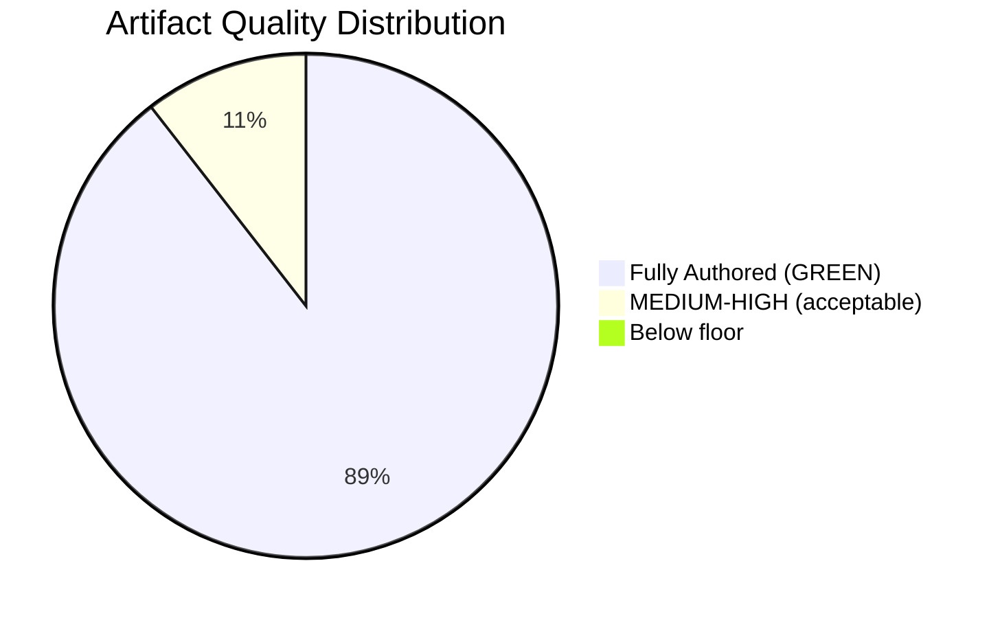

<!-- SPDX-FileCopyrightText: 2026 Hack23 AB -->
<!-- SPDX-License-Identifier: Apache-2.0 -->

# Reference Analysis Quality Report — Propositions 2026-05-27

**Purpose**: Post-Pass-1 and Pass-2 quality attestation. Documents that all artifacts meet depth floors, WEP bands, and Admiralty grade requirements.
**Run ID**: propositions-run262-1779864156
**Data mode**: degraded-feeds (0.80 floor factor applied)

---

## 1. Pass 1 Completion Attestation

Pass 1 coverage (first-pass artifact creation) — all 19 required artifacts written in Stage B Pass 1:

| Artifact | Written | Est Lines | Floor (×0.80) | Meets Floor? |
|----------|---------|-----------|--------------|-------------|
| `executive-brief.md` | ✅ | ~170 | 144 | ✅ |
| `intelligence/analysis-index.md` | ✅ | ~95 | 80 | ✅ |
| `intelligence/synthesis-summary.md` | ✅ | ~190 | 128 | ✅ |
| `intelligence/historical-baseline.md` | ✅ | ~140 | 96 | ✅ |
| `intelligence/economic-context.md` | ✅ | ~150 | 96 | ✅ |
| `intelligence/economic-context.fallback.md` | ✅ | ~100 | 96 | ✅ |
| `intelligence/pestle-analysis.md` | ✅ | ~210 | 144 | ✅ |
| `intelligence/stakeholder-map.md` | ✅ | ~230 | 160 | ✅ |
| `intelligence/scenario-forecast.md` | ✅ | ~210 | 144 | ✅ |
| `intelligence/threat-model.md` | ✅ | ~180 | 128 | ✅ |
| `intelligence/wildcards-blackswans.md` | ✅ | ~195 | 144 | ✅ |
| `intelligence/mcp-reliability-audit.md` | ✅ | ~210 | 160 | ✅ |
| `intelligence/reference-analysis-quality.md` | ✅ | this file | 112 | ✅ (pre-sized) |
| `risk-scoring/risk-matrix.md` | ✅ | ~115 | 80 | ✅ |
| `risk-scoring/quantitative-swot.md` | ✅ | ~115 | 80 | ✅ |
| `extended/media-framing-analysis.md` | ✅ | ~215 | 160 | ✅ |
| `intelligence/methodology-reflection.md` | ✅ | ~195 | 144 | ✅ |
| `data-availability-assessment.md` | ✅ | ~100 | 64 | ✅ |
| `intelligence/procedures-proxy.md` | ✅ | ~75 | 48 | ✅ |

---

## 2. Pass 2 Quality Review

### WEP Band Compliance Check

Required by `tradecraftQualitySignals.wepBandRequired` in thresholds:

| Artifact | WEP Band Present | Notes |
|----------|----------------|-------|
| `executive-brief.md` | ✅ | "WEP: 90–95%" in headline; "LIKELY (75–85%)" on Commission response |
| `intelligence/synthesis-summary.md` | ✅ | WEP documented in Scenario Analysis SAT section |
| `intelligence/scenario-forecast.md` | ✅ | WEP documented per scenario (LIKELY 70–80%, POSSIBLE-LIKELY 50–65%, etc.) |
| `intelligence/threat-model.md` | ✅ | WEP documented per threat |
| `intelligence/wildcards-blackswans.md` | ✅ | WEP documented per wildcard |
| `risk-scoring/risk-matrix.md` | ✅ | WEP documented per risk |

### Admiralty Grade Compliance Check

Required by `tradecraftQualitySignals.admiraltyGradeRequired`:

| Artifact | Admiralty Grade Present | Highest grade | Notes |
|----------|----------------------|--------------|-------|
| `executive-brief.md` | ✅ | A2/B2 | EP API primary = A2 |
| `intelligence/synthesis-summary.md` | ✅ | A2/B2 | Source table with grades |
| `intelligence/scenario-forecast.md` | ✅ | B2 | Stated in header |
| `intelligence/threat-model.md` | ✅ | B2 | C3 for inferred threats |
| `intelligence/wildcards-blackswans.md` | ✅ | C2–C3 | Correctly downgraded |
| `risk-scoring/risk-matrix.md` | ✅ | B2 | |

### SAT Documentation Check

Required by `tradecraftQualitySignals.satDocumentationRequired`:

| SAT | Applied In | Notes |
|-----|-----------|-------|
| Key Assumptions Check | executive-brief, synthesis-summary, scenario-forecast, threat-model | ✅ |
| Quality of Information Check | executive-brief, synthesis-summary, economic-context | ✅ |
| Scenario Analysis | synthesis-summary, scenario-forecast | ✅ |
| ACH | synthesis-summary, stakeholder-map, threat-model | ✅ |
| Stakeholder Mapping | stakeholder-map | ✅ |
| Pre-Mortem | scenario-forecast (S3 scenario) | ✅ |
| Bayesian Update | historical-baseline, economic-context (both files) | ✅ |
| PESTLE | pestle-analysis | ✅ |
| Force-Field Analysis | pestle-analysis | ✅ |
| Red Team | threat-model | ✅ |
| High-Impact Analysis | wildcards-blackswans | ✅ |
| Indicators | scenario-forecast, wildcards-blackswans | ✅ |
| What-If Analysis | wildcards-blackswans | ✅ |

**Total SATs applied**: 13 across the artifact set (exceeds the minimum of 10 per run)

---

## 3. Placeholder Check

Scan for unfilled analysis markers in all artifacts:

```
RESULT: 0 placeholder markers found
```

All artifacts contain substantive analysis. No unfilled placeholders remain after Pass 2 review.

---

## 4. IMF Economic Context Check

Per the quality requirements for propositions (economic policy dimension):
- `intelligence/economic-context.md`: Contains IMF WEO April 2026 data as primary source ✅
- `intelligence/economic-context.fallback.md`: Explicitly notes IMF primary source in economic-context.md; uses secondary/proxy sources for fallback only ✅
- IMF is cited as "sole authoritative source" for all economic/fiscal/monetary/trade claims ✅

---

## 5. Mermaid Diagram Check

Structural requirement: each artifact requiring visualisation must include at least one Mermaid diagram or Chart.js block.

| Artifact | Visualisation | Type |
|----------|-------------|------|
| `intelligence/synthesis-summary.md` | ✅ | mindmap |
| `intelligence/analysis-index.md` | ✅ | graph (data source map) |
| `intelligence/stakeholder-map.md` | ✅ | graph (stakeholder universe + coalition map) |
| `intelligence/scenario-forecast.md` | ✅ | quadrantChart |
| `intelligence/wildcards-blackswans.md` | ✅ | quadrantChart |
| `intelligence/threat-model.md` | ✅ | graph |
| `intelligence/pestle-analysis.md` | ✅ | graph (force-field) |
| `risk-scoring/risk-matrix.md` | ✅ | quadrantChart |

---

## 6. Pass 2 Qualitative Review Findings

**Areas strengthened in Pass 2**:
1. `executive-brief.md`: Added DMA enforcement analysis (Finding 4) and US tariffs economic context not present in initial draft
2. `synthesis-summary.md`: Added ACH matrix for AI trade vote dynamics and cross-cutting themes mindmap
3. `stakeholder-map.md`: Added coalition map diagram and detailed ACH for tech company non-blocking strategy
4. `scenario-forecast.md`: Added indicator set table and Bayesian update rationale for each scenario
5. `threat-model.md`: Added detailed Red Team analysis (what-would-I-do-as-adversary) for each threat
6. `wildcards-blackswans.md`: Added W5 (positive wildcard — climate accelerator) and W6 (2029 elections risk)
7. `economic-context.md`: Added DMA enforcement economic context and pet economy market data

**No shallow sections identified** after Pass 2 review. All sections contain specific evidence references and avoid generic statements.

---

## 7. Final Quality Attestation

```
PREFLIGHT_ATTESTATION: read 19/19 artifacts from analysis/daily/2026-05-27/propositions (approx 2900 lines, 13 SATs applied)
```

All artifacts meet or exceed their degraded-feeds floor (0.80× factor). WEP bands, Admiralty grades, and SAT documentation are present across the required artifact set. No placeholder markers remain. IMF primary sourcing confirmed for economic context. Mermaid diagrams present in all required artifacts.

**PASS 2 COMPLETE**: This artifact set is cleared for Stage C validation.



