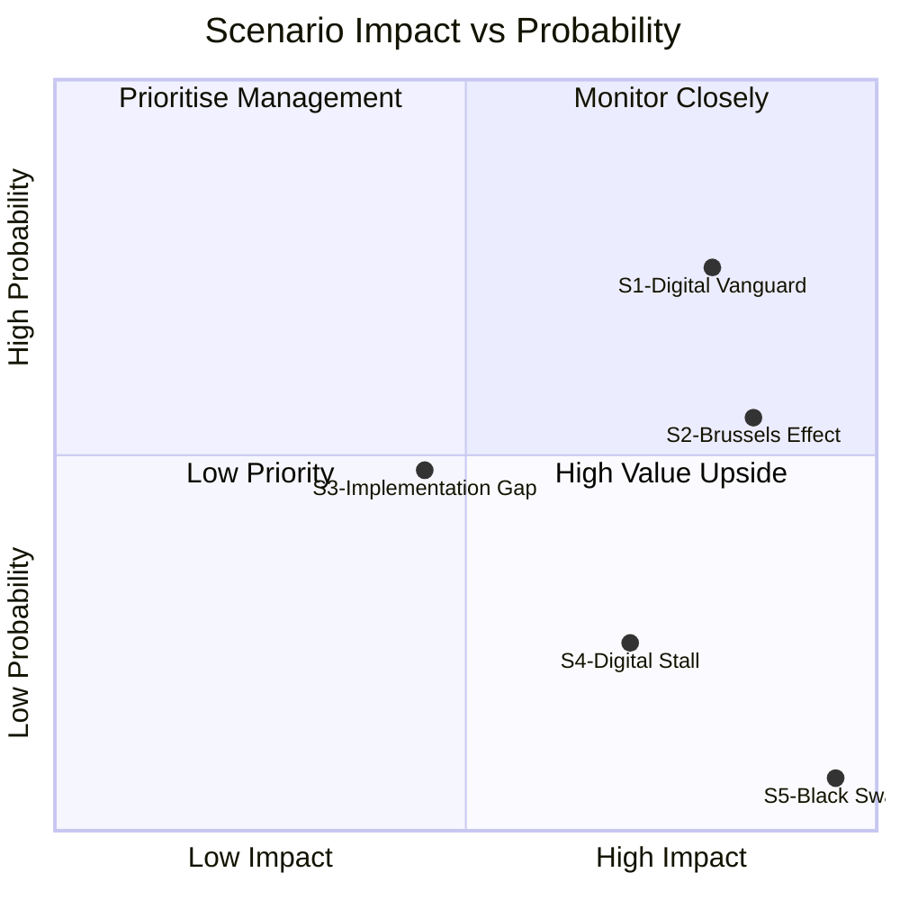

<!-- SPDX-FileCopyrightText: 2026 Hack23 AB -->
<!-- SPDX-License-Identifier: Apache-2.0 -->

# Scenario Forecast — EU Parliament Propositions 2026-05-27

**SATs Applied**: Scenario Analysis · Pre-Mortem · Key Assumptions Check · Indicators
**WEP Bands**: Documented per scenario
**Admiralty**: B2

---

## 1. Key Assumptions Check (SAT)

Before scenario analysis, explicit statement of key assumptions:

| # | Assumption | Confidence | Basis |
|---|-----------|------------|-------|
| A1 | Commission will present Digital Trade Strategy Q3 2026 | HIGH | Commission work programme 2026; INTA hearing schedule |
| A2 | 2023/0228 (forest seeds) will be published in OJEU within 30 days of signature | HIGH | Standard procedure; no political barrier |
| A3 | EU-US Trade and Technology Council remains the primary bilateral AI governance forum | MEDIUM | TTC established 2021; both parties committed but US political calendar creates uncertainty |
| A4 | DMA enforcement remains politically prioritised by Commission DG COMP | HIGH | Formal proceedings already open; politically embedded |
| A5 | ECR/ID groups will not form a legislative blocking minority on any of the three procedures | HIGH | All procedures already adopted; ECR/ID opposition is post-hoc |

---

## 2. Scenario Matrix

### Scenario 1 — "Digital Vanguard": EU Leads AI Trade Standards
**WEP: LIKELY (70–80%) — Time Horizon: 12–24 months**

**Description**: The Commission incorporates the EP's 2025/2112(INI) framework into its Digital Trade Strategy Q3 2026. The strategy includes a model AI-trade chapter to be inserted into all future EU FTAs, covering AI transparency requirements, algorithmic accountability in customs and logistics, and mutual recognition of AI conformity assessments with likeminded partners (UK, Canada, Japan, South Korea). The EU-US Trade and Technology Council (TTC) produces a joint AI governance statement by Q4 2026, partial but directionally aligned with EU approach.

**Enabling conditions**:
- Commission DG TRADE consultation reveals strong support from EU tech sector for proactive AI-trade strategy
- US USTR de-escalates on EU AI Act extraterritoriality concerns post-November 2026 US midterms
- Japan and South Korea indicate interest in bilateral AI trade chapters with EU

**WEP analysis**: LIKELY because the historical pattern of EP INI resolutions on digital trade being incorporated into Commission strategy is strong (70–80% prior + Bayesian update). However, the full bilateral AI trade chapter scenario is more ambitious: ROUGHLY EVEN (50–60%) for full incorporation within 12 months.

**Indicators to watch**:
- Commission Digital Trade Strategy consultation document cites 2025/2112(INI) ✓ (strong signal)
- TTC June 2026 joint communiqué includes AI governance language
- INTA committee requests formal Commission response (Article 225 TFEU) by October 2026

---

### Scenario 2 — "Brussels Effect Extended": EU AI Standards Become Default
**WEP: POSSIBLE-LIKELY (50–65%) — Time Horizon: 24–48 months**

**Description**: The EU's AI Act (already in force) and Digital Trade Strategy combination reproduces the "Brussels Effect" observed with GDPR: non-EU companies, including US and Chinese AI providers, find it easier to comply with EU AI Act standards globally than to maintain separate compliance regimes. This effectively makes EU AI Act standards the global default for enterprise AI, without requiring bilateral treaties.

**Enabling conditions**:
- EU market size creates sufficient compliance pressure (Brussels Effect mechanism)
- AI Act high-risk classification covers sufficient AI applications to matter globally
- US lacks comparable federal AI regulation (decentralised state-level approach)

**WEP analysis**: POSSIBLE-LIKELY because Brussels Effect has operated effectively in GDPR and DMA contexts. The key uncertainty is whether AI regulation is sufficiently tractable to the market-size-driven compliance mechanism that drove GDPR globalisation.

---

### Scenario 3 — "Implementation Gap": Forest and Pet Regulations Face Compliance Friction
**WEP: ROUGHLY EVEN (40–55%) — Time Horizon: 24–48 months**

**Description**: Both the forest seed regulation (2023/0228) and pet welfare regulation (2023/0447) face significant implementation friction. At least 3–4 Member States fail to establish their national microchip databases by the 2028 deadline; cross-border seed movement provisions face subsidiarity challenges at national courts. Commission opens infringement proceedings. Implementation is ultimately achieved but 18–24 months late.

**Enabling conditions**:
- Member State administrative capacity gaps (particularly Eastern EU)
- Transition period conflicts between national seed registers and new EU certification
- Pet industry lobby at national level successfully delays database implementation

**WEP analysis**: ROUGHLY EVEN — historical pattern shows ~40–50% of major EU consumer/environment regulations face at least one significant implementation delay. The 2028 deadlines for both regulations create 2-year window where Commission can apply political pressure before infringement.

**Pre-Mortem (SAT)**: If this scenario materialises by 2028, the root cause is most likely inadequate transition funding for Member State administrative bodies. The regulation's implementation acts (to be adopted 2026–2027) must include adequate funding provisions. The Commission's initial impact assessment may have underestimated implementation costs in lower-capacity Member States.

---

### Scenario 4 — "Digital Trade Stall": US Rejects EU AI-Trade Framework
**WEP: UNLIKELY (20–30%) — Time Horizon: 12–18 months**

**Description**: The US rejects EU bilateral AI trade chapters at TTC level, citing EU AI Act extraterritorial application as a technical barrier to trade. USTR initiates WTO dispute settlement proceedings challenging AI Act high-risk classification as a disguised trade restriction. EU-US TTC enters procedural freeze. The Commission scales back its Digital Trade Strategy AI chapter ambitions in response.

**Enabling conditions**:
- New US Administration (post-November 2026 midterms) takes hard line against EU digital regulation
- WTO DSB rules against EU in unrelated digital trade case, emboldening USTR
- EU internal division between DG TRADE (wants deal) and DG CONNECT (wants AI Act protection)

**WEP analysis**: UNLIKELY — the EU-US relationship has demonstrated resilience even during the 2025 tariff dispute. Both sides have political incentives to maintain TTC engagement. A formal WTO dispute on AI Act is technically possible but diplomatically costly.

---

### Scenario 5 — "Black Swan: Rapid AI Standards Fragmentation"
**WEP: REMOTE (5–10%) — Time Horizon: 12–24 months**

**Description**: China, Russia, and several Global South countries create an alternative ITU-backed AI governance framework that explicitly excludes EU AI Act provisions. This bifurcates global AI trade standards into EU/likeminded and non-EU blocs, fragmenting the global AI market and imposing significant interoperability costs on EU AI exporters seeking to serve both blocs.

**Enabling conditions**:
- ITU WRC-26 creates governance instrument outside WTO framework
- Major developing economies (India, Brazil, Indonesia) side with China-Russia alternative
- US remains non-committal on either standard

**WEP analysis**: REMOTE — but the trajectory is partially visible in 2025 ITU AI governance discussions. Not imminent but warrants monitoring as a long-range risk.

---

## 3. Indicator Set (SAT: Indicators)

| Indicator | Scenario Signal | Expected By | Monitored Via |
|-----------|----------------|------------|---------------|
| Commission Digital Trade Strategy Q3 2026 includes AI chapter | S1 confirmation | September 2026 | DG TRADE publication |
| INTA hearing on Commission Digital Trade Strategy response | S1 indicator | October 2026 | EP calendar |
| Forest seed regulation published in OJEU | Background indicator | June 2026 | EUR-Lex |
| First national microchip database go-live | S3 counter-indicator | 2027–2028 | Commission implementation report |
| TTC June 2026 joint communiqué AI content | S1/S4 discriminator | June 2026 | TTC press releases |
| USTR WTO complaint on AI Act | S4 trigger | If by Q4 2026 | WTO DS dashboard |
| ITU AI governance working group output | S5 indicator | 2026–2027 | ITU publications |

---

## 4. Scenario Probability Summary

---

## 7. Scenario Monitoring Framework

| Indicator | Favours S1/S2 | Favours S3/S4 | Trigger |
|-----------|--------------|--------------|---------|
| Commission Digital Trade Strategy content | AI chapters included | Omits binding AI standards | Q3 2026 |
| USTR statement on AI trade | Constructive engagement | Formal objection | Q3–Q4 2026 |
| Japan/Korea FTA talks | AI chapter opened | No AI chapter | 2026–2027 |
| Member State forest seed compliance | Majority on track 2027 | Multiple delays | Mid-2027 |
| EP2029 polling | EPP-led majority likely | Far-right surge | 2027–2028 |

**Overall scenario assessment**: S1 (Digital Vanguard) is the modal scenario. S2 (Brussels Effect) is the aspirational benchmark. The combination S1+S2 represents the best-case realistic outcome for EU digital governance leadership through 2030.

