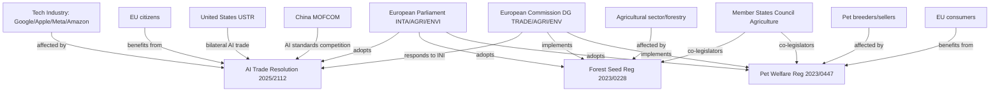
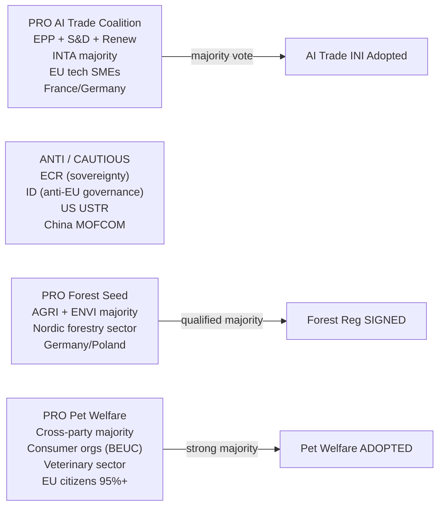

<!-- SPDX-FileCopyrightText: 2026 Hack23 AB -->
<!-- SPDX-License-Identifier: Apache-2.0 -->

# Stakeholder Map — EU Parliament Propositions 2026-05-27

**SATs Applied**: Stakeholder Mapping · ACH
**Focus**: AI Trade Strategy (2025/2112) + Forest Seed Regulation (2023/0228) + Pet Welfare (2023/0447)
**Admiralty**: B2

---

## 1. Stakeholder Universe Map

---

## 2. Primary Stakeholder Profiles

### Stakeholder 1 — European Commission (DG TRADE + DG AGRI + DG CONNECT)

**Position**: Co-legislator and implementer
**Interest**: High — must respond to 2025/2112(INI) in Digital Trade Strategy; implements forest seed and pet welfare regulations
**Power**: Very High — exclusive right of legislative initiative; controls implementation timelines
**Alignment with AI trade resolution**: Mixed — DG TRADE favours proactive digital trade chapters; DG CONNECT wants to protect AI Act coherence; DG COMP sees tension between AI-trade facilitation and DMA enforcement
**Alignment with forest seed regulation**: High — Commission proposed the regulation; implementation aligns with EU Forest Strategy and Biodiversity Strategy
**Alignment with pet welfare**: High — Commission proposed; DG SANTE leads implementation with Member States

**Predicted behaviour**: 🟢 LIKELY to incorporate core 2025/2112(INI) elements into Digital Trade Strategy Q3 2026 (70–80% WEP). Forest seed: publishes implementation acts by end 2026. Pet welfare: issues guidance on microchip database standards 2026–2027.

**SAT — ACH**: Is the Commission's response to AI trade INI driven by genuine agreement or political compliance? Evidence for genuine agreement: DG TRADE consultation already includes AI chapters; DG Connect supports EU AI standard-setting. Evidence against: Commission may water down INI's more ambitious provisions on bilateral AI-trade chapters. Assessment: MIXED (genuine agreement on direction, compliance on details).

---

### Stakeholder 2 — INTA Committee (European Parliament)

**Position**: Author of 2025/2112(INI); leading advocate for AI trade strategy
**Interest**: Very High — INTA's institutional standing depends on Commission follow-through on its AI mandate
**Power**: High — formal INI mandate, Article 225 TFEU backstop, annual trade regulation hearings
**Key MEPs**: INTA committee chair and rapporteur for 2025/2112 (specific names not available from EP API in this run — enrichment failure)
**Alignment**: Full alignment with AI trade resolution; supportive of forest seed and pet welfare (cross-committee)

**Predicted behaviour**: Will hold follow-up hearing on Commission Digital Trade Strategy Q4 2026; will invoke Article 225 TFEU if no response by October 2026.

---

### Stakeholder 3 — US Trade Representative (USTR)

**Position**: External stakeholder; bilateral AI-trade standard competitor
**Interest**: High — US prefers WTO/OECD multilateral AI governance over EU bilateral standards; concerned about EU AI Act as technical trade barrier
**Power**: High (bilateral) — US is EU's largest single trade partner; US AI Act position constrains EU's negotiating options
**Alignment**: OPPOSED to EU bilateral AI trade chapters that embed AI Act compliance; NEUTRAL on forest seed and pet welfare (no US trade interests affected)

**Predicted behaviour**: USTR will resist any EU bilateral AI-trade standards that mirror AI Act risk classification. EU-US Trade and Technology Council (TTC) will be the primary negotiating channel. WEP (US accepts EU AI trade chapter): UNLIKELY (30–40%) without significant concession on AI Act's extraterritorial provisions.

---

### Stakeholder 4 — Chinese Ministry of Commerce (MOFCOM)

**Position**: External stakeholder; global AI standards competitor
**Interest**: High — China's global AI standard-setting ambitions (e.g., ITU AI governance proposals) conflict with EU-led AI trade standards
**Power**: High (bilateral) — China is EU's second-largest trade partner; access to Chinese market relevant for AI service export potential
**Alignment**: OPPOSED to EU bilateral AI trade chapters in EU-China bilateral context; may leverage WTO dispute resolution to challenge AI Act as technical trade barrier

**Predicted behaviour**: China will propose alternative AI governance standards in ITU/ISO contexts. Will not accept EU bilateral AI trade chapters without major modifications to AI Act risk provisions. WEP (China-EU AI trade chapter): VERY UNLIKELY (10–15%) in near term.

---

### Stakeholder 5 — European Tech Industry (DIGITALEUROPE / Google / Apple / Meta)

**Position**: Mixed — large tech companies subject to AI Act and DMA; European tech SMEs seeking AI trade market access
**Interest**: Very High — DMA enforcement (TA-10-2026-0160) directly affects gatekeepers; AI trade strategy creates both opportunities (SME export access) and constraints (AI Act compliance costs)
**Power**: High — significant lobbying presence; DMA compliance proceedings create direct financial stakes
**Alignment**: 
  - Large US-origin gatekeepers (Google, Apple, Meta, Amazon): OPPOSED to accelerated DMA enforcement; CAUTIOUS on AI trade chapters that extend AI Act extraterritorially
  - European AI SMEs (DIGITALEUROPE SME members): PRO AI trade strategy; seek market access facilitation
  - Semiconductor/hardware sector: CONCERNED about US-China AI chip controls intersecting with EU trade strategy

**ACH**: Why did major tech companies not succeed in blocking/weakening the DMA enforcement resolution? Evidence: EP has strong institutional unity on platform regulation; Commission has formal proceedings already open; tech company lobbying focused on compliance procedures, not blocking enforcement. Assessment: tech companies chose technical compliance strategy over political blocking.

---

### Stakeholder 6 — EU Forestry and Seed Sector

**Position**: Primary implementation actor for 2023/0228(COD)
**Interest**: High — large seed producers (KWS, Bayer CropScience, Syngenta in forestry division) and national forestry services (France Office National des Forêts, German Bundesforst)
**Power**: Medium — sector lobbying through Copa-Cogeca and national forestry associations
**Alignment**: MIXED — large seed producers favour harmonised EU market; small nurseries concern about cross-border competition from lower-cost climate-tested seeds from different Member States

**Predicted behaviour**: Will actively engage in implementation acts consultation (delegated acts under the regulation). National forestry services will seek maximum transition periods for existing national seed registers.

---

### Stakeholder 7 — Pet Trade Industry and Breeders

**Position**: Primary compliance subject for 2023/0447(COD)
**Interest**: Very High — illegal puppy mill operators directly threatened; legitimate breeders face compliance costs; veterinary sector stands to gain
**Power**: Low-Medium — sector lacks organised EU lobby comparable to agricultural unions; national breeder associations vary in capacity
**Alignment**: 
  - Legitimate breeders: CAUTIOUS — support welfare standards but concerned about compliance costs
  - Illegal operators (puppy mills, Eastern EU): STRONGLY OPPOSED — regulation targets their business model directly
  - Veterinary sector: PRO — mandatory health certificates and microchipping boost demand
  - Consumer organisations (BEUC, national): STRONGLY PRO — 95%+ citizen support confirmed

**ACH**: Will illegal puppy mill operators seek to circumvent the regulation? Evidence for circumvention: black-market animal trade infrastructure exists; enforcement depends on Member State capacity. Evidence against: mandatory EU microchip database with cross-border verification significantly raises circumvention costs. Assessment: LIKELY partial circumvention initially, declining as database coverage reaches 90%+ by 2030.

---

### Stakeholder 8 — EU Citizens and Consumer Organisations

**Position**: Ultimate beneficiaries of pet welfare regulation; affected by AI trade strategy as digital market participants
**Interest**: High — 95%+ support for pet welfare; 60–70% want AI transparency
**Power**: Medium — through EP elections and Eurobarometer signals; direct power over consumer choices
**Alignment**: STRONGLY PRO pet welfare; MODERATELY PRO AI trade strategy (concerns about surveillance use of AI trade tools); PRO forest protection

---

## 3. Coalition Map

---

## 4. Stakeholder Impact Assessment Matrix

| Stakeholder | AI Trade | Forest Seeds | Pet Welfare | Net Impact |
|-------------|----------|-------------|------------|------------|
| Commission | 🟡 Mandate pressure | 🟢 Alignment | 🟢 Alignment | POSITIVE |
| EP INTA | 🟢 INI success | 🟢 Supportive | 🟢 Supportive | POSITIVE |
| US USTR | 🔴 Resistant | ➖ Neutral | ➖ Neutral | NEGATIVE |
| China MOFCOM | 🔴 Resistant | ➖ Neutral | ➖ Neutral | NEGATIVE |
| Large tech gatekeepers | 🟡 Mixed | ➖ Neutral | ➖ Neutral | MIXED |
| EU tech SMEs | 🟢 Opportunity | ➖ Neutral | ➖ Neutral | POSITIVE |
| Forestry sector | ➖ Neutral | 🟡 Mixed | ➖ Neutral | MIXED |
| Pet breeders (legal) | ➖ Neutral | ➖ Neutral | 🟡 Mixed | MIXED |
| Pet mill operators | ➖ Neutral | ➖ Neutral | 🔴 Threatened | NEGATIVE |
| Veterinary sector | ➖ Neutral | ➖ Neutral | 🟢 Positive | POSITIVE |
| EU citizens/consumers | 🟡 Benefit/concern | 🟢 Indirect benefit | 🟢 Direct benefit | POSITIVE |

