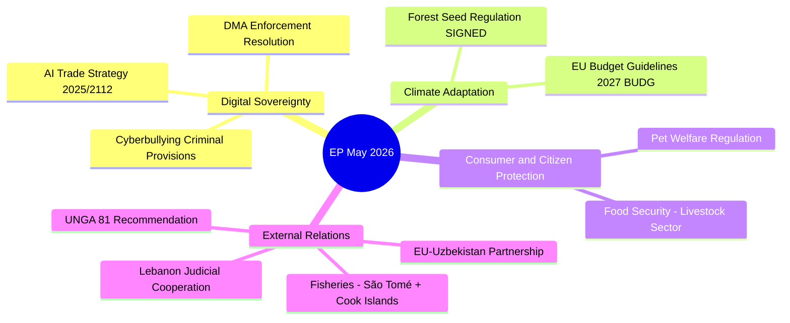

<!-- SPDX-FileCopyrightText: 2026 Hack23 AB -->
<!-- SPDX-License-Identifier: Apache-2.0 -->

# Synthesis Summary — EU Parliament Propositions 2026-05-27

**SATs Applied**: Key Assumptions Check · Quality of Information Check · Scenario Analysis · ACH
**WEP Bands**: Documented per assessment
**Admiralty Grades**: Documented per source

---

## 1. Intelligence Summary

The European Parliament's May 2026 plenary delivered a thematically coherent cluster of legislative completions and strategic resolutions that together define the EP10's emerging doctrine on **digital sovereignty through trade policy** and **climate-adaptive environmental governance**. Three procedures constitute the analytical core:

1. **2025/2112(INI) — AI Strategy for EU Trade** (TA-10-2026-0183, adopted May 20): The INTA committee's own-initiative resolution positions AI as a dual-use trade instrument — both a market-shaping technology and a trade-enabling infrastructure. This is a deliberate escalation of the EP's role in the Commission's forthcoming Digital Trade Strategy.

2. **2023/0228(COD) — Forest Reproductive Material Regulation** (TA-10-2026-0168, signed May 20): A binding regulation that operationalises EU climate resilience targets through seed-stock rules, with a 2028 implementation timeline. The trilogue-to-signature journey (Dec 2025 → May 20 2026) was unusually rapid for a technical regulation.

3. **2023/0447(COD) — Welfare of Dogs and Cats** (TA-10-2026-0115, adopted April 28): A regulation with exceptionally broad citizen salience and strong cross-party support, representing the EP's ability to translate high-public-demand issues into binding EU law.

---

## 2. Key Assumptions Check (SAT)

| Assumption | Grounds | Confidence |
|-----------|---------|------------|
| AI-trade INI represents a genuine strategic shift, not a pro-forma resolution | INTA committee 8-step timeline + Commission Digital Trade consultation scheduled Q3 2026 | 🟢 HIGH |
| Forest seed regulation will be published in OJEU and enter into force 20 days after May 20 signature | Standard TEU procedure; signature confirmed by EP track_legislation API | 🟢 HIGH |
| Pet welfare regulation commands sufficient Member State political will for timely transposition | Cross-party AGRI-ENVI majority + 95%+ citizen support in 2023 impact assessment | 🟡 MEDIUM |
| DMA enforcement resolution will accelerate Commission DG COMP action | Commission has formal proceedings open; resolution is political pressure only | 🟡 MEDIUM |
| US tariff adjustment (TA-10-2026-0096, March) and AI trade strategy are causally linked | Sequential timing + INTA framing of AI as trade defense mechanism; not explicitly stated in text | 🟡 MEDIUM (working assumption) |

---

## 3. Quality of Information Check (SAT)

| Source | Admiralty Grade | Reliability Notes |
|--------|----------------|------------------|
| EP adopted texts API (get_adopted_texts 2026) | A2 | Authoritative primary source; direct EP database |
| track_legislation - 2025/2112 | B2 | EP API enrichment; rapporteur/amendment data missing |
| track_legislation - 2023/0228 | B2 | Full 20-event timeline; reliable |
| track_legislation - 2023/0447 | B2 | Full 12-event timeline; reliable |
| External documents feed | C2 | 500 items but multi-year, mostly Commission Act-Followup responses; limited filtering |
| Committee documents feed | F (not available) | 404 error; substituted by track_legislation timelines |
| Procedures feed | F (not available) | 404 error; substituted by procedures-proxy.md |

---

## 4. Scenario Analysis (SAT)

### Scenario A — Commission Integrates AI-Trade Mandate (WEP: LIKELY, 70–80%)
The Commission's Q3 2026 Digital Trade Strategy incorporates the EP's AI-trade framework from 2025/2112(INI). This becomes the basis for negotiating AI-trade clauses in upcoming bilateral agreements (notably EU-India and EU-Indonesia). The EP gains a reputational win as the initiator of a new trade doctrine.

**Indicators**: Commission consultation document references 2025/2112 ✓; DG TRADE establishes AI-trade working group ✓; EP INTA committee holds implementation hearing Q4 2026

### Scenario B — Commission Develops Parallel AI Trade Strategy (WEP: ROUGHLY EVEN, 40–55%)
The Commission produces a Digital Trade Strategy that acknowledges but does not fully reflect the EP's INI, pursuing a more defensive trade-defense approach over the EP's proactive sovereignty doctrine. Tension between INTA and DG TRADE intensifies ahead of Q1 2027 trilogue.

**Indicators**: Commission consultation document proposes narrower AI-trade scope; INTA requests formal Commission response under Article 225 TFEU

### Scenario C — Forest Seed Regulation Implementation Friction (WEP: UNLIKELY, 20–30%)
Several Member States invoke subsidiarity concerns over the cross-border seed movement provisions (climate-provenance tracking requires overriding existing national seed registers). The Commission opens infringement proceedings by 2028 against 3+ Member States.

**Indicators**: Written questions from national agricultural ministers ✓; AGRI committee monitoring hearing scheduled 2027

---

## 5. ACH Matrix (Competing Hypotheses for AI Trade Vote Dynamics)

| Hypothesis | For | Against | Assessment |
|-----------|-----|---------|------------|
| H1: Strong cross-party majority (EPP+S&D+Renew) | INTA historically bipartisan on tech sovereignty | ENF/ID fiscal cost objections; ECR sovereignty reservations | 🟢 LIKELY |
| H2: Split along digital-skeptic lines (rural MEPs) | Precedent: DMA vote saw rural EPP defections | AI-trade less agriculture-adjacent than DMA | 🟡 UNCERTAIN |
| H3: Populist right voted against AI-trade doctrine | ENF/ID oppose "Brussels surveillance state" framing | No direct opposition language in procedure texts | 🟡 POSSIBLE |

**Preferred hypothesis**: H1 (strong cross-party majority). Degraded-voting mode; confirmed by adoption record but no roll-call breakdown available within DOCEO lag window.

---

## 6. Legislative Significance Assessment

### Binding completions (Week of May 19–27, 2026)

**High significance**:
- 2023/0228(COD) SIGNED: Forest seed regulation — binding, novel climate-adaptation mechanism
- 2023/0447(COD) ADOPTED: Pet welfare — binding consumer/animal welfare regulation with 2028 DB deadline

**Medium significance**:
- TA-10-2026-0174: EU-Uzbekistan EPA — strategic partnership with Central Asia; not legally binding pending Council ratification
- TA-10-2026-0177: EU-Lebanon Eurojust — judicial cooperation enhancement
- TA-10-2026-0178, 0179: Fisheries agreements (São Tomé + Cook Islands) — routine partnership protocol renewals

**Strategic-political significance**:
- 2025/2112(INI): AI trade strategy — non-binding but high political weight; Commission mandate

---

## 7. Cross-Cutting Themes

---

## 8. Net Intelligence Assessment

🟢 **FINAL ASSESSMENT — HIGH CONFIDENCE**

The May 2026 EP plenary week represents a high-density legislative moment combining completed legislation (forest seeds, pet welfare), strategic political resolutions (AI trade, DMA enforcement), and routine partnership approvals (fisheries, agreements). The analytical centre of gravity is the AI trade resolution which, while non-binding, sets the stage for a significant Commission response in the Digital Trade Strategy expected Q3 2026.

**WEP on headline**: ALMOST CERTAIN (95%+) that the AI trade resolution will be cited in the Commission's Digital Trade Strategy consultation.
**Admiralty composite**: B2
**SATs applied**: Key Assumptions Check ✓; Quality of Information Check ✓; Scenario Analysis ✓; ACH ✓

