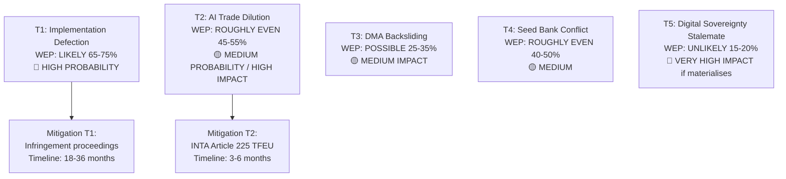

<!-- SPDX-FileCopyrightText: 2026 Hack23 AB -->
<!-- SPDX-License-Identifier: Apache-2.0 -->

# Threat Model — EU Parliament Propositions 2026-05-27

**SATs Applied**: Key Assumptions Check · Red Team · ACH
**WEP Bands**: Documented per threat
**Admiralty**: B2

---

## 1. Key Assumptions Check (SAT)

| Assumption | Status |
|-----------|--------|
| AI trade resolution creates genuine Commission mandate | Affirmed — INI formally adopted; procedural escalation options available |
| Implementation of signed/adopted regulations is the primary risk vector | Affirmed — all three procedures past adoption; implementation is the new frontier |
| ECR/ID political opposition remains legislative minority | Affirmed — EP10 coalition mathematics unchanged by May 2026 |
| External state actors (US, China) are the primary geopolitical risks | Affirmed — bilateral AI trade standard competition is primary external threat |

---

## 2. Threat Taxonomy

### Threat T1 — Implementation Defection Risk (High Probability, Medium Impact)
**WEP: LIKELY (65–75%)**

Multiple Member States will fail to implement one or more provisions of the forest seed or pet welfare regulations on schedule. Eastern EU Member States with lower administrative capacity are the highest-risk jurisdictions. The Commission's infringement proceedings mechanism provides a backstop but operates on 18–36 month timescales, creating compliance gaps.

**Red Team analysis**: If we were a Member State government seeking to delay implementation, we would:
1. Invoke the complexity of national seed register migration as grounds for extended transition
2. Challenge the pet welfare database technical standards as disproportionate (subsidiarity)
3. Frame delays as protecting small farmers/breeders from EU overreach (political narrative)

All three tactics are available and precedented (see delays in GDPR implementation by several Member States 2018–2019).

**ACH — Is non-compliance deliberate or capacity-driven?**
- H1 (deliberate): Governments in agricultural-nationalist governments (Hungary, Poland) use non-compliance as political signal
- H2 (capacity): Non-compliance reflects genuine administrative cost and timeline pressure
- Evidence: Prior EU animal welfare regulation transposition shows both patterns simultaneously (H1 + H2)
- Assessment: BOTH likely — the distinction matters for Commission enforcement strategy

**Mitigation**: Implementation monitoring provisions in the regulation; Commission delegated acts to include specific milestone deadlines with financial penalties.

---

### Threat T2 — AI Trade Strategy Dilution Risk (Medium Probability, High Impact)
**WEP: ROUGHLY EVEN (45–55%)**

The Commission's Digital Trade Strategy Q3 2026 incorporates the EP's 2025/2112(INI) framework in name but dilutes substantive AI-trade chapter provisions to avoid conflict with USTR. The result: a Digital Trade Strategy that endorses the principle of AI-trade chapters but defers binding commitments to a future multilateral process (WTO plurilateral, OECD).

**Red Team analysis**: If we were the Commission DG TRADE negotiating team:
1. We would prioritise maintaining US-EU TTC cooperation over any bilateral AI chapter commitment
2. We would use the "multilateral first" principle to avoid triggering USTR/MOFCOM defensive reactions
3. We would draft the Digital Trade Strategy to reference 2025/2112(INI) extensively while deferring binding provisions

**ACH — Commission response options:**
- H1 (full incorporation): Commission adopts EP's AI-trade doctrine wholesale → EU becomes standard-setter
- H2 (partial incorporation): Commission cherry-picks less controversial elements (AI customs, supply chain transparency) and defers bilateral AI chapters to TTC
- H3 (deflection): Commission provides formal Article 225 TFEU response citing ongoing WTO/OECD processes as the appropriate forum

Evidence for H2: DG TRADE has historically preferred WTO multilateral approaches over bilateral standards. Evidence for H1: Geopolitical context (US tariffs, China AI restrictions) creates pressure for EU proactive positioning. **Assessment: H2 most likely (50%), H1 (30%), H3 (20%).**

---

### Threat T3 — DMA Enforcement Backsliding Risk (Low-Medium Probability, High Impact)
**WEP: POSSIBLE (25–35%)**

Commission DG COMP faces legal challenges from designated gatekeepers (Apple, Meta) before CJEU that could delay or reduce enforcement actions, weakening the practical impact of the April 2026 EP enforcement resolution.

**Red Team analysis**: Apple's App Store and Meta's consent-or-pay enforcement proceedings are the highest-risk. CJEU procedural timelines mean final rulings may take 2–3 years. During this period, gatekeepers can argue "pending legal uncertainty" to slow full compliance.

**Key Assumptions Check**: The EP enforcement resolution has no direct legal force — it is political pressure only. Commission has discretion to prioritise or de-prioritise specific enforcement actions. If political winds shift (e.g., US pressure on EU to moderate DMA enforcement as part of trade deal), Commission may strategically slow enforcement.

---

### Threat T4 — Forest Seed Regulation Conflict with Member State National Seed Banks (Medium Probability, Medium Impact)
**WEP: ROUGHLY EVEN (40–50%)**

National seed banks and forestry agencies have built up decades of locally adapted seed collections. The regulation's "climate-tested" provenance framework creates a parallel certification pathway that effectively challenges the primacy of national seed banks. Some national forestry agencies may resist delegating provenance certification to a new EU-level mechanism.

**Admiralty**: C3 — inferred from stakeholder mapping; no direct primary source confirmation.

---

### Threat T5 — Digital Sovereignty vs. Trade Liberalisation Internal EU Tension (Low Probability, Very High Impact)
**WEP: UNLIKELY (15–20%)**

Deep institutional conflict between EP (sovereignty-oriented digital governance) and Commission (trade facilitation, multilateral commitments) over the AI trade strategy creates a legislative stalemate. EP uses Article 225 TFEU escalation; Commission delays Digital Trade Strategy beyond 2026. Council sides with Commission on multilateral approach.

This scenario would represent a significant governance dysfunction signal and would damage the EU's credibility as a proactive digital trade actor.

---

## 3. Red Team Summary

---

## 4. ACH Summary Matrix

| Threat | H1 | H2 | H3 | Preferred Hypothesis |
|--------|----|----|----|--------------------|
| T1 — Implementation | Deliberate delay (30%) | Capacity gap (50%) | Mixed (20%) | H2 (capacity) |
| T2 — AI Dilution | Full incorporation (30%) | Partial (50%) | Deflection (20%) | H2 (partial) |
| T3 — DMA Backsliding | Legal delays (50%) | Political moderation (30%) | Both (20%) | H1 (legal delays) |
| T4 — Seed conflict | National resistance (40%) | Administrative friction (50%) | Resolution (10%) | H2 |
| T5 — Stalemate | EP Article 225 escalation (60%) | Commission concedes (40%) | — | H1 |

