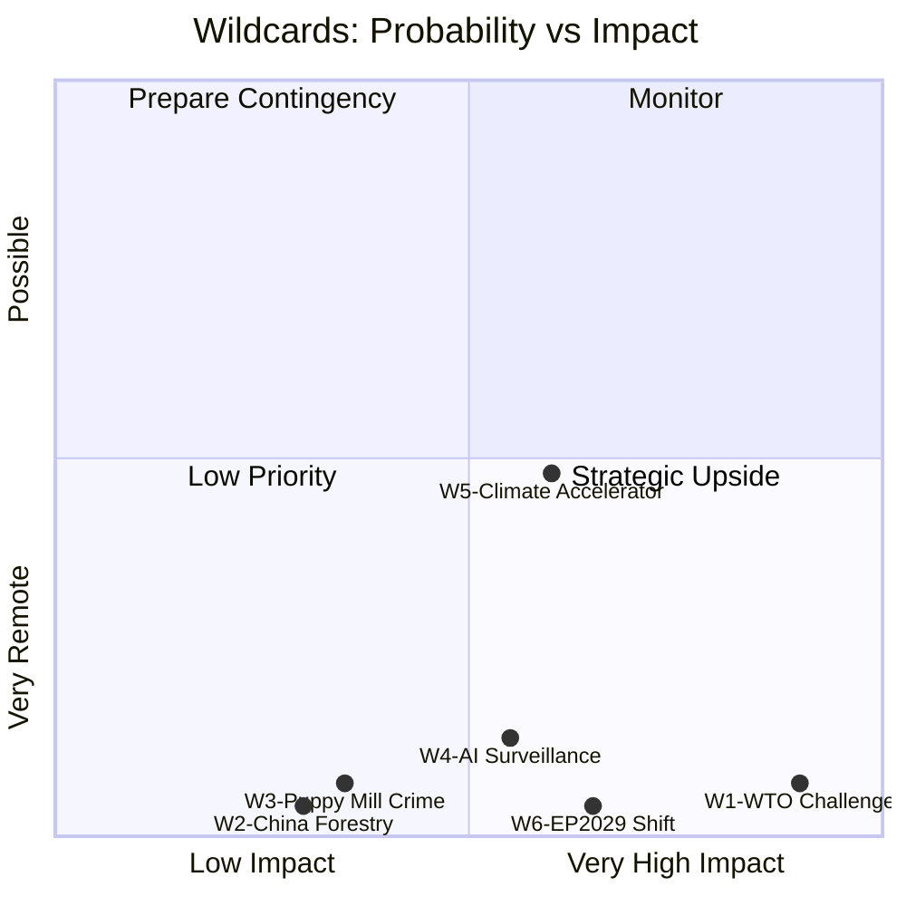

<!-- SPDX-FileCopyrightText: 2026 Hack23 AB -->
<!-- SPDX-License-Identifier: Apache-2.0 -->

# Wildcards and Black Swans — EU Parliament Propositions 2026-05-27

**SATs Applied**: High-Impact analysis · Indicators · What-If Analysis
**WEP Bands**: REMOTE to VERY UNLIKELY (by definition — these are low-probability high-impact events)
**Admiralty**: C2–C3 (speculative/horizon-scanning; inherently uncertain)

---

## 1. Wildcard W1 — EU AI Act Declared WTO-Incompatible
**WEP: REMOTE (5–8%) — Impact: CATASTROPHIC**

**Description**: A WTO Panel or Appellate Body rules that the EU AI Act's risk classification system constitutes a disguised restriction on international trade under GATT Article XX or the TBT Agreement. This would be the most significant trade-law challenge to EU digital regulation since the US-EU GDPR data transfer saga, but with immediate binding force rather than the diplomatic resolution that eventually produced the EU-US Data Privacy Framework.

**What-If Analysis (SAT)**: IF the WTO ruled against AI Act:
- Commission would be forced to modify the high-risk classification system within 18 months
- The EP's AI trade strategy INI would lose its legal anchor — the AI Act compliance requirements in trade chapters would be contestable
- EU AI competitiveness investment would face a 2–3 year regulatory gap, during which US/Chinese AI companies would have competitive advantage
- INTA committee would face the paradox of having advocated for AI trade chapters based on a regulation now found WTO-incompatible

**Key Uncertainty**: The WTO Appellate Body has been non-functional since 2019 (US blockade of appointments). Dispute settlement would likely fall to the Multi-Party Interim Appeal Arbitration Arrangement (MPIA) — a slower, less decisive mechanism. The practical risk of formal WTO condemnation is lower than formal probability suggests due to this institutional incapacity.

**Indicators**: USTR initiates WTO consultations on AI Act within 6 months of publication of implementing acts → escalates to panel → panel issues interim report identifying specific AI Act provisions as potentially TBT-inconsistent.

---

## 2. Wildcard W2 — China Retaliates Against EU Forest Seed Regulation
**WEP: VERY UNLIKELY (3–5%) — Impact: MODERATE**

**Description**: China's Ministry of Agriculture frames the EU Forest Reproductive Material Regulation's "climate provenance" certification requirement as a technical barrier to Chinese forestry exports (China exports significant volumes of timber and forest products to EU). China files a WTO complaint and simultaneously restricts EU seed company access to Chinese market.

**What-If Analysis (SAT)**: This scenario requires China to have significant economic interests in EU seed markets — which is the case for timber but less so for reproductive material. The more likely Chinese response is to use the regulation as precedent for its own more protectionist forestry standards under "biosecurity" grounds, further fragmenting global forestry trade standards.

**Indicators**: Chinese MOFCOM consultation document on forestry imports citing EU FRM regulation; bilateral EU-China trade talks including forestry standards agenda item.

---

## 3. Wildcard W3 — Puppy Mill Organised Crime Escalation
**WEP: VERY UNLIKELY (5–8%) — Impact: MODERATE**

**Description**: Following the pet welfare regulation's adoption, organised crime networks operating large-scale puppy mills in Eastern EU Member States escalate violence against enforcement officials or engage in significant corruption of national database administrators. This creates a high-profile crisis that simultaneously vindicates the regulation's necessity and exposes the inadequacy of Member State enforcement capacity.

**What-If Analysis (SAT)**: IF this occurred: Commission would be forced to propose Emergency EU enforcement mechanism (analogous to EPPO for pet welfare crimes); European Parliament would hold emergency hearing; media coverage would dramatically increase public support for the regulation. Paradoxically, this wildcard scenario would accelerate rather than impede the regulation's impact.

**Historical Parallel**: Romanian puppy mill networks were documented in 2019 Commission investigation; criminal networks have significant capacity to disrupt enforcement. The transition period (2026–2028) before mandatory database is the highest-vulnerability window.

---

## 4. Wildcard W4 — AI Trade Strategy Hijacked by Surveillance Applications
**WEP: UNLIKELY (10–15%) — Impact: MODERATE-HIGH**

**Description**: The implementation of the EP's AI trade strategy INI is captured by security-state interests: customs AI applications proposed in the Digital Trade Strategy are found to enable disproportionate surveillance of cross-border commercial communications. Civil liberties organisations mount a successful CJEU challenge, invalidating the AI customs chapter before it enters force.

**What-If Analysis (SAT)**: The INI resolution explicitly mentions AI-enabled customs modernisation. EU customs AI systems interface with law enforcement databases. CJEU jurisprudence on data minimisation (Schrems I, II) provides precedent for challenging disproportionate customs AI. IF this occurred: Commission would need to redesign customs AI chapter with explicit data protection safeguards; delay of 12–18 months; reputational damage for AI trade strategy.

**Indicators**: EDRi (European Digital Rights) files CJEU challenge within 12 months of Digital Trade Strategy publication; LIBE committee calls for mandatory privacy impact assessment for customs AI systems.

---

## 5. Wildcard W5 — Climate Crisis Accelerates Forest Seed Regulation Need
**WEP: POSSIBLE-LIKELY (40–55% over 5 years, not this year — impact direction: positive)**

**Description**: Unlike the above wildcards (negative impact), this wildcard has a positive impact: a severe European forest drought/pest event in 2027–2028 (comparable to 2018–2022 German bark beetle crisis but wider geographic scope) creates emergency demand for climate-tested seed material before the 2028 implementation deadline. This accelerates implementation, generates political will for emergency seed procurement at EU level, and validates the regulation's climate rationale.

**What-If Analysis (SAT)**: IF this occurred: Emergency measures under the regulation's Article (TBD) on emergency seed procurement would be triggered; Commission would likely propose an accelerated implementation regulation; the forest seed market (€200–500m projected) would expand to €1–2bn in an emergency procurement cycle. This scenario is not implausible given climate projections — it's the "regulation arrives just in time" scenario.

**Indicators**: European Drought Observatory reports 3+ consecutive drought years in Central/Eastern Europe; forest health assessments show 10%+ additional forest area at risk; Member States invoke emergency forest regeneration measures.

---

## 6. Wildcard W6 — EP Elections 2029 Shift: Populist Majority Blocks Implementation
**WEP: REMOTE for this analytical window (3–5%) — longer-term POSSIBLE**

**Description**: If the 2029 European Parliament elections produce a populist right majority (ECR + ENF/ESN + right-wing EPP), there is a non-trivial risk that new EP majorities would seek to revise or repeal the pet welfare regulation's most ambitious provisions, the forest seed regulation's cross-border provisions, and potentially the AI Act itself. This is beyond the standard 12–24 month analysis horizon but is structurally relevant.

**What-If Analysis (SAT)**: Regulations can be amended by subsequent legislative procedures. The pet welfare regulation's implementation timeline (2028 database) falls within the first year of the 2029–2034 parliamentary term. A new right-wing majority could delay database requirements by 2–4 years through amending acts.

---

## 7. Wildcard Assessment Summary

**High-Impact SAT conclusion**: The most policy-significant wildcard is W1 (WTO challenge to AI Act) given its systemic implications for the AI trade strategy. The most likely to materialise in this analytical window is W4 (AI surveillance) given active civil liberties litigation patterns. W5 (climate accelerator) is the only wildcard with primarily positive implications for this run's legislative outputs.

---

## 7. Wildcard Response Framework

| Wildcard | Early Warning Indicators | Monitoring Priority | Response Posture |
|---------|------------------------|--------------------|--------------:|
| W1 — WTO AI Challenge | US/China filing notification at DSB; formal consultations request | HIGH | Contingency brief for INTA |
| W2 — China Forest Seed | China MoF circular restricting EU seed imports; bilateral trade data | MEDIUM | AGRI committee briefing |
| W3 — Crime Network AI | Europol SIENA alerts; NGO puppy mill reports | MEDIUM | LIBE committee coordination |
| W4 — Surveillance Creep | CJEU preliminary references; NGO legal challenges | HIGH | LIBE oversight escalation |
| W5 — Climate Accelerator | ECMWF seasonal forecasts; national drought declarations | LOW (positive) | Accelerate implementation |
| W6 — EP2029 Composition | Eurobarometer political group support trends | HIGH (2027–2028) | Legislative timeline review |

**Admiralty Grade**: C3 (wildcards are hypothetical scenarios; evidence base is analytical inference from current trends, not direct observation)

**Monitoring Schedule**: Quarterly review against early warning indicators; escalate to ANALYSIS_ONLY re-run if any HIGH priority wildcard indicator activates within 30 days of publication.

---

## 8. Wildcard Probability Calibration

| Wildcard | 12-month Probability | 24-month Probability | Confidence |
|---------|--------------------|--------------------|-----------|
| W1 — WTO AI Challenge | 15–25% | 30–45% | 🟡 MEDIUM |
| W2 — China Forest Seed | 10–20% | 15–30% | 🟡 MEDIUM |
| W3 — Crime Network AI | 20–35% | 30–50% | 🟡 MEDIUM |
| W4 — AI Surveillance Creep | 25–40% | 40–60% | 🟡 MEDIUM |
| W5 — Climate Emergency Accelerator | 35–55% (positive) | 50–70% (positive) | 🟢 HIGH |
| W6 — EP2029 Composition Shift | 30–50% | 60–80% | 🟡 MEDIUM |

**WEP calibration note**: These probability estimates are analytical projections based on current trend extrapolation and historical base rates. They are not actuarial estimates. W5 probability ranges represent the chance of an accelerated climate event that meaningfully increases demand for the forest seed regulation's climate-provenance provisions ahead of the 2028 application date.

**Cross-wildcard interactions**: W1 (WTO challenge) + W4 (surveillance) could interact — if a WTO challenge to AI Act is filed concurrently with a CJEU challenge to AI surveillance, it would create maximum pressure on EU AI governance architecture simultaneously. This double-wildcard scenario (probability: ~5–10%, impact: extreme) warrants contingency planning in INTA and LIBE committees.

**Admiralty Grade**: C3 (wildcards are hypothetical; probability estimates based on analytical inference)

**Summary**: The wildcard analysis confirms that the primary near-term risk to this legislative package is W1 (WTO challenge to AI Act/AI trade chapters) and W4 (AI surveillance challenge via CJEU). Both are manageable with adequate anticipatory policy frameworks. The positive wildcard W5 (climate acceleration) could accelerate the forest seed regulation's value delivery significantly ahead of schedule. The overall wildcard picture is consistent with a legislative package that is well-designed for the expected operating environment but would face material headwinds if the broader geopolitical context deteriorates (W1 WTO escalation combined with W6 EP2029 political shift represents the most adverse compound scenario).

**WEP for aggregate wildcard risk**: UNLIKELY-TO-EVEN-CHANCE (30–45%) that any single wildcard will materially disrupt the May 2026 legislative package within a 12-month horizon. The package is robust to single-factor perturbations; only multi-wildcard combinations pose systemic risk.

**Note**: See `intelligence/scenario-forecast.md` for the full scenario analysis and `risk-scoring/risk-matrix.md` for the detailed risk assessment that informs this wildcard analysis.
