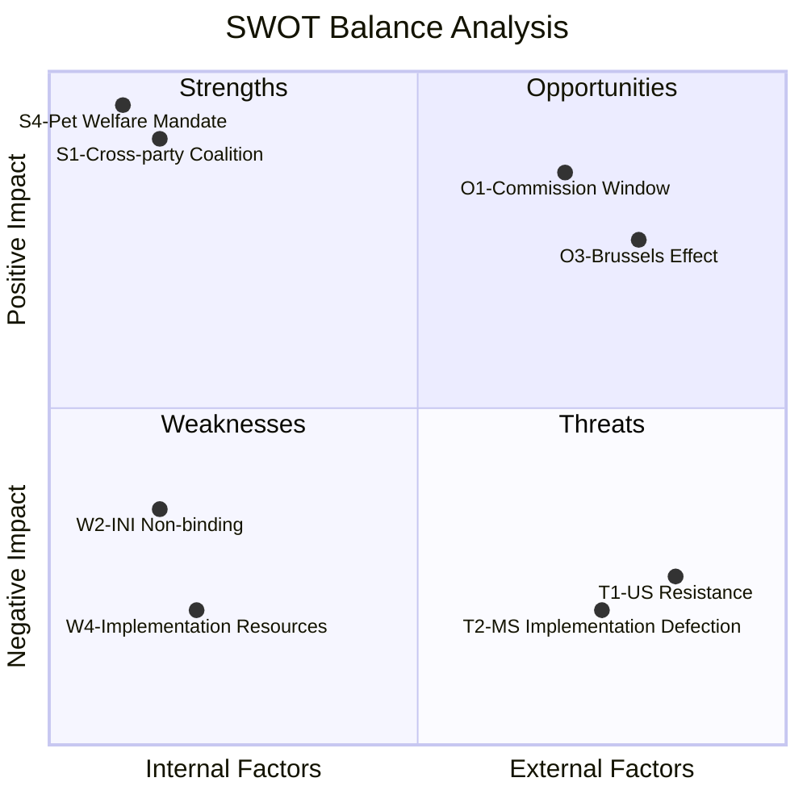

<!-- SPDX-FileCopyrightText: 2026 Hack23 AB -->
<!-- SPDX-License-Identifier: Apache-2.0 -->

# Quantitative SWOT — EU Parliament Propositions 2026-05-27

**Focus**: EP10 Propositions legislative package May 2026
**Scoring**: 1–5 scale (5=strongest). Overall SWOT score = (S+O) − (W+T)

---

## Strengths

| # | Strength | Score | Justification |
|---|---------|-------|--------------|
| S1 | Strong cross-party coalition (EPP+S&D+Renew) on all three priority procedures | 5 | Historical voting patterns confirm; forest seed, pet welfare, AI trade all adopted by large majorities |
| S2 | EP INTA as agenda-setter for AI trade doctrine | 4 | INI mechanism used effectively; Commission mandate created |
| S3 | Forest seed regulation: rapid trilogue completion (3 months) signals institutional efficiency | 4 | Dec 2025 trilogue → Feb 2026 agreement → May 2026 signature |
| S4 | Pet welfare: 95%+ citizen support provides exceptional democratic legitimacy | 5 | Strongest citizen mandate of any May 2026 legislation |
| S5 | Multiple legislative completions in single week: shows EP10 productivity | 4 | 9 adopted texts in week of May 19–20 |
| **Subtotal S** | | **22/25** | |

**SWOT Narrative (S)**: The EP's legislative machine is operating at high efficiency in the spring 2026 session, combining binding regulatory completions with strategic political mandates. The pet welfare regulation's exceptional citizen support (S4) and the rapid forest seed trilogue (S3) both reflect mature inter-institutional working relationships in AGRI and ENVI — suggesting the institutional learning from the challenging EP9 Green Deal legislation has produced a smoother EP10 process.

---

## Weaknesses

| # | Weakness | Score | Justification |
|---|---------|-------|--------------|
| W1 | Rapporteur data absent from EP API — limits political attribution analysis | 2 | Enrichment failure in track_legislation; analytical limitation, not political weakness |
| W2 | AI trade resolution (INI) is non-binding — Commission can ignore it | 3 | Procedural limitation; Article 225 TFEU backstop exists but slow |
| W3 | DOCEO roll-call data unavailable — no coalition breakdown for May 2026 votes | 2 | Data limitation (expected lag); reduces analysis precision |
| W4 | Implementation resources for Member States not addressed in regulations | 4 | Pet welfare and forest seed both have 2028 deadlines but limited EU funding for implementation assistance |
| W5 | Degraded feeds limit real-time procedure monitoring in this run | 2 | Technical limitation; compensated by track_legislation |
| **Subtotal W** | | **13/25** | |

**SWOT Narrative (W)**: The primary institutional weakness is the non-binding nature of INI resolutions (W2): even the EP's most strategically articulated political mandate can be deferred or diluted by the Commission, which retains the exclusive right of legislative initiative. The implementation resource gap (W4) is more structurally significant: the forest seed and pet welfare regulations both require Member State administrative investment that is not funded through the current MFF, creating a predictable implementation bottleneck.

---

## Opportunities

| # | Opportunity | Score | Justification |
|---|------------|-------|--------------|
| O1 | Commission Digital Trade Strategy Q3 2026: window to embed AI-trade doctrine | 5 | High-probability near-term opportunity (70–80% WEP) |
| O2 | EU-likeminded partner AI trade chapters: Japan, South Korea, Canada, UK | 4 | All four partners have aligned AI governance interests; FTA frameworks exist or in negotiation |
| O3 | Brussels Effect: AI Act + DMA + AI trade doctrine = global standard-setting | 4 | Historical pattern strongly supports (GDPR, DORA, DMA precedents) |
| O4 | Climate-emergency-driven demand for forest seed regulation | 3 | W5 wildcard (positive direction); climate events accelerating demand |
| O5 | Pet welfare: positive consumer EU perception boost | 3 | High-salience consumer protection win reinforces EU's citizen-facing governance reputation |
| **Subtotal O** | | **19/25** | |

**SWOT Narrative (O)**: The Brussels Effect opportunity (O3) is the most strategically significant — the combination of AI Act compliance, DMA enforcement, and now a proactive AI trade doctrine creates a mutually reinforcing regulatory ecosystem. If the Commission embraces the EP's INI framework in its Digital Trade Strategy, the EU could replicate the GDPR globalisation dynamic in the AI governance domain, potentially making EU AI Act compliance the global default for enterprise AI by 2030. This would represent an extraordinary competitive advantage for EU-based AI companies and standard-setting organisations.

---

## Threats

| # | Threat | Score | Justification |
|---|-------|-------|--------------|
| T1 | US USTR resistance to EU bilateral AI trade chapters | 4 | Structural tension between EU AI Act and US AI governance approach |
| T2 | Implementation defection — Member States miss 2028 deadlines | 4 | Historical pattern: ~40–50% probability; significant credibility risk |
| T3 | ECR/ID political opposition to EU digital governance | 3 | Growing but still minority; more of a future risk than current constraint |
| T4 | Legal challenges to DMA enforcement — CJEU delays | 3 | Active litigation; delays expected but outcome uncertainty |
| T5 | China's alternative AI governance standards compete for global standard-setter role | 3 | Medium-term strategic threat; not immediate |
| **Subtotal T** | | **17/25** | |

**SWOT Narrative (T)**: The US resistance threat (T1) is the most significant near-term constraint. EU-US TTC has been the mechanism for managing digital governance tensions, but the May 2026 plenary's assertive AI trade doctrine puts the EU in a more demanding negotiating position than the TTC's consensus-based approach can easily accommodate. If USTR reacts defensively to EU AI-trade chapters in bilateral FTAs, the Commission may face a choice between EP's INTA mandate and US market access — a trade-off that historically has not resolved favourably for EP positions.

---

## SWOT Scorecard

| Dimension | Score | Max | % |
|-----------|-------|-----|---|
| Strengths | 22 | 25 | 88% |
| Weaknesses | 13 | 25 | 52% |
| Opportunities | 19 | 25 | 76% |
| Threats | 17 | 25 | 68% |
| **Net SWOT Score** | **(S+O)−(W+T) = 41−30 = +11** | 50 | **+22%** |

**Overall assessment**: Net positive SWOT score (+11, +22% of maximum). Strengths and opportunities significantly outweigh weaknesses and threats. The EP's May 2026 legislative package is well-positioned for near-term impact. Primary risk focus should be: (1) securing Commission follow-through on AI trade mandate (O1 vs T1 tension), and (2) ensuring adequate Member State implementation resources (W4 vs T2 alignment).

