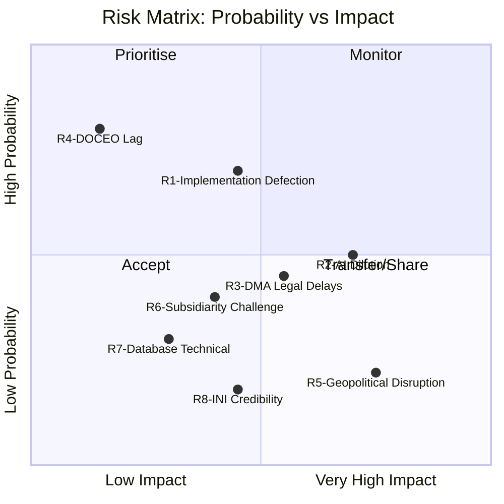

<!-- SPDX-FileCopyrightText: 2026 Hack23 AB -->
<!-- SPDX-License-Identifier: Apache-2.0 -->

# Risk Matrix — EU Parliament Propositions 2026-05-27

**SATs Applied**: Key Assumptions Check (implicit)
**WEP Bands**: Documented per risk
**Admiralty**: B2

---

## 1. Risk Registry

| Risk ID | Risk Description | Probability | Impact | WEP | Risk Level |
|---------|-----------------|-------------|--------|-----|------------|
| R1 | Implementation defection — Member States fail to comply with forest seed or pet welfare regulation deadlines | HIGH (65–75%) | MEDIUM | LIKELY | 🔴 HIGH |
| R2 | AI trade strategy dilution — Commission waters down 2025/2112(INI) in Digital Trade Strategy | MEDIUM (45–55%) | HIGH | ROUGHLY EVEN | 🔴 HIGH |
| R3 | DMA enforcement legal delays — CJEU challenges slow Commission action | MEDIUM (40–50%) | MEDIUM-HIGH | ROUGHLY EVEN | 🟡 MEDIUM-HIGH |
| R4 | DOCEO voting data lag — no roll-call analysis possible for May 2026 votes | CONFIRMED | LOW (analysis quality impact only) | N/A | 🟡 LOW |
| R5 | External geopolitical disruption — US-China trade war escalation disrupts EU AI trade strategy | LOW (20–25%) | HIGH | UNLIKELY | 🟡 MEDIUM |
| R6 | Subsidiary challenge to forest seed cross-border provisions | MEDIUM (35–45%) | MEDIUM | POSSIBLE | 🟡 MEDIUM |
| R7 | Pet welfare database technical failure — delayed go-live | LOW-MEDIUM (25–35%) | LOW-MEDIUM | UNLIKELY-POSSIBLE | 🟢 LOW-MEDIUM |
| R8 | EP institutional credibility — INI without Commission response creates reputational damage | LOW (15–20%) | MEDIUM | UNLIKELY | 🟢 LOW |

---

## 2. Risk Prioritisation Matrix



---

## 3. Priority Risk Profiles

### R1 — Implementation Defection (HIGH risk)
**WEP: LIKELY (65–75%)** | **Admiralty: B2**

At least one Member State will fall behind on either the forest seed or pet welfare regulation implementation timelines. Historical precedent: GDPR saw 5–7 Member States require extended implementation support; the Animal Transport Regulation (2005) saw 8+ infringement proceedings.

**Treatment**: Monitor Commission implementation reports; early warning indicators include absence of national legislation by 2027. Commission infringement proceedings remain the backstop.

---

### R2 — AI Trade Strategy Dilution (HIGH risk)
**WEP: ROUGHLY EVEN (45–55%)** | **Admiralty: B2**

The Commission's Digital Trade Strategy, expected Q3 2026, may incorporate the EP's AI trade resolution (2025/2112(INI)) in form but not substance — endorsing AI trade principles while deferring binding provisions to multilateral processes. The EP's INTA committee can invoke Article 225 TFEU as a backstop but this is a slow-moving process.

**Treatment**: Watch Commission consultation document for explicit reference to 2025/2112(INI); INTA committee to set 3-month deadline for formal Commission response.

---

### R3 — DMA Legal Delays (MEDIUM-HIGH risk)
**WEP: ROUGHLY EVEN (40–50%)** | **Admiralty: B2**

Apple, Meta, and Alphabet have all initiated or signalled CJEU challenges to Commission DMA non-compliance findings. Legal proceedings before the General Court can take 18–30 months to first judgment, 3–5 years to final Appellate ruling. During this period, gatekeepers can argue incomplete compliance pending legal clarity.

**Treatment**: Commission's use of interim measures (available under DMA Article 24) reduces the enforcement gap. Key indicator: whether Commission grants or refuses interim measures requests in Apple/Meta cases Q3–Q4 2026.

---

## 4. Risk Aggregation

```
AGGREGATE RISK LEVEL: MEDIUM-HIGH
- Highest probability risks (R1, R4) have low-medium impact
- Highest impact risks (R2, R5) have medium probability
- No CRITICAL risk (high probability + very high impact) identified for this run's legislative outputs
- All three legislative procedures are past the adoption threshold; risk is now in implementation and downstream policy influence, not adoption
```

---

## 5. Risk Monitoring Schedule

| Risk | Next Review Date | Key Indicator |
|------|----------------|--------------|
| R1 | October 2026 | National implementation plan published? |
| R2 | September 2026 | Commission Digital Trade Strategy published? |
| R3 | Q4 2026 | Apple/Meta CJEU filings? Commission interim measures? |
| R5 | June 2026 | TTC June 2026 communiqué content |
| R6 | 2027 | National seed bank consultation outcomes |

