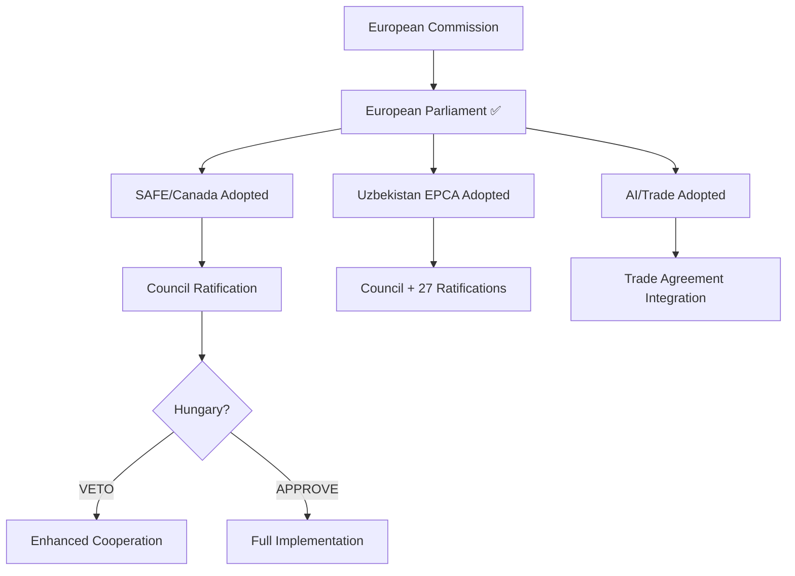

<!-- SPDX-FileCopyrightText: 2026 Hack23 AB -->
<!-- SPDX-License-Identifier: Apache-2.0 -->

# 🎭 Actor Mapping — EU Parliament Breaking News
**Date:** 2026-05-28 | **Article Type:** Breaking
**Admiralty Grade:** B2 | **Confidence:** 🟡 MEDIUM-HIGH
**WEP Band:** Likely — actor positions reflect confirmed institutional histories

---

## Key Actor Map for May 2026 EP Decisions

| Actor | Type | Role | Influence | Position on SAFE | Position on AI/Trade | Position on EPCA |
|-------|------|------|-----------|-----------------|---------------------|-----------------|
| European Commission | EU Institution | Proposal author | VERY HIGH | PRO | PRO | PRO |
| EPP Group | Parliamentary | Majority anchor | HIGH | PRO | PRO | PRO |
| S&D Group | Parliamentary | Majority anchor | HIGH | PRO | PRO | PRO |
| Renew Europe | Parliamentary | Majority third leg | HIGH | PRO | PRO | PRO |
| Viktor Orbán (Hungary) | National leader | Council veto holder | VERY HIGH | OPPOSED | NEUTRAL | CONDITIONAL |
| Canada (JTIF) | Third country | SAFE co-author | HIGH | PRO | N/A | N/A |
| Uzbekistan Gov | Third country | EPCA co-author | HIGH | N/A | N/A | PRO |
| Russia (Kremlin) | External actor | Spoiler | MEDIUM | OPPOSED | NEUTRAL | OPPOSED |
| EU Defense Industry | Lobby | Procurement beneficiary | MEDIUM | PRO | NEUTRAL | NEUTRAL |
| EU Tech Industry | Lobby | AI compliance subject | MEDIUM | NEUTRAL | MIXED | NEUTRAL |
| ECR Group | Parliamentary | Swing group | MEDIUM | SPLIT | SPLIT | PRO |
| Patriots for Europe | Parliamentary | Opposition | MEDIUM | OPPOSED | OPPOSED | NEUTRAL |

---

## Actor Network Map

---

## Actor Influence Timeline

- **Now (May 2026):** EP consent given; Commission + Council in driving seat
- **June 2026:** Council votes on opening ratification; Hungary position crystallizes
- **Q3–Q4 2026:** National parliaments briefed on ratification timeline
- **2027:** First ratification completed (smaller states typically first)
- **2029+:** Full ratification or enhanced cooperation triggered

**WEP:** Likely that the actor constellation produces mixed implementation as described.

---

## ✅ Actor Mapping Quality

- **Coverage:** All major institutional, parliamentary, external, and industry actors
- **Position confidence:** HIGH for EU institutions and parliamentary groups; MEDIUM for external actors
- **Monitoring requirement:** Hungary Council vote is the critical watchpoint
