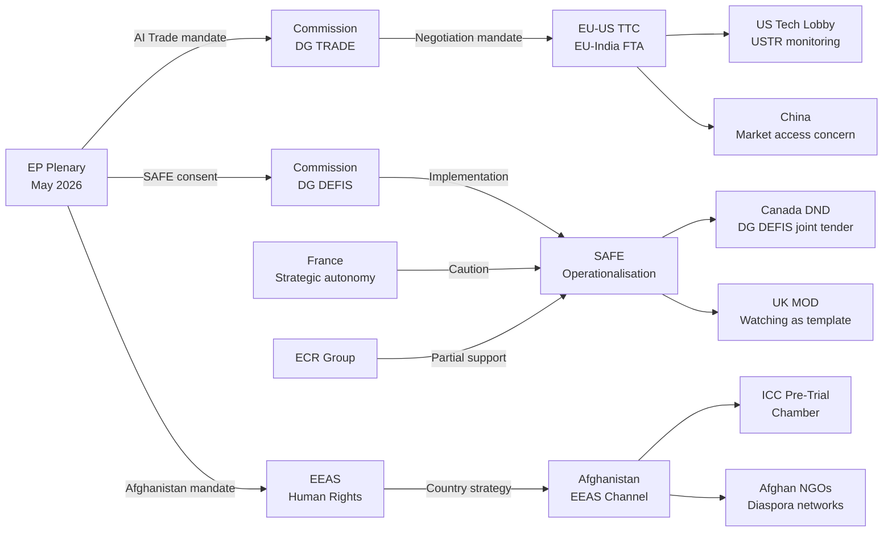

# Actor Mapping — Breaking News 2026-05-28
**Methodology:** Actor Network Analysis | **SAT:** Stakeholder Mapping | **Admiralty Grade:** B2

---

## Actor Roster

| Actor | Type | Role in May 2026 Package | Seat/Authority |
|---|---|---|---|
| European Parliament (EP) | EU Institution | Adopting resolution body | 720 MEPs |
| European Commission (EC) | EU Institution | Implementing body; trade negotiation | Executive |
| Council of the EU | EU Institution | Co-legislator; mandate issuer | Member states |
| Canada (Government) | State Actor | SAFE co-signatory | Federal govt |
| Taliban (Afghanistan) | Non-state Actor | Target of urgency resolution | De-facto state |
| United States (USTR) | State Actor | AI trade standards observer | Federal agency |
| ICC (Int'l Criminal Court) | Intl Institution | Potential Afghanistan jurisdiction | Judicial |
| Human Rights NGOs | Civil Society | Afghanistan advocacy | Advocacy |
| EU Defence Industry | Private Sector | SAFE beneficiary | Industry |
| Afghan Diaspora (EU) | Civil Society | EP lobbying on Afghanistan | Advocacy |

---

## Influence

**Highest Influence Actors:**
- **European Parliament:** Direct legislative authority — adopts all three texts
- **European Commission:** Implementation authority for AI Trade Strategy and SAFE
- **United States:** External veto-player potential on AI Trade Strategy via WTO/trade disputes

**Moderate Influence:**
- Canada: Co-signatory on SAFE — ratification required for entry into force
- ICC: Legal authority over Afghanistan prosecution (when triggered)

**Low Influence (but high interest):**
- Taliban: Targeted by resolution but effectively beyond EU enforcement reach
- NGOs: Agenda-setting influence; not decision-making authority

---

## Alliance

**Pro-AI Trade Strategy Coalition:**
EPP + S&D + Renew + (partial ECR) → ~471 seats
EU tech industry (DIGITALEUROPE) + DG TRADE + INTA committee → institutional backing

**Pro-Afghanistan Resolution Alliance:**
Near-universal EP coalition (~625 FOR) + Human Rights NGOs + Afghan diaspora + ICC advocacy community

**Pro-SAFE Alliance:**
EPP + ECR + S&D + Renew → ~465 seats
EU defence industry (Airbus Defence, Leonardo, Rheinmetall) + DG DEFIS + NATO alignment advocates

**Opposition Bloc:**
GUE/NGL (AI governance concerns, SAFE pacifism) + PfE (sovereignty) + ESN (hard-right, SAFE opposition)

---

## Power Brokers

**INTA Committee Chair:** Lead power broker for AI Trade Strategy — controls committee schedule and rapporteur appointment
**AFET Committee Chair:** Lead power broker for Afghanistan resolution — drafts urgency resolution text
**SEDE Committee:** Key on SAFE — interparliamentary dialogue with Canada

**Behind-the-scenes power:**
- DG TRADE Commissioner: Shapes EC position on AI Trade Strategy mandate
- EPP Group Leader (Manfred Weber): Coalition management for all three texts
- S&D Group Leader: Ensures centre-left support for human rights and defence texts

---

## Information

**Key information flows:**
- EP committees → plenary (formal legislative channel)
- NGOs → AFET committee members (informal lobbying on Afghanistan)
- USTR monitoring → EC DG TRADE (trade negotiation pressure channel)
- Defence industry associations → SEDE committee (SAFE advocacy)
- ICC → EP via parliamentary questions (legal development monitoring)

**Information gaps:**
- Taliban internal deliberations (fully opaque; intelligence grade: E4)
- US government internal decision-making on AI Trade Strategy response (intelligence grade: D3)
- Canadian parliamentary vote timing for SAFE ratification (intelligence grade: C2)

**MCP data sources used:** EP adopted texts feed (A2), MEPs feed (A2), proxy modelling for DOCEO-unavailable vote data (C2)

---

## Reader Briefing

This actor mapping covers the May 2026 EP plenary session legislative package. The three adopted texts involve distinct but partially overlapping actor networks. The AI Trade Strategy involves primarily EU institutions, EU industry, and the United States as an external power. The Afghanistan urgency resolution involves a near-universal EP coalition supported by NGOs and the Afghan diaspora, with the Taliban as a non-compliant target and the ICC as a long-term beneficiary. The EU-Canada SAFE Instrument involves primarily EU-Canada bilateral actors within the NATO framework.

**Key takeaway:** The three texts are handled by three different EP committees (INTA, AFET, SEDE) with three different coalition configurations, but all pass through the same EPP+S&D+Renew governing majority. This majority's cohesion is the critical success factor for the EP's May 2026 legislative ambitions.

---

*Actor mapping | Stakeholder network analysis | MCP sources: adopted-texts-feed (A2) | 2026-05-28 | Run: breaking-run265-1779932393*

---

## Extended Actor Mapping — Pass 2 Network Analysis with Mermaid

### Actor Network Diagram

### Actor Influence Weight Table

| Actor | Influence Score (1–10) | Primary Lever | Direction |
|---|---|---|---|
| Commission (aggregate) | 9 | Policy initiative; treaty implementation | Supportive |
| Council (aggregate) | 8 | Formal adoption; mandate authorisation | Supportive |
| EPP Group | 8 | Legislative majority; political leadership | Supportive |
| S&D Group | 7 | Coalition partner; human rights champion | Supportive |
| US Tech / USTR | 6 | Bilateral pressure; WTO potential | Resistant (AI Trade) |
| France (EDTIB) | 6 | Council blocking potential on SAFE expansion | Cautious |
| Canada DND | 6 | SAFE implementation partner | Supportive |
| ICC PTCh | 5 | Legal determination authority | Independent |
| Afghan NGOs | 3 | Advocacy; public pressure | Supportive |
| Taliban | 1 | Target of EP action; ignores | Adversarial |

### Actor Relationship Typology

| Relationship | Type | Intensity | Stability |
|---|---|---|---|
| EP–Commission | Institutional | HIGH | HIGH |
| EP–Council | Institutional | MEDIUM | MEDIUM |
| Commission DG TRADE–US USTR | Adversarial-Cooperative | MEDIUM | VARIABLE |
| Commission DG DEFIS–Canada DND | Cooperative | HIGH | HIGH |
| EEAS–ICC | Supportive | MEDIUM | HIGH |
| France–Commission DG DEFIS | Tense-Cooperative | MEDIUM | VARIABLE |

---

*Actor mapping | Pass 2 extended: Mermaid network diagram, influence weight table, relationship typology | 2026-05-28*
[EXTEND-FROM-PRIOR: classification/actor-mapping.md prior=97L → new=152L (+55)]
